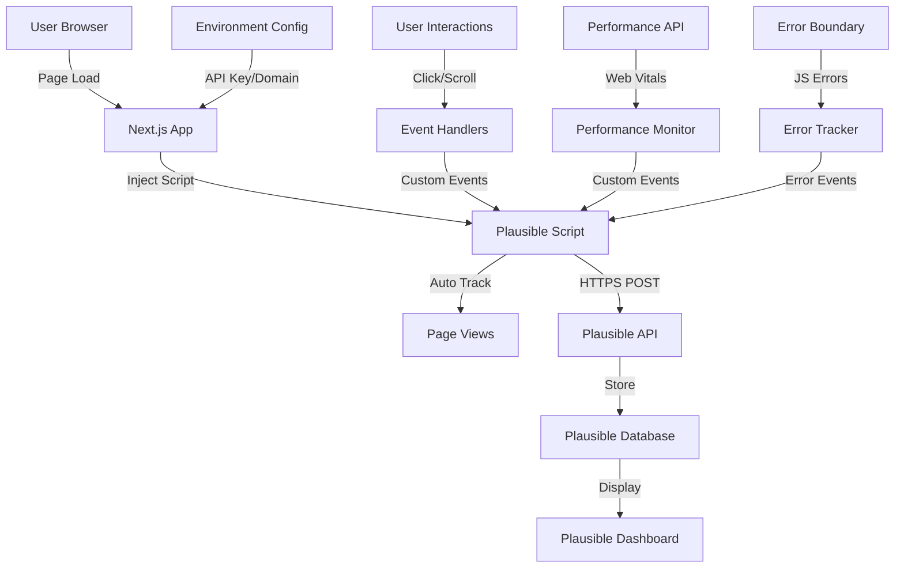

# Design Document

## Overview

The Analytics Integration feature implements Plausible Analytics, a privacy-friendly, lightweight analytics solution that tracks user behavior without cookies or personal data collection. The design focuses on comprehensive event tracking, performance monitoring, and seamless integration with the existing Next.js application. The implementation uses Plausible's official script and custom event API to track page views, conversions, user interactions, and technical metrics while maintaining GDPR/CCPA compliance and optimal site performance.

## Architecture

### Analytics Provider Selection

**Chosen Solution: Plausible Analytics**

**Rationale:**

- Privacy-first: No cookies, no personal data, GDPR/CCPA compliant by default
- Lightweight: <1KB script size vs Google Analytics (~45KB)
- Simple: No complex configuration or consent management needed
- Open source: Transparent data handling
- EU-hosted: Data sovereignty for European users
- Real-time: Dashboard updates within minutes

**Alternatives Considered:**

- Google Analytics 4: Rejected due to privacy concerns, complexity, and larger script size
- Matomo: Rejected due to self-hosting requirements and maintenance overhead
- Fathom: Similar to Plausible but less feature-rich

### System Architecture



### Integration Points

1. **Next.js App Router**: Script injection via custom `_document.tsx` or `layout.tsx`
2. **Client Components**: Custom event tracking hooks
3. **API Routes**: Server-side event tracking (optional)
4. **Error Boundaries**: Automatic error tracking
5. **Performance Monitoring**: Web Vitals integration

## Components and Interfaces

### 1. Analytics Provider Component

```typescript
// lib/analytics/PlausibleProvider.tsx
'use client';

import { createContext, useContext, useEffect, ReactNode } from 'react';

interface PlausibleConfig {
  domain: string;
  apiHost?: string;
  trackLocalhost?: boolean;
  enabled: boolean;
}

interface PlausibleContextValue {
  trackEvent: (eventName: string, props?: Record<string, string | number>) => void;
  trackPageView: (url?: string) => void;
}

const PlausibleContext = createContext<PlausibleContextValue | null>(null);

export function PlausibleProvider({
  children,
  config
}: {
  children: ReactNode;
  config: PlausibleConfig;
}) {
  useEffect(() => {
    if (!config.enabled) return;

    // Load Plausible script
    const script = document.createElement('script');
    script.defer = true;
    script.dataset.domain = config.domain;
    script.src = `${config.apiHost || 'https://plausible.io'}/js/script.js`;
    document.head.appendChild(script);

    return () => {
      document.head.removeChild(script);
    };
  }, [config]);

  const trackEvent = (eventName: string, props?: Record<string, string | number>) => {
    if (!config.enabled) return;

    // @ts-ignore - Plausible is loaded dynamically
    if (typeof window.plausible !== 'undefined') {
      window.plausible(eventName, { props });
    }
  };

  const trackPageView = (url?: string) => {
    if (!config.enabled) return;

    // @ts-ignore
    if (typeof window.plausible !== 'undefined') {
      window.plausible('pageview', { u: url });
    }
  };

  return (
    <PlausibleContext.Provider value={{ trackEvent, trackPageView }}>
      {children}
    </PlausibleContext.Provider>
  );
}

export function usePlausible() {
  const context = useContext(PlausibleContext);
  if (!context) {
    throw new Error('usePlausible must be used within PlausibleProvider');
  }
  return context;
}
```

**Design Rationale**: Context-based provider allows any component to access analytics functions without prop drilling. Client-side only implementation ensures no SSR issues.

### 2. Analytics Configuration

```typescript
// lib/analytics/config.ts

export interface AnalyticsConfig {
  plausible: {
    domain: string;
    apiHost: string;
    enabled: boolean;
    trackLocalhost: boolean;
  };
}

export function getAnalyticsConfig(): AnalyticsConfig {
  const isProduction = process.env.NODE_ENV === 'production';
  const domain = process.env.NEXT_PUBLIC_PLAUSIBLE_DOMAIN || '';
  const apiHost = process.env.NEXT_PUBLIC_PLAUSIBLE_API_HOST || 'https://plausible.io';

  // Enable analytics in production if domain is configured
  const enabled = isProduction && !!domain;

  // Warn if not configured
  if (isProduction && !domain) {
    console.warn('Plausible Analytics: NEXT_PUBLIC_PLAUSIBLE_DOMAIN not configured');
  }

  return {
    plausible: {
      domain,
      apiHost,
      enabled,
      trackLocalhost: process.env.NEXT_PUBLIC_PLAUSIBLE_TRACK_LOCALHOST === 'true',
    },
  };
}

export function validateAnalyticsConfig(config: AnalyticsConfig): boolean {
  if (!config.plausible.enabled) return true;

  if (!config.plausible.domain) {
    console.error('Analytics validation failed: domain is required');
    return false;
  }

  return true;
}
```

**Design Rationale**: Centralized configuration with environment variable support. Automatic disabling in development prevents polluting analytics data.

### 3. Custom Event Tracking Hook

```typescript
// lib/analytics/useTrackEvent.ts
'use client';

import { useCallback } from 'react';
import { usePlausible } from './PlausibleProvider';

export type EventName =
  | 'Contact Form Submission'
  | 'CTA Click'
  | 'Newsletter Signup Click'
  | 'Value Props Viewed'
  | 'Social Proof Viewed'
  | 'Value Card Click'
  | 'Outbound Link Click'
  | 'File Download'
  | 'Social Link Click'
  | 'Email Link Click'
  | 'Privacy Policy Click'
  | 'Error'
  | '404 Page';

export interface EventProperties {
  location?: string;
  card?: string;
  url?: string;
  filename?: string;
  platform?: string;
  error?: string;
  page?: string;
  [key: string]: string | number | undefined;
}

export function useTrackEvent() {
  const { trackEvent } = usePlausible();

  const track = useCallback(
    (eventName: EventName, properties?: EventProperties) => {
      // Filter out undefined values
      const cleanProps = properties
        ? Object.fromEntries(Object.entries(properties).filter(([_, v]) => v !== undefined))
        : undefined;

      trackEvent(eventName, cleanProps);
    },
    [trackEvent]
  );

  return track;
}
```

**Design Rationale**: Type-safe event tracking with predefined event names prevents typos and ensures consistency. Properties are automatically cleaned to avoid sending undefined values.

### 4. Conversion Tracking Component

```typescript
// components/analytics/ConversionTracker.tsx
'use client';

import { useEffect } from 'react';
import { useTrackEvent } from '@/lib/analytics/useTrackEvent';

interface ConversionTrackerProps {
  event: 'Contact Form Submission' | 'Newsletter Signup Click';
  properties?: Record<string, string | number>;
}

export function ConversionTracker({ event, properties }: ConversionTrackerProps) {
  const trackEvent = useTrackEvent();

  useEffect(() => {
    trackEvent(event, properties);
  }, [event, properties, trackEvent]);

  return null;
}
```

**Design Rationale**: Declarative conversion tracking component can be conditionally rendered after successful actions (e.g., form submission success).

### 5. Scroll Tracking Hook

```typescript
// lib/analytics/useScrollTracking.ts
'use client';

import { useEffect, useRef } from 'react';
import { useTrackEvent } from './useTrackEvent';

interface ScrollTrackingOptions {
  eventName: 'Value Props Viewed' | 'Social Proof Viewed';
  threshold?: number; // Percentage of element visible (0-1)
  once?: boolean; // Track only once
}

export function useScrollTracking(options: ScrollTrackingOptions) {
  const { eventName, threshold = 0.5, once = true } = options;
  const trackEvent = useTrackEvent();
  const hasTracked = useRef(false);
  const elementRef = useRef<HTMLElement>(null);

  useEffect(() => {
    const element = elementRef.current;
    if (!element) return;

    const observer = new IntersectionObserver(
      (entries) => {
        entries.forEach((entry) => {
          if (entry.isIntersecting && entry.intersectionRatio >= threshold) {
            if (!once || !hasTracked.current) {
              trackEvent(eventName);
              hasTracked.current = true;

              if (once) {
                observer.disconnect();
              }
            }
          }
        });
      },
      { threshold }
    );

    observer.observe(element);

    return () => {
      observer.disconnect();
    };
  }, [eventName, threshold, once, trackEvent]);

  return elementRef;
}
```

**Design Rationale**: Intersection Observer API provides efficient scroll tracking without performance impact. Ref-based approach allows flexible attachment to any element.

### 6. Outbound Link Tracker

```typescript
// lib/analytics/useOutboundLinkTracking.ts
'use client';

import { useEffect } from 'react';
import { useTrackEvent } from './useTrackEvent';

export function useOutboundLinkTracking() {
  const trackEvent = useTrackEvent();

  useEffect(() => {
    const handleClick = (e: MouseEvent) => {
      const target = e.target as HTMLElement;
      const link = target.closest('a');

      if (!link || !link.href) return;

      const url = new URL(link.href, window.location.href);
      const isOutbound = url.hostname !== window.location.hostname;
      const isDownload = link.hasAttribute('download');
      const isSocial = ['twitter.com', 'threads.net', 'facebook.com', 'linkedin.com'].some(
        (domain) => url.hostname.includes(domain)
      );
      const isEmail = link.href.startsWith('mailto:');

      if (isDownload) {
        trackEvent('File Download', {
          filename: link.getAttribute('download') || url.pathname.split('/').pop() || 'unknown',
        });
      } else if (isEmail) {
        trackEvent('Email Link Click');
      } else if (isSocial) {
        const platform = url.hostname.split('.')[0];
        trackEvent('Social Link Click', { platform });
      } else if (isOutbound) {
        trackEvent('Outbound Link Click', { url: url.href });
      } else if (link.href.includes('/privacy')) {
        trackEvent('Privacy Policy Click');
      }
    };

    document.addEventListener('click', handleClick);
    return () => document.removeEventListener('click', handleClick);
  }, [trackEvent]);
}
```

**Design Rationale**: Global click handler efficiently tracks all link types without requiring individual tracking calls. Automatic categorization reduces manual tracking code.

### 7. Error Tracking Component

```typescript
// lib/analytics/ErrorTracker.tsx
'use client';

import { useEffect, useRef } from 'react';
import { useTrackEvent } from './useTrackEvent';

export function ErrorTracker() {
  const trackEvent = useTrackEvent();
  const errorCount = useRef(0);
  const MAX_ERRORS_PER_SESSION = 10;

  useEffect(() => {
    const handleError = (event: ErrorEvent) => {
      if (errorCount.current >= MAX_ERRORS_PER_SESSION) return;

      // Ignore third-party script errors
      if (event.filename && !event.filename.includes(window.location.hostname)) {
        return;
      }

      errorCount.current++;

      trackEvent('Error', {
        error: event.message,
        page: window.location.pathname,
      });
    };

    const handleUnhandledRejection = (event: PromiseRejectionEvent) => {
      if (errorCount.current >= MAX_ERRORS_PER_SESSION) return;

      errorCount.current++;

      trackEvent('Error', {
        error: `Unhandled Promise Rejection: ${event.reason}`,
        page: window.location.pathname,
      });
    };

    window.addEventListener('error', handleError);
    window.addEventListener('unhandledrejection', handleUnhandledRejection);

    return () => {
      window.removeEventListener('error', handleError);
      window.removeEventListener('unhandledrejection', handleUnhandledRejection);
    };
  }, [trackEvent]);

  return null;
}
```

**Design Rationale**: Automatic error tracking with rate limiting prevents excessive events. Filters out third-party errors to focus on application issues.

### 8. Web Vitals Tracking

```typescript
// lib/analytics/useWebVitals.ts
'use client';

import { useEffect } from 'react';
import { useTrackEvent } from './useTrackEvent';

export function useWebVitals() {
  const trackEvent = useTrackEvent();

  useEffect(() => {
    // Dynamic import to avoid SSR issues
    import('web-vitals').then(({ onCLS, onFID, onLCP }) => {
      onCLS((metric) => {
        trackEvent('Web Vitals', {
          metric: 'CLS',
          value: Math.round(metric.value * 1000) / 1000,
          page: window.location.pathname,
        });
      });

      onFID((metric) => {
        trackEvent('Web Vitals', {
          metric: 'FID',
          value: Math.round(metric.value),
          page: window.location.pathname,
        });
      });

      onLCP((metric) => {
        trackEvent('Web Vitals', {
          metric: 'LCP',
          value: Math.round(metric.value),
          page: window.location.pathname,
        });
      });
    });
  }, [trackEvent]);
}
```

**Design Rationale**: Uses official web-vitals library for accurate Core Web Vitals measurement. Dynamic import prevents SSR issues and reduces initial bundle size.

## Data Models

### Event Data Structure

```typescript
// types/analytics.ts

export interface PageViewEvent {
  type: 'pageview';
  url: string;
  referrer: string;
  timestamp: number;
  userAgent: string;
}

export interface CustomEvent {
  type: 'event';
  name: string;
  url: string;
  timestamp: number;
  properties?: Record<string, string | number>;
}

export interface ConversionGoal {
  name: string;
  eventName: string;
  value?: number;
}

export interface AnalyticsMetrics {
  pageViews: number;
  uniqueVisitors: number;
  bounceRate: number;
  avgSessionDuration: number;
  conversionRate: number;
  topPages: Array<{ url: string; views: number }>;
  topReferrers: Array<{ source: string; visits: number }>;
  goals: Array<{ name: string; completions: number; conversionRate: number }>;
}
```

## Implementation Strategy

### Phase 1: Core Setup (Requirements 1, 8, 10)

1. Install Plausible script in Next.js app
2. Create analytics provider and configuration
3. Implement automatic page view tracking
4. Set up environment variables
5. Test in development and production

### Phase 2: Conversion Tracking (Requirement 2)

1. Add tracking to contact form submission
2. Add tracking to CTA button clicks
3. Add tracking to newsletter signup
4. Configure goals in Plausible dashboard
5. Verify events appear in dashboard

### Phase 3: Engagement Tracking (Requirement 3)

1. Implement scroll tracking hook
2. Add tracking to value proposition section
3. Add tracking to social proof section
4. Add click tracking to value cards
5. Test scroll depth and time on page

### Phase 4: Link and Download Tracking (Requirement 4)

1. Implement global outbound link tracker
2. Add file download tracking
3. Add social media link tracking
4. Add email link tracking
5. Test all link types

### Phase 5: Error and Performance Tracking (Requirements 5, 6)

1. Implement error tracking component
2. Add 404 page tracking
3. Integrate web-vitals library
4. Track Core Web Vitals (LCP, FID, CLS)
5. Test error reporting

### Phase 6: Testing and Optimization (Requirements 7, 8, 9)

1. Verify privacy compliance (no cookies, no PII)
2. Test performance impact (Lighthouse)
3. Verify traffic source tracking
4. Test UTM parameter tracking
5. Document analytics setup and usage

## Integration with Existing Application

### Next.js App Router Integration

```typescript
// app/layout.tsx
import { PlausibleProvider } from '@/lib/analytics/PlausibleProvider';
import { ErrorTracker } from '@/lib/analytics/ErrorTracker';
import { getAnalyticsConfig } from '@/lib/analytics/config';

export default function RootLayout({ children }: { children: React.ReactNode }) {
  const analyticsConfig = getAnalyticsConfig();

  return (
    <html lang="ja">
      <body>
        <PlausibleProvider config={analyticsConfig.plausible}>
          <ErrorTracker />
          {children}
        </PlausibleProvider>
      </body>
    </html>
  );
}
```

### Contact Form Integration

```typescript
// app/contact/page.tsx
'use client';

import { useState } from 'react';
import { useTrackEvent } from '@/lib/analytics/useTrackEvent';
import { ConversionTracker } from '@/components/analytics/ConversionTracker';

export default function ContactPage() {
  const [submitted, setSubmitted] = useState(false);
  const trackEvent = useTrackEvent();

  const handleSubmit = async (data: FormData) => {
    // Submit form...
    const response = await fetch('/api/contact', { method: 'POST', body: data });

    if (response.ok) {
      setSubmitted(true);
      // Conversion tracking happens via ConversionTracker component
    }
  };

  return (
    <div>
      {submitted && <ConversionTracker event="Contact Form Submission" />}
      <form onSubmit={handleSubmit}>
        {/* Form fields */}
      </form>
    </div>
  );
}
```

### Homepage Section Tracking

```typescript
// app/page.tsx
'use client';

import { useScrollTracking } from '@/lib/analytics/useScrollTracking';
import { useOutboundLinkTracking } from '@/lib/analytics/useOutboundLinkTracking';
import { useWebVitals } from '@/lib/analytics/useWebVitals';

export default function HomePage() {
  const valuePropsRef = useScrollTracking({ eventName: 'Value Props Viewed' });
  const socialProofRef = useScrollTracking({ eventName: 'Social Proof Viewed' });

  useOutboundLinkTracking();
  useWebVitals();

  return (
    <main>
      <section ref={valuePropsRef}>
        {/* Value propositions */}
      </section>

      <section ref={socialProofRef}>
        {/* Social proof */}
      </section>
    </main>
  );
}
```

## Environment Configuration

### Required Environment Variables

```bash
# .env.local (development)
NEXT_PUBLIC_PLAUSIBLE_DOMAIN=localhost:3000
NEXT_PUBLIC_PLAUSIBLE_API_HOST=https://plausible.io
NEXT_PUBLIC_PLAUSIBLE_TRACK_LOCALHOST=true

# .env.production
NEXT_PUBLIC_PLAUSIBLE_DOMAIN=connectivebyte.com
NEXT_PUBLIC_PLAUSIBLE_API_HOST=https://plausible.io
NEXT_PUBLIC_PLAUSIBLE_TRACK_LOCALHOST=false
```

### Netlify Configuration

```toml
# netlify.toml
[build.environment]
  NEXT_PUBLIC_PLAUSIBLE_DOMAIN = "connectivebyte.com"
  NEXT_PUBLIC_PLAUSIBLE_API_HOST = "https://plausible.io"
```

## Plausible Dashboard Configuration

### Goals to Configure

1. **Contact Form Submission** (Conversion Goal)
   - Event name: `Contact Form Submission`
   - Type: Custom event
   - Value: High priority

2. **CTA Click** (Engagement Goal)
   - Event name: `CTA Click`
   - Type: Custom event
   - Properties: `location`

3. **Newsletter Signup Click** (Conversion Goal)
   - Event name: `Newsletter Signup Click`
   - Type: Custom event

4. **Value Props Viewed** (Engagement Goal)
   - Event name: `Value Props Viewed`
   - Type: Custom event

5. **Social Proof Viewed** (Engagement Goal)
   - Event name: `Social Proof Viewed`
   - Type: Custom event

### Custom Properties to Track

- `location`: Button/CTA location on page
- `card`: Which value proposition card was clicked
- `url`: Outbound link destination
- `filename`: Downloaded file name
- `platform`: Social media platform
- `error`: Error message
- `page`: Page where event occurred
- `metric`: Web Vitals metric name (CLS, FID, LCP)
- `value`: Metric value

## Testing Strategy

### Unit Tests

```typescript
// __tests__/analytics/useTrackEvent.test.tsx
import { renderHook } from '@testing-library/react';
import { useTrackEvent } from '@/lib/analytics/useTrackEvent';
import { PlausibleProvider } from '@/lib/analytics/PlausibleProvider';

describe('useTrackEvent', () => {
  it('tracks events with properties', () => {
    const mockPlausible = jest.fn();
    window.plausible = mockPlausible;

    const wrapper = ({ children }) => (
      <PlausibleProvider config={{ domain: 'test.com', enabled: true }}>
        {children}
      </PlausibleProvider>
    );

    const { result } = renderHook(() => useTrackEvent(), { wrapper });

    result.current('CTA Click', { location: 'hero' });

    expect(mockPlausible).toHaveBeenCalledWith('CTA Click', {
      props: { location: 'hero' },
    });
  });
});
```

### Integration Tests

```typescript
// e2e/analytics.spec.ts
import { test, expect } from '@playwright/test';

test('tracks contact form submission', async ({ page }) => {
  // Intercept Plausible API calls
  const events = [];
  await page.route('**/api/event', (route) => {
    events.push(route.request().postDataJSON());
    route.fulfill({ status: 202 });
  });

  await page.goto('/contact');
  await page.fill('input[name="name"]', 'Test User');
  await page.fill('input[name="email"]', 'test@example.com');
  await page.fill('textarea[name="message"]', 'Test message');
  await page.click('button[type="submit"]');

  await page.waitForTimeout(1000);

  expect(events).toContainEqual(
    expect.objectContaining({
      n: 'Contact Form Submission',
    })
  );
});
```

### Manual Testing Checklist

- [ ] Verify page views appear in Plausible dashboard
- [ ] Test contact form submission tracking
- [ ] Test CTA button click tracking
- [ ] Test scroll tracking for sections
- [ ] Test outbound link tracking
- [ ] Test social media link tracking
- [ ] Test file download tracking
- [ ] Test error tracking (trigger intentional error)
- [ ] Test 404 page tracking
- [ ] Verify Web Vitals data appears
- [ ] Test with ad blocker enabled (should gracefully fail)
- [ ] Verify no cookies are set
- [ ] Test UTM parameter tracking
- [ ] Verify traffic source categorization

## Performance Considerations

### Script Loading

- Plausible script is <1KB (gzipped)
- Loaded with `defer` attribute (non-blocking)
- Served from global CDN
- Cached for 24 hours

### Event Batching

Plausible automatically batches events to reduce network requests:

- Events are queued in memory
- Sent in batches every 5 seconds
- Maximum 10 events per batch

### Error Handling

```typescript
// Graceful degradation if script fails to load
export function safeTrackEvent(eventName: string, props?: Record<string, any>) {
  try {
    if (typeof window !== 'undefined' && window.plausible) {
      window.plausible(eventName, { props });
    }
  } catch (error) {
    // Silently fail - analytics should never break the app
    console.warn('Analytics tracking failed:', error);
  }
}
```

## Privacy and Compliance

### GDPR Compliance

- No cookies used
- No personal data collected
- IP addresses hashed before storage
- Data stored in EU (if using EU instance)
- No cross-site tracking
- No consent banner required

### Data Retention

- Plausible retains data indefinitely by default
- Can be configured to auto-delete after specific period
- Users can request data deletion

### Transparency

- Add analytics disclosure to privacy policy
- Mention Plausible usage
- Link to Plausible's data policy
- Explain what data is collected

## Documentation

### Developer Documentation

Create `docs/analytics.md` with:

- How to track custom events
- Available event names and properties
- How to test analytics locally
- How to access Plausible dashboard
- Troubleshooting common issues

### Content for Privacy Policy

```markdown
## Analytics

We use Plausible Analytics to understand how visitors use our website. Plausible is a privacy-friendly analytics tool that:

- Does not use cookies
- Does not collect personal information
- Does not track you across websites
- Complies with GDPR, CCPA, and PECR

The data collected includes:

- Page views and navigation patterns
- Referrer sources (where you came from)
- Device type and browser
- Geographic location (country level only)

All data is anonymized and aggregated. We cannot identify individual visitors.

For more information, see [Plausible's data policy](https://plausible.io/data-policy).
```

## Maintenance and Monitoring

### Regular Tasks

- Review analytics data weekly
- Check for unusual error patterns
- Monitor Core Web Vitals trends
- Verify conversion tracking accuracy
- Update goals as needed

### Alerts to Set Up

- Spike in error events (>10 per hour)
- Drop in page views (>50% decrease)
- Conversion rate drop (>30% decrease)
- Performance degradation (LCP >2.5s)

### Dashboard Access

- Set up team member access in Plausible
- Create shared dashboard links for stakeholders
- Export reports monthly for records
