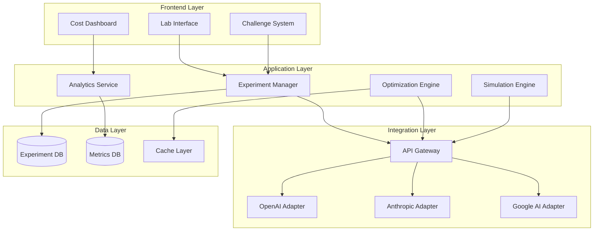

# API Cost Optimization Lab - Design Document

## Overview

The API Cost Optimization Lab is a comprehensive learning platform that enables users to experiment with AI API cost optimization in a safe, isolated environment. The system provides real-time cost tracking, optimization strategy testing, and data-driven analysis to help learners develop practical skills in managing API costs as a business KPI.

The platform architecture follows a modular design with clear separation between the sandbox execution environment, cost tracking system, optimization engine, and analytics dashboard. This design enables scalability, maintainability, and extensibility for future AI provider integrations.

## Architecture

### High-Level Architecture



### Component Architecture

The system is organized into the following major components:

1. **Sandbox Environment**: Isolated execution environment for safe API experimentation
2. **Cost Tracking System**: Real-time monitoring and recording of API costs
3. **Optimization Engine**: Library of optimization strategies and testing framework
4. **Analytics Dashboard**: Visualization and reporting of cost metrics
5. **Challenge System**: Gamified learning activities with progress tracking
6. **API Integration Layer**: Unified interface for multiple AI providers

## Components and Interfaces

### 1. Sandbox Environment

**Purpose**: Provide isolated, safe environment for API experimentation

**Key Classes**:

- `SandboxManager`: Orchestrates sandbox lifecycle and isolation
- `ExperimentSession`: Represents a single experiment session
- `APIKeyManager`: Manages user and shared API keys securely

**Interfaces**:

```typescript
interface ISandboxEnvironment {
  createSession(userId: string, config: SessionConfig): Promise<ExperimentSession>;
  executeAPICall(sessionId: string, request: APIRequest): Promise<APIResponse>;
  terminateSession(sessionId: string): Promise<void>;
  getSessionMetrics(sessionId: string): Promise<SessionMetrics>;
}

interface SessionConfig {
  provider: 'openai' | 'anthropic' | 'google';
  apiKey?: string;
  useSharedKey: boolean;
  isolationLevel: 'user' | 'experiment';
}

interface APIRequest {
  model: string;
  prompt: string;
  parameters: Record<string, any>;
  metadata: RequestMetadata;
}

interface APIResponse {
  content: string;
  tokens: TokenUsage;
  cost: number;
  latency: number;
  timestamp: Date;
}
```

### 2. Cost Tracking System

**Purpose**: Monitor, record, and analyze API costs in real-time

**Key Classes**:

- `CostTracker`: Records all API calls and associated costs
- `BaselineManager`: Manages baseline creation and storage
- `MetricsCollector`: Aggregates cost metrics across experiments

**Interfaces**:

```typescript
interface ICostTracker {
  recordAPICall(call: APICallRecord): Promise<void>;
  createBaseline(experimentId: string, calls: APICallRecord[]): Promise<Baseline>;
  calculateReduction(baselineId: string, optimizedCalls: APICallRecord[]): Promise<CostReduction>;
  getMetrics(experimentId: string): Promise<CostMetrics>;
}

interface APICallRecord {
  experimentId: string;
  sessionId: string;
  provider: string;
  model: string;
  inputTokens: number;
  outputTokens: number;
  systemTokens: number;
  cost: number;
  latency: number;
  timestamp: Date;
}

interface Baseline {
  id: string;
  experimentId: string;
  averageCost: number;
  totalTokens: number;
  averageLatency: number;
  callCount: number;
  createdAt: Date;
}

interface CostReduction {
  baselineId: string;
  optimizedId: string;
  absoluteReduction: number;
  percentageReduction: number;
  tokenSavings: number;
  latencyImpact: number;
}
```

### 3. Optimization Engine

**Purpose**: Provide optimization strategies and testing framework

**Key Classes**:

- `OptimizationStrategy`: Base class for all optimization strategies
- `PromptCompressor`: Reduces prompt token usage
- `CachingStrategy`: Implements various caching approaches
- `BatchProcessor`: Groups API calls for efficiency
- `PromptOptimizer`: AI-powered prompt optimization

**Interfaces**:

```typescript
interface IOptimizationStrategy {
  name: string;
  description: string;
  apply(request: APIRequest): Promise<OptimizedRequest>;
  estimateSavings(request: APIRequest): Promise<SavingsEstimate>;
}

interface OptimizedRequest extends APIRequest {
  originalRequest: APIRequest;
  optimizationApplied: string;
  estimatedSavings: number;
}

interface SavingsEstimate {
  tokenReduction: number;
  costReduction: number;
  qualityImpact: 'none' | 'minimal' | 'moderate';
  confidence: number;
}

interface ICacheStrategy {
  type: 'memory' | 'redis' | 'database';
  ttl: number;
  get(key: string): Promise<CachedResponse | null>;
  set(key: string, value: APIResponse, ttl?: number): Promise<void>;
  invalidate(pattern: string): Promise<void>;
  getHitRate(): Promise<number>;
}
```

### 4. Token Analyzer

**Purpose**: Analyze token usage patterns and identify optimization opportunities

**Key Classes**:

- `TokenAnalyzer`: Breaks down and analyzes token usage
- `OptimizationSuggester`: Generates optimization suggestions
- `TokenVisualizer`: Creates visual representations of token distribution

**Interfaces**:

```typescript
interface ITokenAnalyzer {
  analyzeTokens(calls: APICallRecord[]): Promise<TokenAnalysis>;
  identifyHighCostCalls(calls: APICallRecord[], threshold: number): Promise<APICallRecord[]>;
  suggestOptimizations(analysis: TokenAnalysis): Promise<OptimizationSuggestion[]>;
  visualizeDistribution(analysis: TokenAnalysis): Promise<VisualizationData>;
}

interface TokenAnalysis {
  totalTokens: number;
  inputTokens: number;
  outputTokens: number;
  systemTokens: number;
  distribution: TokenDistribution[];
  highCostAreas: HighCostArea[];
  optimizationOpportunities: number;
}

interface OptimizationSuggestion {
  area: string;
  currentTokens: number;
  estimatedReduction: number;
  strategy: string;
  implementation: string;
  priority: 'high' | 'medium' | 'low';
}
```

### 5. Simulation Engine

**Purpose**: Simulate production scenarios and project costs at scale

**Key Classes**:

- `UsageSimulator`: Simulates various usage patterns
- `CostProjector`: Projects costs over time periods
- `LoadPatternGenerator`: Creates realistic load patterns
- `ScaleCalculator`: Calculates costs at different scales

**Interfaces**:

```typescript
interface ISimulationEngine {
  createSimulation(scenario: UsageScenario): Promise<Simulation>;
  runSimulation(simulationId: string): Promise<SimulationResults>;
  projectCosts(results: SimulationResults, period: TimePeriod): Promise<CostProjection>;
  scaleAnalysis(results: SimulationResults, scales: number[]): Promise<ScaleAnalysis>;
}

interface UsageScenario {
  requestsPerMinute: number;
  userCount: number;
  sessionDuration: number;
  loadPattern: 'steady' | 'peak' | 'seasonal';
  requestTypes: RequestTypeDistribution[];
}

interface SimulationResults {
  totalCalls: number;
  totalCost: number;
  averageCostPerCall: number;
  peakCostPerMinute: number;
  tokenUsage: TokenUsage;
  duration: number;
}

interface CostProjection {
  period: 'day' | 'week' | 'month' | 'year';
  projectedCost: number;
  confidenceInterval: [number, number];
  breakdown: CostBreakdown[];
  warnings: CostWarning[];
}
```

### 6. Challenge System

**Purpose**: Provide gamified learning activities with progress tracking

**Key Classes**:

- `ChallengeManager`: Manages challenge lifecycle
- `ProgressTracker`: Tracks learner progress
- `BadgeSystem`: Awards achievements
- `LeaderboardManager`: Manages competitive rankings

**Interfaces**:

```typescript
interface IChallengeSystem {
  getChallenges(difficulty?: string): Promise<Challenge[]>;
  startChallenge(userId: string, challengeId: string): Promise<ChallengeSession>;
  submitSolution(sessionId: string, solution: ChallengeSolution): Promise<ChallengeResult>;
  getLeaderboard(challengeId: string): Promise<LeaderboardEntry[]>;
}

interface Challenge {
  id: string;
  title: string;
  description: string;
  difficulty: 'beginner' | 'intermediate' | 'advanced';
  targetReduction: number;
  baselineScenario: UsageScenario;
  successCriteria: SuccessCriteria;
  hints: string[];
}

interface ChallengeResult {
  success: boolean;
  achievedReduction: number;
  targetReduction: number;
  score: number;
  feedback: string;
  badgesEarned: Badge[];
}
```

### 7. Digital Twin System

**Purpose**: Create virtual representations of production systems for safe experimentation

**Key Classes**:

- `DigitalTwinManager`: Creates and manages digital twins
- `UsagePatternReplicator`: Replicates production patterns
- `OptimizationTester`: Tests optimizations on digital twins

**Interfaces**:

```typescript
interface IDigitalTwin {
  createTwin(config: DigitalTwinConfig): Promise<DigitalTwin>;
  replicatePattern(twinId: string): Promise<void>;
  applyOptimization(twinId: string, strategy: IOptimizationStrategy): Promise<OptimizationResult>;
  exportRecommendations(twinId: string): Promise<RecommendationReport>;
}

interface DigitalTwinConfig {
  name: string;
  usagePattern: UsagePattern;
  requestTypes: RequestType[];
  frequency: FrequencyConfig;
  apiProvider: string;
}

interface OptimizationResult {
  originalCost: number;
  optimizedCost: number;
  reduction: number;
  qualityMetrics: QualityMetrics;
  recommendations: string[];
}
```

### 8. KPI Designer

**Purpose**: Enable custom cost KPI definition and tracking

**Key Classes**:

- `KPIDefinitionManager`: Manages custom KPI definitions
- `KPICalculator`: Calculates KPI values
- `KPIAlertSystem`: Monitors thresholds and sends alerts
- `KPIVisualizer`: Creates KPI dashboards

**Interfaces**:

```typescript
interface IKPIDesigner {
  defineKPI(definition: KPIDefinition): Promise<CustomKPI>;
  calculateKPI(kpiId: string, experimentId: string): Promise<KPIValue>;
  setThreshold(kpiId: string, threshold: Threshold): Promise<void>;
  getKPITrends(kpiId: string, period: TimePeriod): Promise<KPITrend>;
}

interface KPIDefinition {
  name: string;
  formula: string;
  unit: string;
  description: string;
  category: 'cost' | 'performance' | 'quality';
}

interface KPIValue {
  kpiId: string;
  value: number;
  timestamp: Date;
  status: 'normal' | 'warning' | 'critical';
}
```

### 9. Report Generator

**Purpose**: Generate comprehensive optimization reports

**Key Classes**:

- `ReportBuilder`: Constructs detailed reports
- `VisualizationGenerator`: Creates charts and graphs
- `ExportManager`: Handles multiple export formats

**Interfaces**:

```typescript
interface IReportGenerator {
  generateReport(experimentId: string, options: ReportOptions): Promise<Report>;
  exportReport(reportId: string, format: 'pdf' | 'json'): Promise<Buffer>;
  getExecutiveSummary(reportId: string): Promise<ExecutiveSummary>;
}

interface Report {
  id: string;
  experimentId: string;
  baseline: Baseline;
  optimizations: OptimizationResult[];
  visualizations: Visualization[];
  recommendations: Recommendation[];
  statisticalSignificance: number;
  createdAt: Date;
}
```

## Data Models

### Core Entities

```typescript
// Experiment
interface Experiment {
  id: string;
  userId: string;
  name: string;
  description: string;
  status: 'draft' | 'running' | 'completed' | 'archived';
  baselineId?: string;
  createdAt: Date;
  updatedAt: Date;
}

// User Progress
interface UserProgress {
  userId: string;
  experimentsCompleted: number;
  totalCostSavings: number;
  badgesEarned: Badge[];
  challengesCompleted: string[];
  skillLevel: number;
  lastActivity: Date;
}

// API Provider Configuration
interface ProviderConfig {
  provider: 'openai' | 'anthropic' | 'google';
  models: ModelConfig[];
  pricing: PricingConfig;
  rateLimit: RateLimitConfig;
}

// Cache Entry
interface CacheEntry {
  key: string;
  value: APIResponse;
  ttl: number;
  createdAt: Date;
  expiresAt: Date;
  hitCount: number;
}
```

### Database Schema

```sql
-- Experiments table
CREATE TABLE experiments (
  id UUID PRIMARY KEY,
  user_id UUID NOT NULL,
  name VARCHAR(255) NOT NULL,
  description TEXT,
  status VARCHAR(50) NOT NULL,
  baseline_id UUID,
  created_at TIMESTAMP DEFAULT NOW(),
  updated_at TIMESTAMP DEFAULT NOW()
);

-- API Calls table
CREATE TABLE api_calls (
  id UUID PRIMARY KEY,
  experiment_id UUID NOT NULL,
  session_id UUID NOT NULL,
  provider VARCHAR(50) NOT NULL,
  model VARCHAR(100) NOT NULL,
  input_tokens INTEGER NOT NULL,
  output_tokens INTEGER NOT NULL,
  system_tokens INTEGER NOT NULL,
  cost DECIMAL(10, 6) NOT NULL,
  latency INTEGER NOT NULL,
  timestamp TIMESTAMP DEFAULT NOW(),
  FOREIGN KEY (experiment_id) REFERENCES experiments(id)
);

-- Baselines table
CREATE TABLE baselines (
  id UUID PRIMARY KEY,
  experiment_id UUID NOT NULL,
  average_cost DECIMAL(10, 6) NOT NULL,
  total_tokens INTEGER NOT NULL,
  average_latency INTEGER NOT NULL,
  call_count INTEGER NOT NULL,
  created_at TIMESTAMP DEFAULT NOW(),
  FOREIGN KEY (experiment_id) REFERENCES experiments(id)
);

-- User Progress table
CREATE TABLE user_progress (
  user_id UUID PRIMARY KEY,
  experiments_completed INTEGER DEFAULT 0,
  total_cost_savings DECIMAL(12, 2) DEFAULT 0,
  badges_earned JSONB DEFAULT '[]',
  challenges_completed JSONB DEFAULT '[]',
  skill_level INTEGER DEFAULT 1,
  last_activity TIMESTAMP DEFAULT NOW()
);

-- Challenges table
CREATE TABLE challenges (
  id UUID PRIMARY KEY,
  title VARCHAR(255) NOT NULL,
  description TEXT NOT NULL,
  difficulty VARCHAR(50) NOT NULL,
  target_reduction DECIMAL(5, 2) NOT NULL,
  baseline_scenario JSONB NOT NULL,
  success_criteria JSONB NOT NULL,
  hints JSONB DEFAULT '[]',
  created_at TIMESTAMP DEFAULT NOW()
);

-- Challenge Submissions table
CREATE TABLE challenge_submissions (
  id UUID PRIMARY KEY,
  user_id UUID NOT NULL,
  challenge_id UUID NOT NULL,
  achieved_reduction DECIMAL(5, 2) NOT NULL,
  score INTEGER NOT NULL,
  success BOOLEAN NOT NULL,
  submitted_at TIMESTAMP DEFAULT NOW(),
  FOREIGN KEY (challenge_id) REFERENCES challenges(id)
);
```

## Error Handling

### Error Categories

1. **API Integration Errors**
   - Invalid API keys
   - Rate limit exceeded
   - Provider service unavailable
   - Invalid request parameters

2. **Sandbox Errors**
   - Session creation failure
   - Isolation breach attempt
   - Resource limit exceeded
   - Session timeout

3. **Data Errors**
   - Invalid experiment configuration
   - Missing baseline data
   - Corrupted metrics
   - Database connection failure

4. **Optimization Errors**
   - Strategy application failure
   - Quality degradation detected
   - Cache invalidation error
   - Batch processing failure

### Error Handling Strategy

```typescript
class LabError extends Error {
  constructor(
    public code: string,
    public message: string,
    public category: ErrorCategory,
    public recoverable: boolean,
    public context?: Record<string, any>
  ) {
    super(message);
  }
}

interface IErrorHandler {
  handleError(error: LabError): Promise<ErrorResponse>;
  logError(error: LabError): Promise<void>;
  notifyUser(error: LabError): Promise<void>;
  attemptRecovery(error: LabError): Promise<boolean>;
}

// Error response structure
interface ErrorResponse {
  success: false;
  error: {
    code: string;
    message: string;
    details?: string;
    recoverable: boolean;
    suggestedAction?: string;
  };
}
```

### Recovery Strategies

- **API Failures**: Retry with exponential backoff, fallback to alternative provider
- **Session Errors**: Automatic session recreation, state preservation
- **Data Errors**: Transaction rollback, data validation before commit
- **Cache Errors**: Cache bypass, fallback to direct API calls

## Testing Strategy

### Unit Testing

**Scope**: Individual components and functions

**Key Areas**:

- Cost calculation accuracy
- Token counting logic
- Optimization strategy algorithms
- KPI formula evaluation
- Cache hit/miss logic

**Tools**: Jest, TypeScript

**Coverage Target**: 80% minimum

### Integration Testing

**Scope**: Component interactions and API integrations

**Key Areas**:

- Sandbox environment isolation
- API provider integrations (OpenAI, Anthropic, Google)
- Database operations
- Cache layer functionality
- Report generation pipeline

**Tools**: Jest, Supertest, Test containers

**Approach**: Mock external APIs, use test databases

### End-to-End Testing

**Scope**: Complete user workflows

**Key Scenarios**:

1. Create experiment → Establish baseline → Apply optimization → View results
2. Start challenge → Submit solution → Receive feedback → View leaderboard
3. Create digital twin → Run simulation → Export recommendations
4. Define custom KPI → Track across experiments → Set alerts
5. Compare providers → Analyze costs → Generate report

**Tools**: Playwright, Cypress

**Environment**: Staging environment with test API keys

### Performance Testing

**Scope**: System performance under load

**Key Metrics**:

- API call latency
- Dashboard load time
- Simulation execution time
- Report generation time
- Concurrent user capacity

**Tools**: k6, Artillery

**Targets**:

- API response time: < 200ms (p95)
- Dashboard load: < 2s
- Support 100 concurrent users
- Simulation completion: < 30s for 1000 calls

### Security Testing

**Scope**: API key security, sandbox isolation, data privacy

**Key Areas**:

- API key encryption and storage
- Sandbox escape prevention
- User data isolation
- SQL injection prevention
- XSS protection

**Tools**: OWASP ZAP, Manual penetration testing

## Implementation Phases

### Phase 1: Core Infrastructure (MVP)

- Sandbox environment with single provider (OpenAI)
- Basic cost tracking
- Simple baseline creation
- Manual API calls

### Phase 2: Optimization Engine

- Optimization strategy library
- Token analyzer
- Side-by-side comparison
- Basic visualizations

### Phase 3: Simulation & Analysis

- Usage simulator
- Cost projections
- Scale analysis
- Provider comparison

### Phase 4: Gamification & Learning

- Challenge system
- Progress tracking
- Badges and leaderboard
- Guided exercises

### Phase 5: Advanced Features

- Digital twins
- Custom KPI designer
- AI-powered prompt optimizer
- Advanced caching strategies
- Comprehensive reporting

## Security Considerations

1. **API Key Management**
   - Encrypt keys at rest using AES-256
   - Never log or expose keys in responses
   - Implement key rotation mechanism
   - Support both user and shared keys

2. **Sandbox Isolation**
   - Separate execution contexts per user
   - Resource limits (CPU, memory, API calls)
   - Timeout enforcement
   - Network isolation

3. **Data Privacy**
   - User data isolation in database
   - No cross-user data access
   - Anonymize data in leaderboards
   - GDPR compliance for data export/deletion

4. **Rate Limiting**
   - Per-user API call limits
   - Per-experiment limits
   - Global system limits
   - Graceful degradation

## Performance Optimization

1. **Caching Strategy**
   - Cache API responses for identical requests
   - Cache baseline calculations
   - Cache visualization data
   - Redis for distributed caching

2. **Database Optimization**
   - Index on experiment_id, user_id, timestamp
   - Partition api_calls table by date
   - Aggregate metrics in background jobs
   - Connection pooling

3. **Async Processing**
   - Queue long-running simulations
   - Background report generation
   - Async metric aggregation
   - WebSocket for real-time updates

4. **Frontend Optimization**
   - Lazy load visualizations
   - Paginate large result sets
   - Debounce API calls
   - Client-side caching

## Monitoring and Observability

1. **Metrics to Track**
   - API call success/failure rates
   - Average cost per experiment
   - User engagement metrics
   - System resource utilization
   - Cache hit rates

2. **Logging Strategy**
   - Structured logging (JSON format)
   - Log levels: DEBUG, INFO, WARN, ERROR
   - Correlation IDs for request tracing
   - Sensitive data redaction

3. **Alerting**
   - API provider outages
   - High error rates
   - Resource exhaustion
   - Unusual cost patterns

## Future Enhancements

1. **Additional AI Providers**
   - Cohere
   - Hugging Face
   - Azure OpenAI
   - AWS Bedrock

2. **Advanced Analytics**
   - Machine learning for cost prediction
   - Anomaly detection
   - Automated optimization recommendations
   - A/B testing framework

3. **Collaboration Features**
   - Team workspaces
   - Shared experiments
   - Commenting and annotations
   - Export to production CI/CD

4. **Integration Ecosystem**
   - Slack/Discord notifications
   - GitHub integration for code snippets
   - Zapier webhooks
   - REST API for external tools
