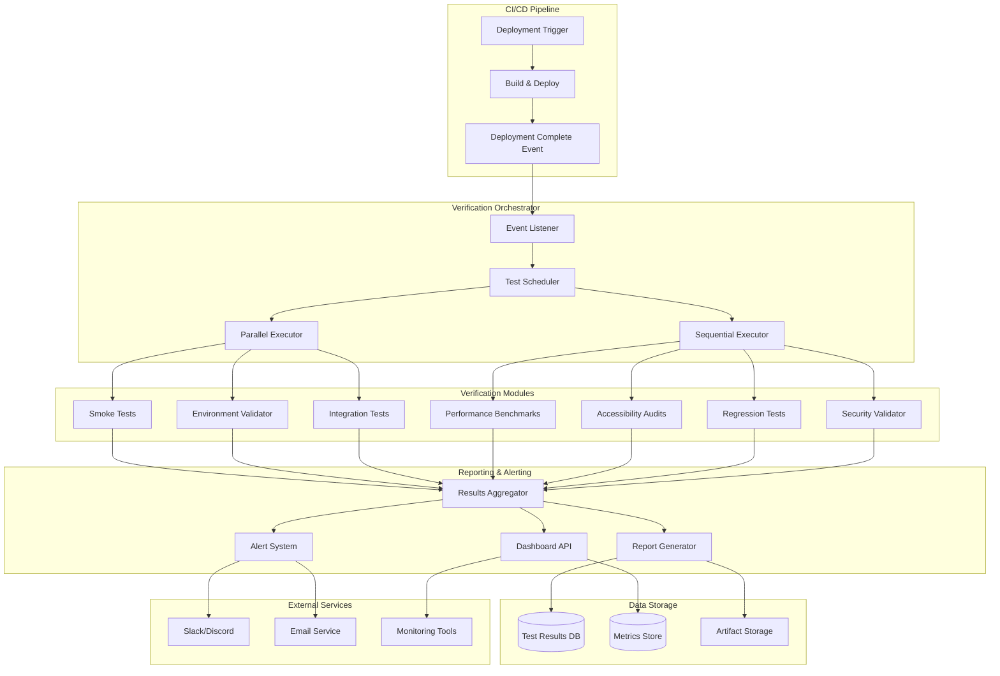
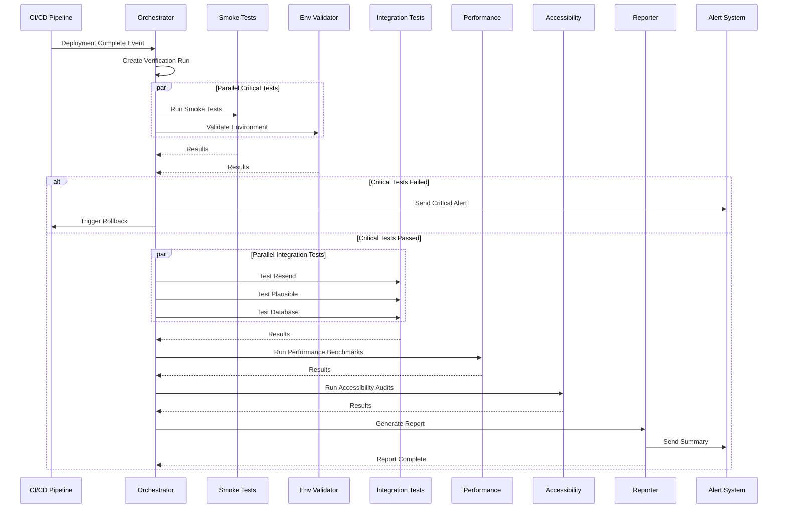

# Design Document

## Overview

The Automated Deployment Verification System is designed as a comprehensive, event-driven testing framework that integrates seamlessly with the CI/CD pipeline. The system follows a modular architecture where independent verification modules can be executed in parallel for fast feedback, while maintaining the ability to run comprehensive sequential tests when needed. The design prioritizes reliability, observability, and actionable feedback, ensuring that deployment issues are detected immediately and communicated clearly to the development team.

### Design Principles

1. **Fail Fast**: Critical tests run first to provide immediate feedback
2. **Parallel Execution**: Independent tests run concurrently to minimize verification time
3. **Idempotent Tests**: Tests can be run multiple times without side effects
4. **Self-Healing**: Automatic cleanup of test data and resources
5. **Observable**: Comprehensive logging and metrics for debugging

## Architecture

### System Architecture Diagram



### Technology Stack

**Core Framework:**

- Node.js / TypeScript - Test execution runtime
- Jest - Test framework and assertion library
- Playwright - Browser automation for E2E tests
- Artillery - Load testing and performance benchmarking

**Verification Tools:**

- axe-core - Accessibility testing
- Lighthouse CI - Performance auditing
- Pa11y - Additional accessibility validation
- OWASP ZAP - Security scanning

**Infrastructure:**

- GitHub Actions / GitLab CI - CI/CD integration
- PostgreSQL - Test results storage
- Redis - Test execution coordination
- S3 / Cloudflare R2 - Artifact storage

**Monitoring & Alerting:**

- Grafana - Visualization dashboard
- Prometheus - Metrics collection
- Slack API - Team notifications
- Resend - Email notifications

## Components and Interfaces

### 1. Verification Orchestrator

**Purpose**: Coordinate test execution and manage workflow

**Key Interfaces:**

```typescript
interface VerificationOrchestrator {
  startVerification(deployment: DeploymentInfo): Promise<VerificationRun>;
  getVerificationStatus(runId: string): Promise<VerificationStatus>;
  cancelVerification(runId: string): Promise<void>;
  retryFailedTests(runId: string): Promise<VerificationRun>;
}

interface DeploymentInfo {
  deploymentId: string;
  environment: 'production' | 'staging' | 'development';
  version: string;
  commitSha: string;
  deployedAt: Date;
  deployedBy: string;
  previousVersion?: string;
}

interface VerificationRun {
  runId: string;
  deploymentId: string;
  status: 'pending' | 'running' | 'passed' | 'failed' | 'cancelled';
  startedAt: Date;
  completedAt?: Date;
  testResults: TestResult[];
  summary: VerificationSummary;
}

interface VerificationSummary {
  totalTests: number;
  passed: number;
  failed: number;
  skipped: number;
  duration: number;
  criticalFailures: string[];
}
```

### 2. Smoke Test Module

**Purpose**: Rapid validation of critical functionality

**Key Interfaces:**

```typescript
interface SmokeTestModule {
  runSmokeTests(deployment: DeploymentInfo): Promise<SmokeTestResult>;
}

interface SmokeTestResult extends TestResult {
  tests: {
    homepageLoad: TestCase;
    apiHealth: TestCase;
    databaseConnectivity: TestCase;
    cacheConnectivity: TestCase;
    criticalEndpoints: TestCase[];
  };
}

interface TestCase {
  name: string;
  status: 'passed' | 'failed' | 'skipped';
  duration: number;
  error?: Error;
  metadata?: Record<string, any>;
}

// Smoke test configuration
const SMOKE_TEST_CONFIG = {
  timeout: 120000, // 2 minutes
  retries: 2,
  criticalEndpoints: [
    { path: '/', method: 'GET', expectedStatus: 200 },
    { path: '/api/health', method: 'GET', expectedStatus: 200 },
    { path: '/api/newsletter', method: 'POST', expectedStatus: 200 },
  ],
};
```

### 3. Environment Validator

**Purpose**: Verify environment configuration

**Key Interfaces:**

```typescript
interface EnvironmentValidator {
  validateEnvironment(environment: string): Promise<ValidationResult>;
  getRequiredVariables(environment: string): EnvironmentVariable[];
}

interface ValidationResult {
  isValid: boolean;
  missingVariables: string[];
  invalidVariables: InvalidVariable[];
  warnings: string[];
}

interface EnvironmentVariable {
  name: string;
  required: boolean;
  format?: 'url' | 'email' | 'api_key' | 'boolean' | 'number';
  validator?: (value: string) => boolean;
  description: string;
}

interface InvalidVariable {
  name: string;
  value: string;
  expectedFormat: string;
  error: string;
}

// Environment variable definitions
const REQUIRED_ENV_VARS: EnvironmentVariable[] = [
  {
    name: 'RESEND_API_KEY',
    required: true,
    format: 'api_key',
    validator: (v) => v.startsWith('re_'),
    description: 'Resend API key for email delivery',
  },
  {
    name: 'RESEND_AUDIENCE_ID',
    required: true,
    format: 'api_key',
    validator: (v) => v.startsWith('aud_'),
    description: 'Resend audience ID for newsletter subscribers',
  },
  {
    name: 'NEXT_PUBLIC_SITE_URL',
    required: true,
    format: 'url',
    description: 'Public URL of the website',
  },
  // ... more variables
];
```

### 4. Integration Test Module

**Purpose**: Validate external service integrations

**Key Interfaces:**

```typescript
interface IntegrationTestModule {
  testResendIntegration(): Promise<IntegrationTestResult>;
  testPlausibleIntegration(): Promise<IntegrationTestResult>;
  testDatabaseIntegration(): Promise<IntegrationTestResult>;
  testCacheIntegration(): Promise<IntegrationTestResult>;
}

interface IntegrationTestResult extends TestResult {
  service: string;
  connectivity: boolean;
  responseTime: number;
  testOperations: TestOperation[];
}

interface TestOperation {
  operation: string;
  success: boolean;
  duration: number;
  error?: Error;
  metadata?: Record<string, any>;
}

// Integration test implementations
class ResendIntegrationTest {
  async testEmailSending(): Promise<TestOperation> {
    const testEmail = `test+${Date.now()}@connectivebyte.com`;
    const startTime = Date.now();

    try {
      await resend.emails.send({
        from: 'info@connectivebyte.com',
        to: testEmail,
        subject: 'Deployment Verification Test',
        html: '<p>This is an automated test email.</p>',
      });

      return {
        operation: 'send_email',
        success: true,
        duration: Date.now() - startTime,
      };
    } catch (error) {
      return {
        operation: 'send_email',
        success: false,
        duration: Date.now() - startTime,
        error: error as Error,
      };
    }
  }

  async testAudienceAccess(): Promise<TestOperation> {
    // Test audience API access
  }
}
```

### 5. Performance Benchmark Module

**Purpose**: Measure and validate performance metrics

**Key Interfaces:**

```typescript
interface PerformanceBenchmarkModule {
  runLighthouseAudit(url: string): Promise<LighthouseResult>;
  measurePageLoadTime(url: string): Promise<PageLoadMetrics>;
  measureAPIPerformance(endpoints: string[]): Promise<APIPerformanceMetrics>;
  compareWithBaseline(
    current: PerformanceMetrics,
    baseline: PerformanceMetrics
  ): PerformanceComparison;
}

interface LighthouseResult {
  performance: number;
  accessibility: number;
  bestPractices: number;
  seo: number;
  pwa: number;
  metrics: {
    firstContentfulPaint: number;
    largestContentfulPaint: number;
    totalBlockingTime: number;
    cumulativeLayoutShift: number;
    speedIndex: number;
  };
}

interface PageLoadMetrics {
  url: string;
  loadTime: number;
  domContentLoaded: number;
  firstPaint: number;
  firstContentfulPaint: number;
  resourceCount: number;
  transferSize: number;
}

interface APIPerformanceMetrics {
  endpoint: string;
  requestCount: number;
  averageResponseTime: number;
  p50: number;
  p95: number;
  p99: number;
  errorRate: number;
}

interface PerformanceComparison {
  improved: string[];
  degraded: string[];
  unchanged: string[];
  significantChanges: PerformanceChange[];
}

interface PerformanceChange {
  metric: string;
  previousValue: number;
  currentValue: number;
  changePercent: number;
  severity: 'critical' | 'warning' | 'info';
}
```

### 6. Accessibility Audit Module

**Purpose**: Validate WCAG compliance

**Key Interfaces:**

```typescript
interface AccessibilityAuditModule {
  runAxeAudit(url: string): Promise<AxeResult>;
  runPa11yAudit(url: string): Promise<Pa11yResult>;
  testKeyboardNavigation(url: string): Promise<KeyboardNavigationResult>;
  validateColorContrast(url: string): Promise<ColorContrastResult>;
}

interface AxeResult {
  url: string;
  violations: AccessibilityViolation[];
  passes: number;
  incomplete: AccessibilityViolation[];
  inapplicable: number;
}

interface AccessibilityViolation {
  id: string;
  impact: 'critical' | 'serious' | 'moderate' | 'minor';
  description: string;
  help: string;
  helpUrl: string;
  nodes: ViolationNode[];
}

interface ViolationNode {
  html: string;
  target: string[];
  failureSummary: string;
}

interface KeyboardNavigationResult {
  allInteractiveElementsReachable: boolean;
  focusOrderCorrect: boolean;
  focusVisibleOnAllElements: boolean;
  issues: KeyboardNavigationIssue[];
}

interface KeyboardNavigationIssue {
  element: string;
  issue: string;
  recommendation: string;
}
```

### 7. Report Generator

**Purpose**: Create comprehensive deployment reports

**Key Interfaces:**

```typescript
interface ReportGenerator {
  generateReport(verificationRun: VerificationRun): Promise<DeploymentReport>;
  exportToPDF(report: DeploymentReport): Promise<Buffer>;
  exportToJSON(report: DeploymentReport): Promise<string>;
  publishToSlack(report: DeploymentReport): Promise<void>;
}

interface DeploymentReport {
  runId: string;
  deployment: DeploymentInfo;
  summary: VerificationSummary;
  sections: ReportSection[];
  screenshots: Screenshot[];
  recommendations: string[];
  generatedAt: Date;
}

interface ReportSection {
  title: string;
  status: 'passed' | 'failed' | 'warning';
  content: string;
  details: Record<string, any>;
  charts?: ChartData[];
}

interface Screenshot {
  url: string;
  path: string;
  timestamp: Date;
  viewport: { width: number; height: number };
}

interface ChartData {
  type: 'line' | 'bar' | 'pie';
  title: string;
  data: any;
}
```

### 8. Alert System

**Purpose**: Notify team of verification failures

**Key Interfaces:**

```typescript
interface AlertSystem {
  sendAlert(alert: Alert): Promise<void>;
  escalateAlert(alertId: string): Promise<void>;
  acknowledgeAlert(alertId: string, acknowledgedBy: string): Promise<void>;
  suppressAlert(alertId: string, duration: number): Promise<void>;
}

interface Alert {
  id: string;
  severity: 'critical' | 'high' | 'medium' | 'low';
  title: string;
  message: string;
  deployment: DeploymentInfo;
  failedTests: string[];
  suggestedActions: string[];
  channels: AlertChannel[];
  createdAt: Date;
}

type AlertChannel = 'slack' | 'email' | 'sms' | 'pagerduty';

interface AlertConfiguration {
  criticalFailures: {
    channels: AlertChannel[];
    escalationMinutes: number;
  };
  performanceDegradation: {
    threshold: number;
    channels: AlertChannel[];
  };
  accessibilityViolations: {
    criticalOnly: boolean;
    channels: AlertChannel[];
  };
}
```

## Data Models

### Database Schema

```sql
-- Verification runs
CREATE TABLE verification_runs (
  id UUID PRIMARY KEY DEFAULT gen_random_uuid(),
  deployment_id VARCHAR(255) NOT NULL,
  environment VARCHAR(50) NOT NULL,
  version VARCHAR(100) NOT NULL,
  commit_sha VARCHAR(40) NOT NULL,
  status VARCHAR(50) NOT NULL,
  started_at TIMESTAMP NOT NULL DEFAULT NOW(),
  completed_at TIMESTAMP,
  deployed_by VARCHAR(255),
  previous_version VARCHAR(100),
  created_at TIMESTAMP DEFAULT NOW()
);

CREATE INDEX idx_verification_runs_deployment ON verification_runs(deployment_id);
CREATE INDEX idx_verification_runs_status ON verification_runs(status);
CREATE INDEX idx_verification_runs_started ON verification_runs(started_at);

-- Test results
CREATE TABLE test_results (
  id UUID PRIMARY KEY DEFAULT gen_random_uuid(),
  run_id UUID REFERENCES verification_runs(id) ON DELETE CASCADE,
  module VARCHAR(100) NOT NULL,
  test_name VARCHAR(255) NOT NULL,
  status VARCHAR(50) NOT NULL,
  duration INTEGER NOT NULL,
  error_message TEXT,
  stack_trace TEXT,
  metadata JSONB,
  created_at TIMESTAMP DEFAULT NOW()
);

CREATE INDEX idx_test_results_run ON test_results(run_id);
CREATE INDEX idx_test_results_status ON test_results(status);
CREATE INDEX idx_test_results_module ON test_results(module);

-- Performance metrics
CREATE TABLE performance_metrics (
  id UUID PRIMARY KEY DEFAULT gen_random_uuid(),
  run_id UUID REFERENCES verification_runs(id) ON DELETE CASCADE,
  metric_type VARCHAR(100) NOT NULL,
  metric_name VARCHAR(255) NOT NULL,
  value DECIMAL(10, 2) NOT NULL,
  unit VARCHAR(50),
  baseline_value DECIMAL(10, 2),
  change_percent DECIMAL(5, 2),
  created_at TIMESTAMP DEFAULT NOW()
);

CREATE INDEX idx_performance_metrics_run ON performance_metrics(run_id);
CREATE INDEX idx_performance_metrics_type ON performance_metrics(metric_type);

-- Accessibility violations
CREATE TABLE accessibility_violations (
  id UUID PRIMARY KEY DEFAULT gen_random_uuid(),
  run_id UUID REFERENCES verification_runs(id) ON DELETE CASCADE,
  url VARCHAR(500) NOT NULL,
  violation_id VARCHAR(100) NOT NULL,
  impact VARCHAR(50) NOT NULL,
  description TEXT NOT NULL,
  help_url VARCHAR(500),
  node_count INTEGER NOT NULL,
  nodes JSONB NOT NULL,
  created_at TIMESTAMP DEFAULT NOW()
);

CREATE INDEX idx_accessibility_violations_run ON accessibility_violations(run_id);
CREATE INDEX idx_accessibility_violations_impact ON accessibility_violations(impact);

-- Alerts
CREATE TABLE alerts (
  id UUID PRIMARY KEY DEFAULT gen_random_uuid(),
  run_id UUID REFERENCES verification_runs(id) ON DELETE CASCADE,
  severity VARCHAR(50) NOT NULL,
  title VARCHAR(255) NOT NULL,
  message TEXT NOT NULL,
  channels JSONB NOT NULL,
  acknowledged_at TIMESTAMP,
  acknowledged_by VARCHAR(255),
  suppressed_until TIMESTAMP,
  created_at TIMESTAMP DEFAULT NOW()
);

CREATE INDEX idx_alerts_run ON alerts(run_id);
CREATE INDEX idx_alerts_severity ON alerts(severity);
CREATE INDEX idx_alerts_acknowledged ON alerts(acknowledged_at);

-- Deployment artifacts
CREATE TABLE deployment_artifacts (
  id UUID PRIMARY KEY DEFAULT gen_random_uuid(),
  run_id UUID REFERENCES verification_runs(id) ON DELETE CASCADE,
  artifact_type VARCHAR(100) NOT NULL,
  file_path VARCHAR(500) NOT NULL,
  file_size INTEGER NOT NULL,
  mime_type VARCHAR(100),
  metadata JSONB,
  created_at TIMESTAMP DEFAULT NOW()
);

CREATE INDEX idx_deployment_artifacts_run ON deployment_artifacts(run_id);
CREATE INDEX idx_deployment_artifacts_type ON deployment_artifacts(artifact_type);
```

## Verification Workflow

### Deployment Verification Flow



## Error Handling

### Error Categories and Responses

```typescript
enum VerificationErrorType {
  CRITICAL_FAILURE = 'critical_failure',
  INTEGRATION_FAILURE = 'integration_failure',
  PERFORMANCE_DEGRADATION = 'performance_degradation',
  ACCESSIBILITY_VIOLATION = 'accessibility_violation',
  TIMEOUT = 'timeout',
  CONFIGURATION_ERROR = 'configuration_error',
}

interface ErrorHandler {
  handleError(error: VerificationError): Promise<ErrorResponse>;
}

interface VerificationError {
  type: VerificationErrorType;
  message: string;
  module: string;
  testName: string;
  stack?: string;
  metadata?: Record<string, any>;
}

interface ErrorResponse {
  shouldRollback: boolean;
  shouldRetry: boolean;
  alertSeverity: 'critical' | 'high' | 'medium' | 'low';
  suggestedActions: string[];
}

// Error handling rules
const ERROR_HANDLING_RULES: Record<VerificationErrorType, ErrorResponse> = {
  [VerificationErrorType.CRITICAL_FAILURE]: {
    shouldRollback: true,
    shouldRetry: false,
    alertSeverity: 'critical',
    suggestedActions: [
      'Review deployment logs',
      'Check environment configuration',
      'Verify external service status',
    ],
  },
  [VerificationErrorType.PERFORMANCE_DEGRADATION]: {
    shouldRollback: false,
    shouldRetry: false,
    alertSeverity: 'high',
    suggestedActions: [
      'Review performance metrics',
      'Check for resource bottlenecks',
      'Consider optimization strategies',
    ],
  },
  // ... more rules
};
```

## Testing Strategy

### Unit Tests

- Test individual verification modules in isolation
- Mock external dependencies (Resend, Plausible, etc.)
- Test error handling and edge cases
- Coverage target: 90%+

### Integration Tests

- Test verification workflow end-to-end
- Use test deployments in staging environment
- Verify alert and reporting systems
- Test rollback mechanisms

### Performance Tests

- Verify verification completes within time limits
- Test parallel execution efficiency
- Measure resource usage
- Ensure scalability for multiple concurrent verifications

## Implementation Phases

### Phase 1: Core Infrastructure (Week 1)

- Verification orchestrator
- Database schema and models
- Basic smoke tests
- Environment validator

### Phase 2: Integration Testing (Week 2)

- Resend integration tests
- Plausible integration tests
- Database and cache tests
- Newsletter E2E test

### Phase 3: Performance & Accessibility (Week 3)

- Lighthouse integration
- axe-core integration
- Performance benchmarking
- Accessibility auditing

### Phase 4: Reporting & Alerting (Week 4)

- Report generator
- Alert system
- Dashboard API
- Slack/email notifications

### Phase 5: Advanced Features (Week 5)

- Automated rollback
- Trend analysis
- Historical comparisons
- Security validation

## Deployment

### CI/CD Integration

```yaml
# GitHub Actions example
name: Deploy and Verify

on:
  push:
    branches: [main]

jobs:
  deploy:
    runs-on: ubuntu-latest
    steps:
      - uses: actions/checkout@v3
      - name: Deploy to Netlify
        run: netlify deploy --prod

  verify:
    needs: deploy
    runs-on: ubuntu-latest
    steps:
      - name: Run Verification Suite
        run: npm run verify:deployment
        env:
          DEPLOYMENT_ID: ${{ github.sha }}
          ENVIRONMENT: production

      - name: Upload Results
        if: always()
        uses: actions/upload-artifact@v3
        with:
          name: verification-results
          path: ./verification-results/

      - name: Rollback on Failure
        if: failure()
        run: netlify rollback
```

## Monitoring and Observability

### Metrics to Track

- Verification success rate
- Average verification duration
- Test failure rates by module
- Performance trend over time
- Accessibility violation trends
- Alert response times

### Dashboards

- Real-time verification status
- Historical test results
- Performance trends
- Accessibility compliance
- Deployment frequency and success rate
