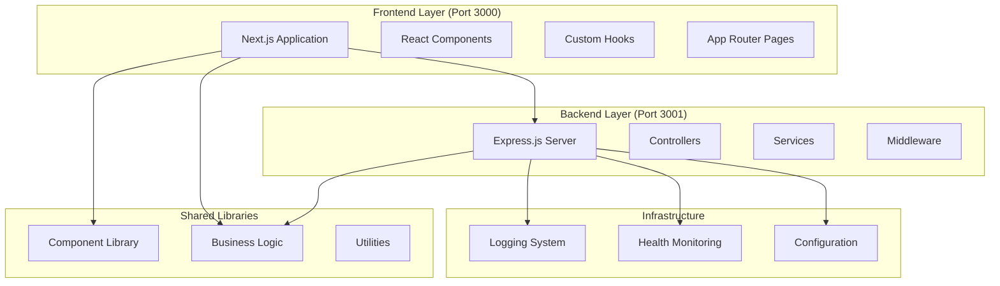
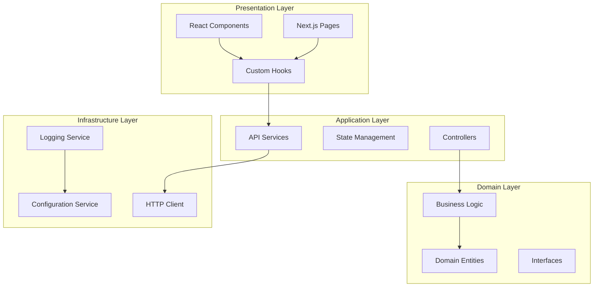
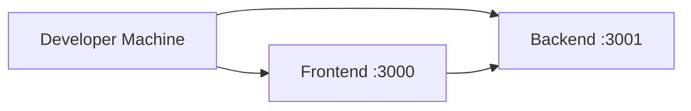
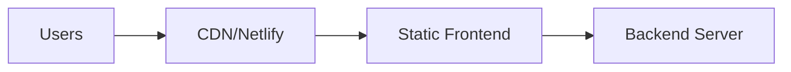

# Design Document

## Overview

ConnectiveByte is designed as a modern, scalable web development platform following clean architecture principles. The system implements a monorepo structure with clear separation between frontend presentation, backend API services, and shared business logic. The architecture emphasizes modularity, testability, and maintainability while providing a seamless development experience.

## Architecture

### High-Level System Architecture



### Clean Architecture Layers



## Components and Interfaces

### Frontend Components

#### 1. Application Structure

- **App Router**: Next.js 15 app directory structure
- **Layout System**: Root layout with global styles and providers
- **Page Components**: Route-specific page implementations
- **Component Library**: Reusable UI components with TypeScript interfaces

#### 2. State Management

- **Custom Hooks**: Encapsulate state logic and side effects
- **API Integration**: Centralized API communication through shared libraries
- **Error Boundaries**: React error boundaries for graceful error handling

#### 3. Styling System

- **Tailwind CSS**: Utility-first CSS framework
- **Component Variants**: Configurable component styles based on state
- **Responsive Design**: Mobile-first responsive implementation

### Backend Components

#### 1. API Layer

```typescript
interface APIController {
  handleRequest(req: Request, res: Response): Promise<void>;
  validateInput(data: unknown): ValidationError[] | null;
  sendSuccess(res: Response, data: any, status?: number): void;
  sendError(res: Response, message: string, status: number): void;
}
```

#### 2. Service Layer

```typescript
interface BusinessService {
  executeOperation<T>(
    operation: () => Promise<T>,
    operationName: string
  ): Promise<ServiceResult<T>>;
  getLogger(): Logger;
}

interface ServiceResult<T> {
  success: boolean;
  data?: T;
  error?: string;
}
```

#### 3. Infrastructure Layer

```typescript
interface LoggingService {
  createLogger(context: string): Logger;
  registerFormatter(name: string, formatter: LogFormatter): void;
  registerTransport(name: string, transport: LogTransport): void;
}

interface HealthService {
  getHealthStatus(): Promise<ServiceResult<HealthStatus>>;
  registerCheck(name: string, check: HealthCheck): void;
  unregisterCheck(name: string): void;
}
```

### Shared Libraries

#### 1. Component Library (`libs/components/`)

```typescript
interface StatusIndicatorProps {
  status: 'loading' | 'success' | 'error' | 'warning';
  message?: string;
  className?: string;
}

interface StatusConfig {
  bg: string;
  text: string;
  icon?: string;
}
```

#### 2. Business Logic Library (`libs/logic/`)

```typescript
interface APIClient {
  fetchWithRetry(url: string, options?: FetchOptions): Promise<Response>;
  get<T>(endpoint: string): Promise<APIResult<T>>;
  post<T>(endpoint: string, data: any): Promise<APIResult<T>>;
}

interface APIResult<T> {
  success: boolean;
  data?: T;
  error?: string;
  status?: number;
}
```

## Data Models

### Health Check Models

```typescript
interface HealthStatus {
  status: 'ok' | 'warning' | 'error';
  timestamp: string;
  uptime: number;
  checks: HealthCheckResult[];
  version: string;
}

interface HealthCheckResult {
  name: string;
  status: 'pass' | 'fail' | 'warn';
  message?: string;
  duration?: number;
}

interface HealthCheck {
  name: string;
  check(): Promise<HealthCheckResult>;
  timeout?: number;
}
```

### API Communication Models

```typescript
interface APIEndpoints {
  health: string;
  root: string;
}

interface FetchOptions {
  retryAttempts?: number;
  retryDelay?: number;
  timeout?: number;
  headers?: Record<string, string>;
}

interface APIConfig {
  baseUrl: string;
  retryAttempts: number;
  retryDelay: number;
  timeout: number;
}
```

### Logging Models

```typescript
interface LogEntry {
  level: 'debug' | 'info' | 'warn' | 'error';
  message: string;
  timestamp: string;
  context: string;
  metadata?: Record<string, any>;
  error?: Error;
}

interface Logger {
  debug(message: string, metadata?: Record<string, any>): void;
  info(message: string, metadata?: Record<string, any>): void;
  warn(message: string, metadata?: Record<string, any>): void;
  error(message: string, error?: Error, metadata?: Record<string, any>): void;
}
```

## Error Handling

### Frontend Error Handling Strategy

#### 1. API Error Handling

```typescript
// Centralized error handling in API layer
async function handleAPICall<T>(apiCall: () => Promise<T>): Promise<APIResult<T>> {
  try {
    const data = await apiCall();
    return { success: true, data };
  } catch (error) {
    console.error('API Error:', error);
    return {
      success: false,
      error: error instanceof Error ? error.message : 'Unknown error',
    };
  }
}
```

#### 2. Component Error Boundaries

```typescript
interface ErrorBoundaryState {
  hasError: boolean;
  error?: Error;
}

class ErrorBoundary extends React.Component<Props, ErrorBoundaryState> {
  static getDerivedStateFromError(error: Error): ErrorBoundaryState {
    return { hasError: true, error };
  }

  componentDidCatch(error: Error, errorInfo: ErrorInfo) {
    console.error('Component Error:', error, errorInfo);
  }
}
```

### Backend Error Handling Strategy

#### 1. Controller Layer Error Handling

```typescript
abstract class BaseController {
  protected async executeAction(
    req: Request,
    res: Response,
    action: (req: Request, res: Response) => Promise<void>
  ): Promise<void> {
    try {
      await action(req, res);
    } catch (error) {
      this.logger.error('Controller error', error);
      this.sendError(res, 'Internal server error', 500);
    }
  }
}
```

#### 2. Service Layer Error Handling

```typescript
abstract class BaseService {
  protected async executeOperation<T>(
    operation: () => Promise<T>,
    operationName: string
  ): Promise<ServiceResult<T>> {
    try {
      const data = await operation();
      return { success: true, data };
    } catch (error) {
      this.logger.error(`Operation ${operationName} failed`, error);
      return {
        success: false,
        error: error instanceof Error ? error.message : 'Unknown error',
      };
    }
  }
}
```

#### 3. Global Error Middleware

```typescript
function errorHandler(err: Error, req: Request, res: Response, next: NextFunction) {
  const isDevelopment = process.env.NODE_ENV === 'development';

  const errorResponse = {
    error: isDevelopment ? err.message : 'Internal server error',
    ...(isDevelopment && { stack: err.stack }),
  };

  res.status(500).json(errorResponse);
}
```

## Testing Strategy

### Frontend Testing Approach

#### 1. Unit Testing (Jest + React Testing Library)

- **Component Testing**: Test component rendering and user interactions
- **Hook Testing**: Test custom hook behavior and state management
- **Utility Testing**: Test pure functions and business logic

#### 2. Integration Testing

- **API Integration**: Test API communication with Mock Service Worker
- **Component Integration**: Test component interactions and data flow

#### 3. End-to-End Testing (Playwright)

- **User Workflows**: Test complete user journeys
- **Cross-browser Testing**: Ensure compatibility across browsers
- **Performance Testing**: Monitor page load times and interactions

### Backend Testing Approach

#### 1. Unit Testing (Jest)

- **Service Testing**: Test business logic in isolation
- **Utility Testing**: Test helper functions and algorithms
- **Model Testing**: Test data validation and transformation

#### 2. Integration Testing (Supertest)

- **API Endpoint Testing**: Test HTTP endpoints with real requests
- **Middleware Testing**: Test request/response processing
- **Database Integration**: Test data persistence (when applicable)

#### 3. Contract Testing

- **API Contract Validation**: Ensure API responses match expected schemas
- **Interface Compliance**: Verify implementations match defined interfaces

### Test Coverage Requirements

- **Backend Services**: > 95% coverage
- **Controllers**: 100% coverage
- **Utilities**: 100% coverage
- **Frontend Components**: > 90% coverage
- **Critical User Paths**: 100% E2E coverage

### Test Data Management

```typescript
interface TestDataFactory {
  createHealthStatus(overrides?: Partial<HealthStatus>): HealthStatus;
  createAPIResponse<T>(data: T, success?: boolean): APIResult<T>;
  createLogEntry(overrides?: Partial<LogEntry>): LogEntry;
}
```

## Performance Considerations

### Frontend Optimizations

- **Code Splitting**: Automatic route-based code splitting with Next.js
- **Image Optimization**: Next.js built-in image optimization
- **Static Generation**: Pre-render pages where possible
- **Bundle Analysis**: Monitor and optimize bundle sizes

### Backend Optimizations

- **Async Operations**: Use async/await for all I/O operations
- **Parallel Execution**: Execute independent operations concurrently
- **Resource Cleanup**: Proper cleanup of resources and connections
- **Caching Strategy**: Implement appropriate caching for static data

### Monitoring and Observability

- **Health Checks**: Comprehensive system health monitoring
- **Structured Logging**: Detailed logging for debugging and monitoring
- **Performance Metrics**: Track response times and system performance
- **Error Tracking**: Centralized error collection and analysis

## Security Considerations

### Input Validation

- **Request Validation**: Validate all incoming requests
- **Type Safety**: Use TypeScript for compile-time type checking
- **Sanitization**: Sanitize user inputs to prevent injection attacks

### Error Information Disclosure

- **Production Error Messages**: Generic error messages in production
- **Development Debugging**: Detailed errors only in development
- **Sensitive Data**: Never log sensitive information

### CORS and Security Headers

- **CORS Configuration**: Proper cross-origin resource sharing setup
- **Security Headers**: Implement security headers for production
- **Environment Variables**: Secure configuration management

## Deployment Architecture

### Development Environment



### Production Environment



### Deployment Strategy

- **Frontend**: Static export deployed to Netlify/Vercel
- **Backend**: Node.js server deployment (containerized)
- **Environment Configuration**: Environment-specific configuration
- **CI/CD Pipeline**: Automated testing and deployment

## Extension Points

### Plugin Architecture

```typescript
interface Plugin {
  name: string;
  version: string;
  initialize(): Promise<void>;
  cleanup(): Promise<void>;
}

interface PluginRegistry {
  register(plugin: Plugin): void;
  unregister(name: string): void;
  getPlugin(name: string): Plugin | undefined;
}
```

### Configuration System

```typescript
interface ConfigurationProvider {
  get<T>(key: string, defaultValue?: T): T;
  set(key: string, value: any): void;
  watch(key: string, callback: (value: any) => void): void;
}
```

### Event System

```typescript
interface EventEmitter {
  on(event: string, listener: (...args: any[]) => void): void;
  emit(event: string, ...args: any[]): void;
  off(event: string, listener: (...args: any[]) => void): void;
}
```

This design provides a solid foundation for building scalable, maintainable web applications while maintaining flexibility for future enhancements and extensions.
