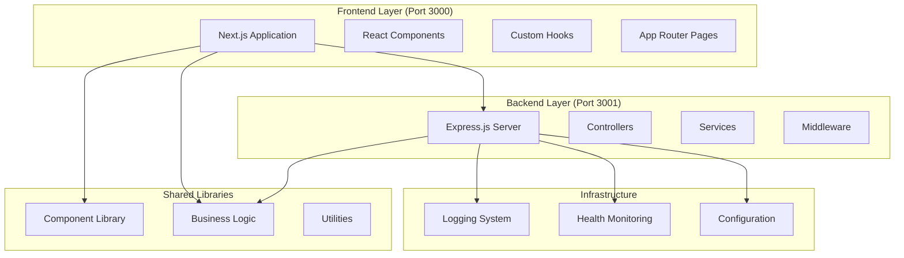
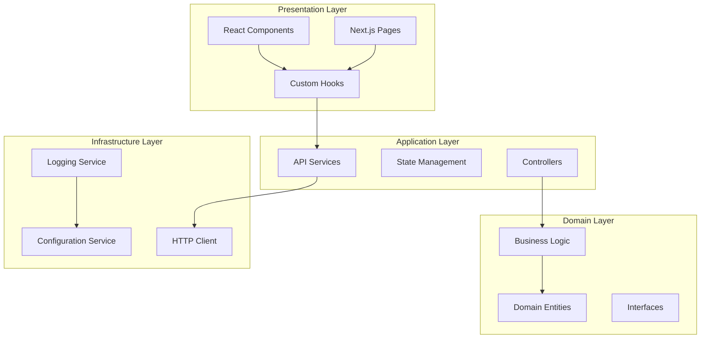

# Design Document

## Overview

ConnectiveByte is designed as a modern, scalable web development platform following clean architecture principles. The system implements a monorepo structure with clear separation between frontend presentation, backend API services, and shared business logic. The architecture emphasizes modularity, testability, and maintainability while providing a seamless development experience.

## Architecture

### Monorepo Workspace Management (Requirement 1.4)

#### Workspace Structure

```
ConnectiveByte/
├── apps/
│   ├── frontend/          # Next.js application
│   ├── backend/           # Express.js API
│   └── bot/              # Future: Chat bot application
├── libs/
│   ├── components/        # Shared React components
│   ├── logic/            # Business logic and utilities
│   └── design/           # Design system definitions
├── package.json          # Root workspace configuration
└── node_modules/         # Shared dependencies
```

#### Workspace Configuration

```json
// Root package.json
{
  "name": "connective-byte-platform",
  "private": true,
  "workspaces": ["apps/*", "libs/*"],
  "scripts": {
    "dev": "concurrently \"npm run dev --workspace=apps/frontend\" \"npm run dev --workspace=apps/backend\"",
    "test": "npm run test --workspaces",
    "build": "npm run build --workspaces"
  }
}
```

**Design Rationale**: NPM workspaces enable efficient dependency management across multiple packages, allowing shared dependencies to be hoisted to the root while maintaining package isolation. This reduces disk space usage and ensures consistent dependency versions across the monorepo.

#### Dependency Management Strategy

- **Shared Dependencies**: Common packages (TypeScript, Jest, ESLint) installed at root
- **Package-Specific Dependencies**: Framework-specific packages (Next.js, Express) in respective apps
- **Version Consistency**: Single source of truth for shared dependency versions
- **Workspace Scripts**: Execute commands across all workspaces or target specific packages

**Benefits**:

- Simplified dependency updates across all packages
- Reduced installation time and disk space
- Easier code sharing between packages
- Consistent tooling configuration

### High-Level System Architecture



### Clean Architecture Layers



### Single Responsibility Principle (Requirement 4.4)

Each module in the architecture has a single, well-defined responsibility:

#### Backend Layer Responsibilities

- **Controllers**: Handle HTTP request/response, input validation, and response formatting
  - Single responsibility: HTTP communication layer
  - No business logic or data access
  - Delegates to services for operations

- **Services**: Implement business logic and orchestrate operations
  - Single responsibility: Business rule implementation
  - No HTTP concerns or data persistence details
  - Uses repositories for data access

- **Middleware**: Handle cross-cutting concerns (logging, error handling, authentication)
  - Single responsibility: Request/response processing
  - Each middleware handles one concern
  - Composable and reusable

- **Repositories**: Manage data access and persistence
  - Single responsibility: Data layer abstraction
  - No business logic
  - Provides clean interface for data operations

#### Frontend Layer Responsibilities

- **Components**: Render UI and handle user interactions
  - Single responsibility: Visual presentation
  - No business logic or API calls
  - Receives data via props

- **Hooks**: Manage state and side effects
  - Single responsibility: State management for specific concern
  - Encapsulates API communication
  - Reusable across components

- **API Services**: Handle HTTP communication with backend
  - Single responsibility: API communication
  - No UI concerns or state management
  - Returns typed data structures

**Design Rationale**: Strict adherence to SRP makes the codebase easier to understand, test, and modify. Each module can be changed independently without affecting others, and responsibilities are clear from the module's name and location in the architecture.

## Components and Interfaces

### Frontend Components

#### 1. Application Structure

- **App Router**: Next.js 15 app directory structure
- **Layout System**: Root layout with global styles and providers
- **Page Components**: Route-specific page implementations
- **Component Library**: Reusable UI components with TypeScript interfaces

#### 2. State Management

- **Custom Hooks**: Encapsulate state logic and side effects
- **API Integration**: Centralized API communication through shared libraries
- **Error Boundaries**: React error boundaries for graceful error handling

#### 3. Styling System

- **Tailwind CSS**: Utility-first CSS framework
- **Component Variants**: Configurable component styles based on state
- **Responsive Design**: Mobile-first responsive implementation

### Backend Components

#### 1. API Layer

```typescript
interface APIController {
  handleRequest(req: Request, res: Response): Promise<void>;
  validateInput(data: unknown): ValidationError[] | null;
  sendSuccess(res: Response, data: any, status?: number): void;
  sendError(res: Response, message: string, status: number): void;
}
```

#### 2. Service Layer

```typescript
interface BusinessService {
  executeOperation<T>(
    operation: () => Promise<T>,
    operationName: string
  ): Promise<ServiceResult<T>>;
  getLogger(): Logger;
}

interface ServiceResult<T> {
  success: boolean;
  data?: T;
  error?: string;
}
```

**Dependency Injection Pattern (Requirement 4.3)**

```typescript
// Base service with logger dependency injection
abstract class BaseService {
  protected logger: Logger;

  constructor(logger: Logger) {
    this.logger = logger;
  }

  protected async executeOperation<T>(
    operation: () => Promise<T>,
    operationName: string
  ): Promise<ServiceResult<T>> {
    this.logger.info(`Starting operation: ${operationName}`);
    try {
      const data = await operation();
      this.logger.info(`Operation ${operationName} completed successfully`);
      return { success: true, data };
    } catch (error) {
      this.logger.error(`Operation ${operationName} failed`, error);
      return {
        success: false,
        error: error instanceof Error ? error.message : 'Unknown error',
      };
    }
  }
}

// Concrete service implementation
class HealthService extends BaseService {
  constructor(logger: Logger) {
    super(logger); // Logger injected via constructor
  }

  async getHealthStatus(): Promise<ServiceResult<HealthStatus>> {
    return this.executeOperation(async () => {
      // Health check logic
      return { status: 'ok', timestamp: new Date().toISOString() };
    }, 'getHealthStatus');
  }
}
```

**Design Rationale**: Constructor-based dependency injection prevents circular dependencies by making dependencies explicit and allowing for easy mocking in tests. Logger instances are created by the logging service and injected into services and controllers, ensuring consistent logging configuration across the application.

#### 3. Infrastructure Layer

```typescript
interface LoggingService {
  createLogger(context: string): Logger;
  registerFormatter(name: string, formatter: LogFormatter): void;
  registerTransport(name: string, transport: LogTransport): void;
}

interface HealthService {
  getHealthStatus(): Promise<ServiceResult<HealthStatus>>;
  registerCheck(name: string, check: HealthCheck): void;
  unregisterCheck(name: string): void;
}
```

### Shared Libraries

#### Design Philosophy: Framework-Agnostic Architecture (Requirement 4.5)

The shared libraries are designed to be framework-agnostic, containing pure business logic and utilities that can be used across different applications and frameworks. This separation ensures:

- **Portability**: Logic can be reused in different contexts (web, mobile, CLI)
- **Testability**: Pure functions are easier to test in isolation
- **Maintainability**: Business logic changes don't require framework-specific updates
- **Flexibility**: Easy migration to different frameworks if needed

#### 1. Component Library (`libs/components/`)

**Purpose**: Reusable UI components that can be imported across applications (Requirement 8.2)

```typescript
interface StatusIndicatorProps {
  status: 'loading' | 'success' | 'error' | 'warning';
  message?: string;
  className?: string;
}

interface StatusConfig {
  bg: string;
  text: string;
  icon?: string;
}
```

**Design Rationale**: Component library provides consistent UI elements across applications, reducing duplication and ensuring visual consistency. Components are designed with composition in mind, allowing flexible customization through props.

#### 2. Business Logic Library (`libs/logic/`)

```typescript
interface APIClient {
  fetchWithRetry(url: string, options?: FetchOptions): Promise<Response>;
  get<T>(endpoint: string): Promise<APIResult<T>>;
  post<T>(endpoint: string, data: any): Promise<APIResult<T>>;
}

interface APIResult<T> {
  success: boolean;
  data?: T;
  error?: string;
  status?: number;
}
```

## Data Models

### Health Check Models

```typescript
interface HealthStatus {
  status: 'ok' | 'warning' | 'error';
  timestamp: string;
  uptime: number;
  checks: HealthCheckResult[];
  version: string;
}

interface HealthCheckResult {
  name: string;
  status: 'pass' | 'fail' | 'warn';
  message?: string;
  duration?: number;
}

interface HealthCheck {
  name: string;
  check(): Promise<HealthCheckResult>;
  timeout?: number;
}
```

### API Communication Models

```typescript
interface APIEndpoints {
  health: string;
  root: string;
}

interface FetchOptions {
  retryAttempts?: number;
  retryDelay?: number;
  timeout?: number;
  headers?: Record<string, string>;
}

interface APIConfig {
  baseUrl: string;
  retryAttempts: number;
  retryDelay: number;
  timeout: number;
}
```

### Logging Models

```typescript
interface LogEntry {
  level: 'debug' | 'info' | 'warn' | 'error';
  message: string;
  timestamp: string;
  context: string;
  metadata?: Record<string, any>;
  error?: Error;
}

interface Logger {
  debug(message: string, metadata?: Record<string, any>): void;
  info(message: string, metadata?: Record<string, any>): void;
  warn(message: string, metadata?: Record<string, any>): void;
  error(message: string, error?: Error, metadata?: Record<string, any>): void;
}
```

### Strategy Pattern for Configurable Algorithms (Requirement 8.3)

#### Log Formatter Strategy

```typescript
interface LogFormatter {
  format(entry: LogEntry): string;
}

class JsonFormatter implements LogFormatter {
  format(entry: LogEntry): string {
    return JSON.stringify(entry);
  }
}

class PrettyFormatter implements LogFormatter {
  format(entry: LogEntry): string {
    return `[${entry.timestamp}] ${entry.level.toUpperCase()}: ${entry.message}`;
  }
}

// Logging service uses strategy pattern
class LoggingService {
  private formatter: LogFormatter;

  setFormatter(formatter: LogFormatter): void {
    this.formatter = formatter;
  }

  log(entry: LogEntry): void {
    const formatted = this.formatter.format(entry);
    console.log(formatted);
  }
}
```

#### Transport Strategy

```typescript
interface LogTransport {
  send(formattedLog: string): Promise<void>;
}

class ConsoleTransport implements LogTransport {
  async send(formattedLog: string): Promise<void> {
    console.log(formattedLog);
  }
}

class FileTransport implements LogTransport {
  constructor(private filePath: string) {}

  async send(formattedLog: string): Promise<void> {
    // Write to file
  }
}

class RemoteTransport implements LogTransport {
  constructor(private endpoint: string) {}

  async send(formattedLog: string): Promise<void> {
    // Send to remote logging service
  }
}
```

**Design Rationale**: Strategy pattern allows runtime selection of algorithms (formatters, transports) without modifying the core logging service. New formatters or transports can be added without changing existing code, adhering to the Open/Closed Principle. This makes the system highly configurable and extensible.

## Error Handling

### Frontend Error Handling Strategy

#### 1. API Error Handling

```typescript
// Centralized error handling in API layer
async function handleAPICall<T>(apiCall: () => Promise<T>): Promise<APIResult<T>> {
  try {
    const data = await apiCall();
    return { success: true, data };
  } catch (error) {
    console.error('API Error:', error);
    return {
      success: false,
      error: error instanceof Error ? error.message : 'Unknown error',
    };
  }
}
```

#### 2. Component Error Boundaries

```typescript
interface ErrorBoundaryState {
  hasError: boolean;
  error?: Error;
}

class ErrorBoundary extends React.Component<Props, ErrorBoundaryState> {
  static getDerivedStateFromError(error: Error): ErrorBoundaryState {
    return { hasError: true, error };
  }

  componentDidCatch(error: Error, errorInfo: ErrorInfo) {
    console.error('Component Error:', error, errorInfo);
  }
}
```

### Backend Error Handling Strategy

#### 1. Controller Layer Error Handling

```typescript
abstract class BaseController {
  protected async executeAction(
    req: Request,
    res: Response,
    action: (req: Request, res: Response) => Promise<void>
  ): Promise<void> {
    try {
      await action(req, res);
    } catch (error) {
      this.logger.error('Controller error', error);
      this.sendError(res, 'Internal server error', 500);
    }
  }
}
```

#### 2. Service Layer Error Handling

```typescript
abstract class BaseService {
  protected async executeOperation<T>(
    operation: () => Promise<T>,
    operationName: string
  ): Promise<ServiceResult<T>> {
    try {
      const data = await operation();
      return { success: true, data };
    } catch (error) {
      this.logger.error(`Operation ${operationName} failed`, error);
      return {
        success: false,
        error: error instanceof Error ? error.message : 'Unknown error',
      };
    }
  }
}
```

#### 3. Global Error Middleware

```typescript
function errorHandler(err: Error, req: Request, res: Response, next: NextFunction) {
  const isDevelopment = process.env.NODE_ENV === 'development';

  const errorResponse = {
    error: isDevelopment ? err.message : 'Internal server error',
    ...(isDevelopment && { stack: err.stack }),
  };

  res.status(500).json(errorResponse);
}
```

## Testing Strategy

### Frontend Testing Approach

#### 1. Unit Testing (Jest + React Testing Library)

- **Component Testing**: Test component rendering and user interactions
- **Hook Testing**: Test custom hook behavior and state management
- **Utility Testing**: Test pure functions and business logic

#### 2. Integration Testing

- **API Integration**: Test API communication with Mock Service Worker
- **Component Integration**: Test component interactions and data flow

#### 3. End-to-End Testing (Playwright)

- **User Workflows**: Test complete user journeys
- **Cross-browser Testing**: Ensure compatibility across browsers
- **Performance Testing**: Monitor page load times and interactions

### Backend Testing Approach

#### 1. Unit Testing (Jest)

- **Service Testing**: Test business logic in isolation
- **Utility Testing**: Test helper functions and algorithms
- **Model Testing**: Test data validation and transformation

#### 2. Integration Testing (Supertest)

- **API Endpoint Testing**: Test HTTP endpoints with real requests
- **Middleware Testing**: Test request/response processing
- **Database Integration**: Test data persistence (when applicable)

#### 3. Contract Testing

- **API Contract Validation**: Ensure API responses match expected schemas
- **Interface Compliance**: Verify implementations match defined interfaces

### Test Coverage Requirements

- **Backend Services**: > 95% coverage
- **Controllers**: 100% coverage
- **Utilities**: 100% coverage
- **Frontend Components**: > 90% coverage
- **Critical User Paths**: 100% E2E coverage

### Test Data Management

```typescript
interface TestDataFactory {
  createHealthStatus(overrides?: Partial<HealthStatus>): HealthStatus;
  createAPIResponse<T>(data: T, success?: boolean): APIResult<T>;
  createLogEntry(overrides?: Partial<LogEntry>): LogEntry;
}
```

## Performance Considerations

### Frontend Optimizations

- **Code Splitting**: Automatic route-based code splitting with Next.js
- **Image Optimization**: Next.js built-in image optimization
- **Static Generation**: Pre-render pages where possible
- **Bundle Analysis**: Monitor and optimize bundle sizes

### Backend Optimizations

- **Async Operations**: Use async/await for all I/O operations
- **Parallel Execution**: Execute independent operations concurrently
- **Resource Cleanup**: Proper cleanup of resources and connections
- **Caching Strategy**: Implement appropriate caching for static data

### Monitoring and Observability

- **Health Checks**: Comprehensive system health monitoring
- **Structured Logging**: Detailed logging for debugging and monitoring
- **Performance Metrics**: Track response times and system performance
- **Error Tracking**: Centralized error collection and analysis

## Security Considerations

### Input Validation

- **Request Validation**: Validate all incoming requests
- **Type Safety**: Use TypeScript for compile-time type checking
- **Sanitization**: Sanitize user inputs to prevent injection attacks

### Error Information Disclosure

- **Production Error Messages**: Generic error messages in production
- **Development Debugging**: Detailed errors only in development
- **Sensitive Data**: Never log sensitive information

### CORS and Security Headers

- **CORS Configuration**: Proper cross-origin resource sharing setup
- **Security Headers**: Implement security headers for production
- **Environment Variables**: Secure configuration management

## Development Workflow and Automation

### Code Quality Automation

#### Automated Formatting (Requirement 5.1)

```typescript
// .prettierrc configuration
{
  "semi": true,
  "trailingComma": "es5",
  "singleQuote": true,
  "printWidth": 100,
  "tabWidth": 2
}
```

**Design Rationale**: Prettier ensures consistent code formatting across the entire codebase, eliminating style debates and reducing cognitive load during code reviews. Automatic formatting on save improves developer productivity.

#### Code Quality Checks (Requirement 5.2)

```typescript
// ESLint configuration with TypeScript
{
  "extends": [
    "next/core-web-vitals",
    "plugin:@typescript-eslint/recommended"
  ],
  "rules": {
    "@typescript-eslint/no-unused-vars": "error",
    "@typescript-eslint/no-explicit-any": "warn"
  }
}
```

**Design Rationale**: ESLint with TypeScript integration catches potential bugs and enforces best practices at development time, preventing issues before they reach production.

#### Git Hooks and Pre-commit Validation (Requirement 5.4)

```bash
# .husky/pre-commit
#!/bin/sh
. "$(dirname "$0")/_/husky.sh"

npm run lint
npm run type-check
```

**Design Rationale**: Git hooks enforce quality gates before code is committed, ensuring that only properly formatted and validated code enters the repository. This prevents broken code from being shared with the team.

#### Conventional Commit Validation (Requirement 5.5)

```javascript
// commitlint.config.js
module.exports = {
  extends: ['@commitlint/config-conventional'],
  rules: {
    'type-enum': [
      2,
      'always',
      ['feat', 'fix', 'docs', 'style', 'refactor', 'test', 'chore', 'perf', 'ci', 'build'],
    ],
  },
};
```

**Design Rationale**: Conventional commits enable automatic changelog generation, semantic versioning, and clear communication of changes. This standardization improves team collaboration and release management.

### Development Environment Configuration

#### Hot Reloading (Requirement 7.3)

**Frontend Hot Reloading**:

- Next.js Fast Refresh for instant component updates
- Preserves component state during edits
- Automatic error recovery and display

**Backend Hot Reloading**:

- ts-node-dev for automatic server restart on file changes
- Preserves process state where possible
- Fast compilation with TypeScript incremental builds

**Design Rationale**: Hot reloading dramatically improves developer productivity by providing instant feedback on code changes without manual server restarts or page refreshes.

#### IntelliSense and Type Safety (Requirement 7.4)

```json
// tsconfig.json - Strict TypeScript configuration
{
  "compilerOptions": {
    "strict": true,
    "noImplicitAny": true,
    "strictNullChecks": true,
    "strictFunctionTypes": true,
    "noUnusedLocals": true,
    "noUnusedParameters": true,
    "noImplicitReturns": true,
    "esModuleInterop": true,
    "skipLibCheck": true,
    "forceConsistentCasingInFileNames": true,
    "paths": {
      "@/components/*": ["./app/components/*"],
      "@/lib/*": ["../../libs/*"]
    }
  }
}
```

**Design Rationale**: Strict TypeScript configuration with path mapping provides comprehensive IntelliSense support, catching errors at compile time and enabling powerful IDE features like auto-completion, refactoring, and inline documentation.

### Concurrent Development Scripts (Requirement 1.5)

```json
// package.json scripts
{
  "scripts": {
    "dev": "concurrently \"npm run dev:frontend\" \"npm run dev:backend\"",
    "dev:frontend": "cd apps/frontend && npm run dev",
    "dev:backend": "cd apps/backend && npm run dev",
    "test": "npm run test:frontend && npm run test:backend",
    "build": "npm run build:frontend && npm run build:backend"
  }
}
```

**Design Rationale**: Concurrent script execution allows developers to start both frontend and backend servers with a single command, simplifying the development workflow and reducing setup friction.

## Deployment Architecture

### Development Environment


### Production Environment


### Independent Deployment Strategy (Requirement 8.4)

#### Frontend Deployment

- **Build Process**: Static export via `next build && next export`
- **Deployment Target**: Netlify, Vercel, or any static hosting
- **Configuration**: Environment variables for API endpoints
- **Rollback**: Git-based rollback via deployment platform
- **Independence**: Can be deployed without backend changes

#### Backend Deployment

- **Build Process**: TypeScript compilation to JavaScript
- **Deployment Target**: Node.js server (containerized or serverless)
- **Configuration**: Environment-specific configuration files
- **Rollback**: Container image versioning or process manager restart
- **Independence**: Can be deployed without frontend changes

**Design Rationale**: Independent deployment allows teams to release frontend and backend changes separately, reducing deployment risk and enabling faster iteration. API versioning ensures backward compatibility during independent deployments.

### Netlify Deployment Configuration (Requirement 5.3)

```toml
# netlify.toml
[build]
  command = "npm run build"
  publish = "apps/frontend/out"

[build.environment]
  NODE_VERSION = "18"

[[redirects]]
  from = "/api/*"
  to = "https://api.connectivebyte.com/:splat"
  status = 200
```

**Design Rationale**: Netlify configuration enables automatic deployment on git push, with proper routing for API requests to the backend server. This simplifies the deployment process and enables continuous delivery.

### CI/CD Pipeline

- **Automated Testing**: Run all tests on pull requests
- **Code Quality Gates**: ESLint and TypeScript checks must pass
- **Automated Deployment**: Deploy on merge to main branch
- **Environment Promotion**: Dev → Staging → Production
- **Rollback Strategy**: Automatic rollback on health check failure

## Extension Points

### Plugin Architecture

```typescript
interface Plugin {
  name: string;
  version: string;
  initialize(): Promise<void>;
  cleanup(): Promise<void>;
}

interface PluginRegistry {
  register(plugin: Plugin): void;
  unregister(name: string): void;
  getPlugin(name: string): Plugin | undefined;
}
```

### Configuration System

```typescript
interface ConfigurationProvider {
  get<T>(key: string, defaultValue?: T): T;
  set(key: string, value: any): void;
  watch(key: string, callback: (value: any) => void): void;
}
```

### Event System

```typescript
interface EventEmitter {
  on(event: string, listener: (...args: any[]) => void): void;
  emit(event: string, ...args: any[]): void;
  off(event: string, listener: (...args: any[]) => void): void;
}
```

## Backward Compatibility Strategy (Requirement 8.5)

### Interface Versioning

```typescript
// Version 1 interface
interface HealthStatusV1 {
  status: 'ok' | 'error';
  timestamp: string;
}

// Version 2 interface (backward compatible)
interface HealthStatusV2 extends HealthStatusV1 {
  uptime?: number; // Optional field maintains compatibility
  checks?: HealthCheckResult[]; // Optional field maintains compatibility
}

// Type alias for current version
type HealthStatus = HealthStatusV2;
```

**Design Rationale**: New fields are added as optional properties, ensuring existing code continues to work. Type aliases allow gradual migration to new versions.

### API Versioning Strategy

```typescript
// Route versioning
app.use('/api/v1/health', healthControllerV1);
app.use('/api/v2/health', healthControllerV2);

// Default to latest version
app.use('/api/health', healthControllerV2);
```

**Design Rationale**: URL-based versioning allows multiple API versions to coexist, enabling gradual client migration without breaking existing integrations.

### Deprecation Process

1. **Announce**: Document deprecated features with migration guide
2. **Warn**: Add runtime warnings for deprecated API usage
3. **Support**: Maintain deprecated features for at least 2 major versions
4. **Remove**: Remove only after sufficient migration period

```typescript
// Deprecation warning example
function deprecatedMethod() {
  console.warn('deprecatedMethod is deprecated. Use newMethod instead.');
  // Still functional
}
```

### Module Extension Guidelines

When adding new modules:

- Use optional parameters for new features
- Provide default implementations for new interfaces
- Maintain existing method signatures
- Add new methods instead of modifying existing ones
- Use feature flags for experimental features

**Design Rationale**: Backward compatibility ensures that updates don't break existing applications, reducing upgrade friction and maintaining trust with developers using the platform.

## Design Principles Summary

This design adheres to the following key principles:

1. **Separation of Concerns**: Clear boundaries between layers and modules
2. **Dependency Inversion**: High-level modules don't depend on low-level modules
3. **Open/Closed Principle**: Open for extension, closed for modification
4. **Single Responsibility**: Each module has one reason to change
5. **Interface Segregation**: Clients depend only on interfaces they use
6. **Don't Repeat Yourself**: Shared libraries eliminate code duplication
7. **Convention Over Configuration**: Sensible defaults with configuration options
8. **Fail Fast**: Early validation and clear error messages
9. **Progressive Enhancement**: Core functionality works, enhancements are optional
10. **Developer Experience First**: Tools and patterns that improve productivity

This design provides a solid foundation for building scalable, maintainable web applications while maintaining flexibility for future enhancements and extensions.
