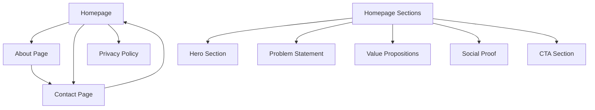

# Design Document

## Overview

The ConnectiveByte Website is a modern, performant corporate marketing site built on the existing ConnectiveByte platform infrastructure. The design implements a dual-layer content strategy: a practical B1 layer for business-focused visitors seeking AI collaboration training, and a subtle intellectual layer for those interested in the philosophical foundations of collective intelligence. The site prioritizes clarity, performance, and conversion while maintaining visual sophistication that reflects the brand's innovative positioning.

## Architecture

### Site Structure

```
ConnectiveByte Website/
├── / (Homepage)
│   ├── Hero Section
│   ├── Problem Statement
│   ├── Value Propositions
│   ├── Social Proof
│   └── CTA Section
├── /about
│   ├── Company Story
│   ├── Philosophy (Third Reality)
│   └── Team/Vision
├── /services (Optional for Phase 2)
│   └── Service Details
├── /contact
│   ├── Consultation Form
│   └── Contact Information
└── /privacy
    └── Privacy Policy
```

**Design Rationale**: Minimal page structure (3-4 pages) reduces complexity and focuses user attention on the primary conversion goal: consultation signup. The homepage consolidates most information to minimize navigation friction.

### Technology Stack

#### Frontend Framework (Requirement 1, 5, 7)

- **Next.js 15**: Leverages existing platform infrastructure
- **React 19**: Component-based architecture for reusability
- **TypeScript**: Type safety and developer experience
- **Tailwind CSS**: Utility-first styling for rapid development
- **Framer Motion**: Smooth animations and transitions

**Design Rationale**: Building on the existing Next.js platform ensures consistency, reduces setup time, and leverages proven infrastructure. Tailwind CSS enables rapid prototyping while maintaining design consistency through utility classes.

#### Additional Libraries

- **React Hook Form**: Efficient form management with validation (Requirement 4)
- **Zod**: Schema validation for form inputs (Requirement 4)
- **Lucide React**: Consistent icon system
- **next-seo**: SEO optimization utilities (Requirement 9)

### Information Architecture (Requirement 8)



**Design Rationale**: Flat hierarchy minimizes clicks to conversion. All critical information is accessible within 2 clicks from any page.

## Components and Interfaces

### Design System (Requirement 1, 2, 3)

#### Color Palette

```typescript
// Brand Colors - Based on ConnectiveByte brand guidelines
const colors = {
  primary: {
    deepBlue: '#1e3a8a', // Trust, intelligence, depth
    techGreen: '#10b981', // Innovation, growth, future
  },
  accent: {
    brightOrange: '#f97316', // Energy, creativity, action
    vividPurple: '#a855f7', // Innovation, transformation
  },
  neutral: {
    50: '#f9fafb', // Backgrounds
    100: '#f3f4f6', // Subtle backgrounds
    200: '#e5e7eb', // Borders
    600: '#4b5563', // Secondary text
    900: '#111827', // Primary text
  },
  semantic: {
    success: '#10b981',
    warning: '#f59e0b',
    error: '#ef4444',
    info: '#3b82f6',
  },
};
```

**Design Rationale**: Deep blue conveys trust and professionalism for B1 layer visitors, while accent colors (orange, purple) suggest innovation and creativity. The palette balances corporate credibility with forward-thinking energy.

#### Typography

```typescript
// Font System
const typography = {
  fonts: {
    heading: "'Inter', 'Noto Sans JP', sans-serif",
    body: "'Inter', 'Noto Sans JP', sans-serif",
  },
  sizes: {
    hero: '3.5rem', // 56px - Homepage hero
    h1: '2.5rem', // 40px - Page titles
    h2: '2rem', // 32px - Section headings
    h3: '1.5rem', // 24px - Subsections
    body: '1rem', // 16px - Body text
    small: '0.875rem', // 14px - Captions
  },
  weights: {
    bold: 700, // Headings, emphasis
    semibold: 600, // Subheadings
    normal: 400, // Body text
  },
  lineHeight: {
    tight: 1.2, // Headings
    normal: 1.5, // UI elements
    relaxed: 1.7, // Body text
  },
};
```

**Design Rationale**: Inter provides excellent readability at all sizes and conveys modern professionalism. Generous line height (1.7) improves readability for longer content sections.

#### Spacing System

```typescript
// Consistent spacing scale (Tailwind default)
const spacing = {
  xs: '0.5rem', // 8px
  sm: '1rem', // 16px
  md: '1.5rem', // 24px
  lg: '2rem', // 32px
  xl: '3rem', // 48px
  '2xl': '4rem', // 64px
  '3xl': '6rem', // 96px
};
```

### Component Library

#### 1. Hero Component (Requirement 1)

```typescript
interface HeroProps {
  headline: string;
  subheadline: string;
  ctaText: string;
  ctaLink: string;
  backgroundImage?: string;
  variant?: 'default' | 'minimal' | 'gradient';
}

// Features:
// - Full viewport height on desktop, auto on mobile
// - Animated text entrance (fade + slide up)
// - Prominent CTA button with hover effects
// - Optional background image with overlay
// - Responsive typography scaling
```

**Design Rationale**: Hero component captures attention immediately and communicates value within 3 seconds. Animation draws eye to key message without being distracting.

#### 2. Problem Card Component (Requirement 2)

```typescript
interface ProblemCardProps {
  icon: ReactNode;
  title: string;
  description: string;
  index: number;
}

// Features:
// - Icon with accent color
// - Clear problem statement
// - Staggered animation on scroll
// - Hover effect for engagement
```

#### 3. Value Proposition Card (Requirement 2)

```typescript
interface ValueCardProps {
  icon: ReactNode;
  title: string; // "Connect" | "Active" | "Collective"
  description: string;
  benefits: string[];
  variant: 'connect' | 'active' | 'collective';
}

// Features:
// - Color-coded by variant (blue/green/orange)
// - Expandable details on interaction
// - Visual hierarchy emphasizing title
// - Benefit list with checkmarks
```

#### 4. Contact Form Component (Requirement 4)

```typescript
interface ContactFormProps {
  onSubmit: (data: ContactFormData) => Promise<void>;
  variant?: 'inline' | 'page';
}

interface ContactFormData {
  name: string;
  email: string;
  message: string;
  consent: boolean;
}

// Features:
// - Real-time validation with Zod schema
// - Error messages inline with fields
// - Loading state during submission
// - Success/error feedback
// - Accessible form labels and ARIA attributes
```

**Validation Schema**:

```typescript
const contactSchema = z.object({
  name: z.string().min(2, 'Name must be at least 2 characters'),
  email: z.string().email('Please enter a valid email'),
  message: z.string().min(10, 'Message must be at least 10 characters'),
  consent: z.boolean().refine((val) => val === true, 'You must agree to continue'),
});
```

#### 5. Navigation Component (Requirement 5, 8)

```typescript
interface NavigationProps {
  currentPath: string;
  variant: 'desktop' | 'mobile';
}

// Features:
// - Sticky header on scroll
// - Mobile hamburger menu
// - Active page highlighting
// - Smooth scroll to sections
// - Logo with link to home
```

**Design Rationale**: Sticky navigation ensures CTA is always accessible. Mobile menu uses slide-in drawer pattern for familiarity.

#### 6. Footer Component (Requirement 8)

```typescript
interface FooterProps {
  companyInfo: CompanyInfo;
  socialLinks: SocialLink[];
  legalLinks: LegalLink[];
}

// Features:
// - Company information and tagline
// - Social media links with icons
// - Legal links (Privacy Policy, Terms)
// - Newsletter signup (optional Phase 2)
// - Subtle philosophical tagline
```

#### 7. CTA Section Component (Requirement 1, 4)

```typescript
interface CTASectionProps {
  headline: string;
  description: string;
  primaryCTA: CTAButton;
  secondaryCTA?: CTAButton;
  variant: 'default' | 'gradient' | 'minimal';
}

// Features:
// - Eye-catching background (gradient or solid)
// - Clear value statement
// - Primary and optional secondary CTA
// - Responsive layout
```

#### 8. Social Proof Component (Requirement 2)

```typescript
interface SocialProofProps {
  participantCount: number;
  testimonials?: Testimonial[];
  stats?: Stat[];
}

// Features:
// - Animated counter for participant count
// - "Version 0" program badge
// - Optional testimonial carousel (Phase 2)
// - Trust indicators
```

## Data Models

### Content Structure (Requirement 6)

```typescript
// Homepage Content
interface HomepageContent {
  hero: {
    headline: string;
    subheadline: string;
    ctaText: string;
    ctaLink: string;
  };
  problems: ProblemCard[];
  values: ValueCard[];
  socialProof: {
    participantCount: number;
    programName: string;
    description: string;
  };
  finalCTA: {
    headline: string;
    description: string;
    steps: string[];
  };
}

// About Page Content
interface AboutContent {
  introduction: string;
  philosophy: {
    title: string;
    description: string;
    concepts: PhilosophyConcept[];
  };
  vision: string;
}

// Contact Page Content
interface ContactContent {
  headline: string;
  description: string;
  formConfig: FormConfiguration;
}
```

**Design Rationale**: Separating content from components enables easy updates without code changes. Content can be stored in JSON/YAML files or eventually migrated to a CMS.

## Page Designs

### Homepage Design (Requirements 1, 2, 3)

#### Section 1: Hero Section

**Layout**:

- Full viewport height on desktop (min-height: 100vh)
- Centered content with max-width: 1200px
- Background: Gradient (deep blue to tech green) or subtle network pattern
- Z-index layering: Background < Overlay < Content

**Content**:

- Headline: "個を超え、知が立ち上がる場所" (Large, bold, animated entrance)
- Subheadline: "AI時代の知的共創圏 ConnectiveByte" (Medium, lighter weight)
- CTA Button: "無料相談に申し込む" (Prominent, bright orange, hover animation)

**Animations**:

- Headline: Fade in + slide up (0.6s delay)
- Subheadline: Fade in + slide up (0.8s delay)
- CTA: Fade in + scale (1.0s delay)

#### Section 2: Problem Statement

**Layout**:

- 3-column grid on desktop, 1-column on mobile
- White/light gray background
- Padding: 4rem vertical, 2rem horizontal

**Content**:

- Section heading: "AI時代、1人で戦うのは限界"
- 3 Problem Cards:
  1. "個人完結型では疲弊するだけ"
  2. "思考プロセスを言語化できない"
  3. "協働による成果拡大ができない"

**Visual Treatment**:

- Each card has icon, title, short description
- Subtle shadow on hover
- Staggered fade-in on scroll

#### Section 3: Value Propositions

**Layout**:

- 3-column grid on desktop, 1-column on mobile
- Alternating background color (light gray)
- Padding: 4rem vertical

**Content**:

- Section heading: "接続可能な人材になる、3つの価値"
- 3 Value Cards:
  1. **Connect** (Blue): "思考を言語化し、他者と接続する"
  2. **Active** (Green): "AIと協働し、創造性を拡張する"
  3. **Collective** (Orange): "集合知を生み出し、価値を創造する"

**Visual Treatment**:

- Color-coded borders/accents
- Icon at top
- Benefit list with checkmarks
- Hover effect: slight lift + shadow

#### Section 4: Social Proof

**Layout**:

- Centered content, max-width: 800px
- White background
- Padding: 3rem vertical

**Content**:

- Badge: "Version 0 参加者募集中"
- Participant count: Animated counter (e.g., "10名が参加")
- Brief description of program

**Visual Treatment**:

- Badge with accent color background
- Large number display with animation
- Subtle background pattern

#### Section 5: Final CTA

**Layout**:

- Full-width section
- Gradient background (orange to purple)
- Centered content, max-width: 800px
- Padding: 4rem vertical

**Content**:

- Heading: "まずは無料相談から"
- 3-step process:
  1. "フォームから申し込み"
  2. "オンライン面談（30分）"
  3. "プログラム参加"
- Large CTA button: "無料相談に申し込む"

**Visual Treatment**:

- White text on gradient background
- Step numbers in circles
- CTA button with white background, brand color text

### About Page Design (Requirement 3)

**Layout**:

- Single column, max-width: 800px
- Generous line spacing for readability
- Padding: 2rem horizontal

**Sections**:

1. **Introduction**: Company story and mission
2. **Philosophy**: "第三の実在" concept explained accessibly
3. **Vision**: Future direction and goals

**Content Strategy**:

- 70% practical (what we do, how we help)
- 30% philosophical (why it matters, deeper meaning)
- Avoid jargon, use concrete examples
- Include visual diagrams if helpful

**Visual Treatment**:

- Clean, minimal design
- Ample whitespace
- Pull quotes for key concepts
- Subtle accent colors for emphasis

### Contact Page Design (Requirement 4)

**Layout**:

- Two-column on desktop: Form (60%) + Info (40%)
- Single column on mobile: Info then Form
- Max-width: 1200px
- Padding: 2rem

**Left Column - Form**:

- Heading: "無料相談のお申し込み"
- Form fields:
  - Name (required)
  - Email (required)
  - Message/Inquiry (required, textarea)
  - Consent checkbox (required)
- Submit button: "送信する"
- Success/error messages

**Right Column - Information**:

- Contact details (if applicable)
- What to expect from consultation
- Response time expectations
- FAQ (optional)

**Visual Treatment**:

- Form fields with clear labels
- Inline validation messages
- Loading spinner on submit
- Success animation on completion

### Privacy Policy Page

**Layout**:

- Single column, max-width: 800px
- Standard legal document formatting
- Table of contents for long content

**Content**:

- Data collection practices
- Usage of information
- Third-party services
- User rights
- Contact information

## Responsive Design Strategy (Requirement 5)

### Breakpoints

```typescript
const breakpoints = {
  mobile: '320px', // Small phones
  tablet: '768px', // Tablets
  desktop: '1024px', // Desktop
  wide: '1280px', // Wide desktop
};
```

### Mobile-First Approach

**Base Styles (Mobile)**:

- Single column layouts
- Larger touch targets (min 44x44px)
- Simplified navigation (hamburger menu)
- Reduced font sizes
- Stacked sections

**Tablet Adjustments**:

- 2-column grids where appropriate
- Larger typography
- More whitespace
- Expanded navigation

**Desktop Enhancements**:

- 3-column grids
- Hover effects
- Larger hero sections
- Side-by-side layouts

## Performance Optimization (Requirement 7)

### Image Optimization

```typescript
// Next.js Image component configuration
const imageConfig = {
  formats: ['image/avif', 'image/webp'],
  deviceSizes: [640, 750, 828, 1080, 1200, 1920],
  imageSizes: [16, 32, 48, 64, 96, 128, 256, 384],
  minimumCacheTTL: 60,
};
```

**Strategies**:

- Use Next.js Image component for automatic optimization
- Lazy load images below the fold
- Provide appropriate sizes for different viewports
- Use modern formats (WebP, AVIF) with fallbacks
- Compress images before upload (target: <100KB per image)

### Code Splitting

- Automatic route-based code splitting via Next.js
- Dynamic imports for heavy components
- Separate vendor bundles
- Tree shaking for unused code

### Bundle Optimization

**Target Sizes**:

- Initial JS bundle: <150KB gzipped
- Initial CSS: <30KB gzipped
- Total initial load: <200KB

**Techniques**:

- Remove unused Tailwind classes (PurgeCSS)
- Minimize third-party dependencies
- Use lightweight alternatives where possible
- Defer non-critical JavaScript

### Caching Strategy

```typescript
// Next.js cache headers
const cacheConfig = {
  static: 'public, max-age=31536000, immutable',
  dynamic: 'public, max-age=0, must-revalidate',
  api: 'no-cache, no-store, must-revalidate',
};
```

## SEO Implementation (Requirement 9)

### Meta Tags Structure

```typescript
interface PageMeta {
  title: string;
  description: string;
  keywords: string[];
  ogImage: string;
  ogType: 'website' | 'article';
  twitterCard: 'summary' | 'summary_large_image';
}

// Example for homepage
const homepageMeta: PageMeta = {
  title: 'ConnectiveByte - AI時代の知的共創圏',
  description: '個を超え、知が立ち上がる場所。AI協働スキルを体系的に学び、接続可能な人材になる。',
  keywords: ['AI協働', '知的共創', 'コラボレーション', 'スキル開発'],
  ogImage: '/images/og-image.jpg',
  ogType: 'website',
  twitterCard: 'summary_large_image',
};
```

### Semantic HTML Structure

```html
<!-- Example homepage structure -->
<html lang="ja">
  <head>
    <!-- Meta tags -->
  </head>
  <body>
    <header>
      <nav aria-label="Main navigation">
        <!-- Navigation links -->
      </nav>
    </header>

    <main>
      <section aria-labelledby="hero-heading">
        <h1 id="hero-heading"><!-- Hero headline --></h1>
      </section>

      <section aria-labelledby="problems-heading">
        <h2 id="problems-heading"><!-- Section heading --></h2>
      </section>

      <!-- Additional sections -->
    </main>

    <footer>
      <!-- Footer content -->
    </footer>
  </body>
</html>
```

### Structured Data

```typescript
// JSON-LD for organization
const organizationSchema = {
  '@context': 'https://schema.org',
  '@type': 'Organization',
  name: 'ConnectiveByte',
  url: 'https://connectivebyte.com',
  logo: 'https://connectivebyte.com/logo.png',
  description: 'AI時代の知的共創圏',
  sameAs: ['https://twitter.com/connectivebyte', 'https://threads.net/@connectivebyte'],
};
```

## Accessibility Implementation (Requirement 10)

### WCAG 2.1 Level AA Compliance

#### Color Contrast

```typescript
// Ensure minimum contrast ratios
const contrastRatios = {
  normalText: 4.5, // 4.5:1 minimum
  largeText: 3.0, // 3:1 minimum (18pt+ or 14pt+ bold)
  uiComponents: 3.0, // 3:1 minimum
};

// Verified color combinations
const accessiblePairs = [
  { bg: '#1e3a8a', fg: '#ffffff' }, // Deep blue + white (7.2:1)
  { bg: '#ffffff', fg: '#111827' }, // White + dark gray (16.1:1)
  { bg: '#f97316', fg: '#ffffff' }, // Orange + white (4.8:1)
];
```

#### Keyboard Navigation

**Requirements**:

- All interactive elements accessible via Tab key
- Visible focus indicators (outline or custom styling)
- Logical tab order following visual flow
- Skip-to-content link for screen readers
- Escape key closes modals/menus

**Implementation**:

```typescript
// Focus management for modal
const Modal = ({ isOpen, onClose, children }) => {
  useEffect(() => {
    if (isOpen) {
      // Trap focus within modal
      const focusableElements = modalRef.current.querySelectorAll(
        'button, [href], input, select, textarea, [tabindex]:not([tabindex="-1"])'
      );
      // Focus first element
      focusableElements[0]?.focus();
    }
  }, [isOpen]);

  // Handle Escape key
  useEffect(() => {
    const handleEscape = (e) => {
      if (e.key === 'Escape' && isOpen) onClose();
    };
    document.addEventListener('keydown', handleEscape);
    return () => document.removeEventListener('keydown', handleEscape);
  }, [isOpen, onClose]);
};
```

#### ARIA Labels and Roles

```typescript
// Navigation component
<nav aria-label="Main navigation">
  <ul role="list">
    <li><a href="/" aria-current="page">Home</a></li>
    <li><a href="/about">About</a></li>
    <li><a href="/contact">Contact</a></li>
  </ul>
</nav>

// Form component
<form aria-labelledby="contact-form-heading">
  <h2 id="contact-form-heading">Contact Us</h2>

  <label htmlFor="name">
    Name <span aria-label="required">*</span>
  </label>
  <input
    id="name"
    type="text"
    required
    aria-required="true"
    aria-invalid={errors.name ? 'true' : 'false'}
    aria-describedby={errors.name ? 'name-error' : undefined}
  />
  {errors.name && (
    <span id="name-error" role="alert" className="error">
      {errors.name.message}
    </span>
  )}
</form>

// Button with loading state
<button
  type="submit"
  disabled={isLoading}
  aria-busy={isLoading}
  aria-live="polite"
>
  {isLoading ? 'Sending...' : 'Submit'}
</button>
```

#### Screen Reader Considerations

- Descriptive alt text for all images
- Skip-to-content link at page top
- Landmark regions (header, nav, main, footer)
- Live regions for dynamic content updates
- Hidden text for icon-only buttons

```typescript
// Skip to content link
<a href="#main-content" className="skip-link">
  Skip to main content
</a>

// Icon button with accessible label
<button aria-label="Open menu" className="menu-button">
  <MenuIcon aria-hidden="true" />
</button>

// Live region for form feedback
<div role="status" aria-live="polite" aria-atomic="true">
  {submitMessage}
</div>
```

## Content Management Strategy (Requirement 6)

### Content File Structure

```typescript
// content/homepage.json
{
  "hero": {
    "headline": "個を超え、知が立ち上がる場所",
    "subheadline": "AI時代の知的共創圏 ConnectiveByte",
    "ctaText": "無料相談に申し込む",
    "ctaLink": "/contact"
  },
  "problems": [
    {
      "icon": "user-x",
      "title": "個人完結型では疲弊するだけ",
      "description": "一人で全てを抱え込む働き方は限界に達しています。"
    }
    // ... more problems
  ],
  "values": [
    {
      "id": "connect",
      "icon": "link",
      "title": "Connect",
      "description": "思考を言語化し、他者と接続する",
      "benefits": [
        "思考プロセスの可視化",
        "効果的なコミュニケーション",
        "知識の共有と蓄積"
      ]
    }
    // ... more values
  ]
}
```

### Content Update Process

**For Non-Technical Users**:

1. Edit JSON files in `/content` directory
2. Validate JSON syntax (use online validator)
3. Commit changes to Git
4. Automatic deployment via CI/CD

**For Future CMS Integration**:

- Structure supports easy migration to headless CMS
- Content types map to CMS content models
- API layer can be added without component changes

### Environment-Specific Content

```typescript
// config/site.ts
export const siteConfig = {
  name: 'ConnectiveByte',
  description: 'AI時代の知的共創圏',
  url: process.env.NEXT_PUBLIC_SITE_URL || 'https://connectivebyte.com',
  ogImage: '/images/og-image.jpg',
  links: {
    twitter: 'https://twitter.com/connectivebyte',
    threads: 'https://threads.net/@connectivebyte',
  },
  contact: {
    email: process.env.NEXT_PUBLIC_CONTACT_EMAIL,
  },
};
```

## Form Handling (Requirement 4)

### Form Submission Options

#### Option 1: Google Forms Embed (Fastest MVP)

```typescript
// Embed Google Form in iframe
<iframe
  src="https://docs.google.com/forms/d/e/[FORM_ID]/viewform?embedded=true"
  width="100%"
  height="800"
  frameBorder="0"
  marginHeight={0}
  marginWidth={0}
>
  Loading…
</iframe>
```

**Pros**: Zero backend code, immediate functionality
**Cons**: Less control over styling, Google branding

#### Option 2: Custom Form with Email Service (Recommended)

```typescript
// Using Resend or similar service
import { Resend } from 'resend';

const resend = new Resend(process.env.RESEND_API_KEY);

export async function POST(request: Request) {
  const { name, email, message } = await request.json();

  // Validate with Zod
  const result = contactSchema.safeParse({ name, email, message });
  if (!result.success) {
    return Response.json({ error: result.error }, { status: 400 });
  }

  // Send email
  await resend.emails.send({
    from: 'contact@connectivebyte.com',
    to: 'info@connectivebyte.com',
    subject: `New consultation request from ${name}`,
    html: `
      <h2>New Consultation Request</h2>
      <p><strong>Name:</strong> ${name}</p>
      <p><strong>Email:</strong> ${email}</p>
      <p><strong>Message:</strong></p>
      <p>${message}</p>
    `,
  });

  return Response.json({ success: true });
}
```

**Pros**: Full control, professional appearance, data ownership
**Cons**: Requires API key and minimal backend code

### Form Validation Strategy

```typescript
// Zod schema with Japanese error messages
const contactSchema = z.object({
  name: z
    .string()
    .min(2, 'お名前は2文字以上で入力してください')
    .max(50, 'お名前は50文字以内で入力してください'),
  email: z.string().email('有効なメールアドレスを入力してください'),
  message: z
    .string()
    .min(10, 'メッセージは10文字以上で入力してください')
    .max(1000, 'メッセージは1000文字以内で入力してください'),
  consent: z.boolean().refine((val) => val === true, 'プライバシーポリシーに同意してください'),
});

// React Hook Form integration
const {
  register,
  handleSubmit,
  formState: { errors, isSubmitting },
  reset,
} = useForm<ContactFormData>({
  resolver: zodResolver(contactSchema),
});
```

## Animation Strategy

### Scroll Animations

```typescript
// Using Framer Motion
import { motion } from 'framer-motion';

const fadeInUp = {
  initial: { opacity: 0, y: 20 },
  animate: { opacity: 1, y: 0 },
  transition: { duration: 0.6 },
};

const staggerChildren = {
  animate: {
    transition: {
      staggerChildren: 0.1,
    },
  },
};

// Usage
<motion.div
  initial="initial"
  whileInView="animate"
  viewport={{ once: true, margin: "-100px" }}
  variants={fadeInUp}
>
  {/* Content */}
</motion.div>
```

### Interaction Animations

```typescript
// Button hover effects
const buttonVariants = {
  rest: { scale: 1 },
  hover: { scale: 1.05 },
  tap: { scale: 0.95 },
};

<motion.button
  variants={buttonVariants}
  initial="rest"
  whileHover="hover"
  whileTap="tap"
>
  Click me
</motion.button>
```

**Animation Principles**:

- Subtle and purposeful (not distracting)
- Enhance user understanding
- Respect prefers-reduced-motion
- Performance-optimized (GPU-accelerated properties)

```typescript
// Respect user preferences
const prefersReducedMotion = useReducedMotion();

<motion.div
  animate={prefersReducedMotion ? {} : { opacity: 1, y: 0 }}
>
  {/* Content */}
</motion.div>
```

## Testing Strategy

### Component Testing

```typescript
// Example: Hero component test
describe('Hero Component', () => {
  it('renders headline and CTA', () => {
    render(
      <Hero
        headline="Test Headline"
        subheadline="Test Subheadline"
        ctaText="Click Here"
        ctaLink="/contact"
      />
    );

    expect(screen.getByText('Test Headline')).toBeInTheDocument();
    expect(screen.getByRole('link', { name: 'Click Here' })).toHaveAttribute('href', '/contact');
  });

  it('is accessible', async () => {
    const { container } = render(<Hero {...props} />);
    const results = await axe(container);
    expect(results).toHaveNoViolations();
  });
});
```

### E2E Testing Scenarios

```typescript
// Playwright test for contact form
test('user can submit contact form', async ({ page }) => {
  await page.goto('/contact');

  await page.fill('input[name="name"]', 'Test User');
  await page.fill('input[name="email"]', 'test@example.com');
  await page.fill('textarea[name="message"]', 'This is a test message');
  await page.check('input[name="consent"]');

  await page.click('button[type="submit"]');

  await expect(page.locator('.success-message')).toBeVisible();
});

// Visual regression test
test('homepage matches snapshot', async ({ page }) => {
  await page.goto('/');
  await expect(page).toHaveScreenshot('homepage.png');
});
```

### Performance Testing

```typescript
// Lighthouse CI configuration
module.exports = {
  ci: {
    collect: {
      url: [
        'http://localhost:3000/',
        'http://localhost:3000/about',
        'http://localhost:3000/contact',
      ],
      numberOfRuns: 3,
    },
    assert: {
      assertions: {
        'categories:performance': ['error', { minScore: 0.9 }],
        'categories:accessibility': ['error', { minScore: 0.95 }],
        'categories:seo': ['error', { minScore: 0.9 }],
      },
    },
  },
};
```

## Deployment Strategy

### Build Process

```bash
# Production build
npm run build

# Generates:
# - Optimized static pages
# - Minified JavaScript bundles
# - Optimized images
# - Sitemap and robots.txt
```

### Netlify Configuration

```toml
# netlify.toml
[build]
  command = "npm run build"
  publish = "apps/frontend/out"

[build.environment]
  NODE_VERSION = "18"
  NEXT_PUBLIC_SITE_URL = "https://connectivebyte.com"

[[redirects]]
  from = "/*"
  to = "/index.html"
  status = 200

[[headers]]
  for = "/*"
  [headers.values]
    X-Frame-Options = "DENY"
    X-Content-Type-Options = "nosniff"
    Referrer-Policy = "strict-origin-when-cross-origin"
```

### Environment Variables

```bash
# .env.local (development)
NEXT_PUBLIC_SITE_URL=http://localhost:3000
NEXT_PUBLIC_CONTACT_EMAIL=info@connectivebyte.com
RESEND_API_KEY=re_xxxxx

# Production (Netlify environment variables)
NEXT_PUBLIC_SITE_URL=https://connectivebyte.com
NEXT_PUBLIC_CONTACT_EMAIL=info@connectivebyte.com
RESEND_API_KEY=re_xxxxx
```

## Design Principles Summary

### 1. Clarity Over Cleverness

- Clear value proposition within 3 seconds
- Simple language avoiding jargon
- Obvious navigation and CTAs
- Progressive disclosure of complexity

### 2. Performance as a Feature

- Fast load times build trust
- Optimized images and code
- Minimal dependencies
- Efficient animations

### 3. Accessibility as Default

- WCAG 2.1 Level AA compliance
- Keyboard navigation support
- Screen reader friendly
- Color contrast compliance

### 4. Mobile-First Responsive

- Design for smallest screens first
- Progressive enhancement for larger screens
- Touch-friendly interactions
- Readable typography at all sizes

### 5. Content-Driven Design

- Content determines layout
- Easy content updates
- Separation of content and presentation
- Future CMS-ready structure

### 6. Dual-Layer Communication

- Surface layer: Practical, business-focused
- Deep layer: Philosophical, intellectual
- 70/30 ratio favoring practical
- Subtle hints at deeper meaning

### 7. Conversion-Focused

- Clear CTAs throughout
- Minimal friction to contact
- Trust-building elements
- Logical user journey

## Phase 1 Scope (MVP - 2 Weeks)

### Week 1: Foundation and Core Pages

- Design system setup (colors, typography, spacing)
- Component library (Hero, Cards, Navigation, Footer)
- Homepage implementation (all sections)
- Basic About page

### Week 2: Contact and Polish

- Contact page with form
- Privacy policy page
- Responsive design refinement
- Performance optimization
- Accessibility audit
- Content population

### Out of Scope for Phase 1

- Blog/news section
- Testimonials carousel
- Advanced animations
- CMS integration
- Multi-language support
- Newsletter signup

## Future Enhancements (Phase 2+)

### Phase 2: Content and Social Proof (Month 2-3)

- Blog/case studies section
- Testimonials from Version 0 participants
- Enhanced animations
- Newsletter integration
- Social media feed integration

### Phase 3: Advanced Features (Month 4-6)

- Interactive demos or tools
- Thought process visualization
- Community features
- Advanced analytics
- A/B testing framework

## Success Metrics

### Performance Targets

- Lighthouse Performance: >90 (desktop), >80 (mobile)
- First Contentful Paint: <1.5s
- Time to Interactive: <3.5s
- Total Bundle Size: <200KB

### Conversion Targets

- Contact form submission rate: >5% of visitors
- Bounce rate: <60%
- Average session duration: >2 minutes
- Pages per session: >2

### Accessibility Targets

- WCAG 2.1 Level AA: 100% compliance
- Keyboard navigation: All features accessible
- Screen reader: Zero critical issues
- Color contrast: All text passes

## Conclusion

This design provides a solid foundation for the ConnectiveByte corporate website, balancing practical business needs with philosophical depth. The architecture is scalable, maintainable, and optimized for performance and accessibility. The phased approach allows for rapid MVP deployment while maintaining flexibility for future enhancements based on user feedback and business needs.
