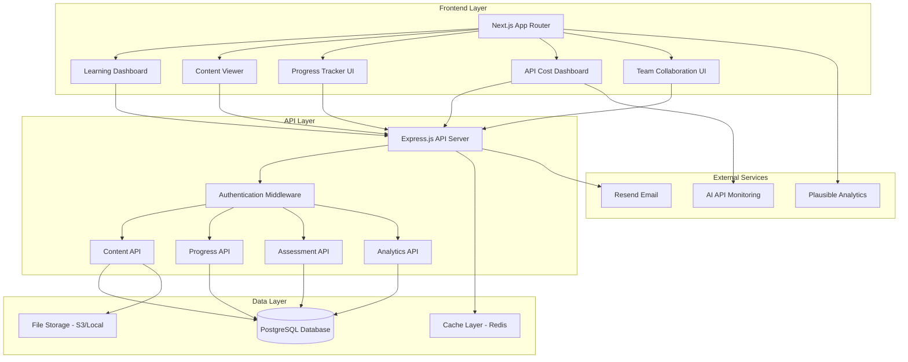
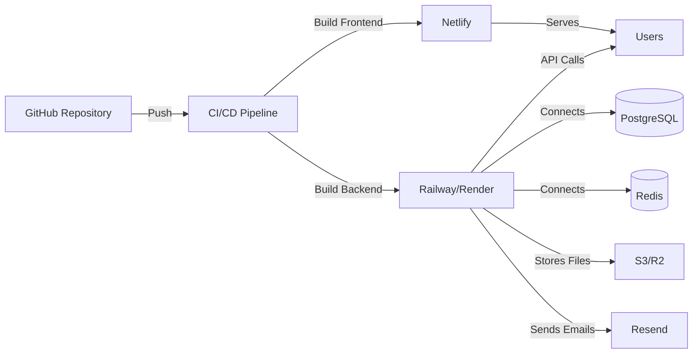

# Design Document

## Overview

The ConnectiveByte Learning Content System is designed as a full-stack educational platform that seamlessly integrates with the existing Next.js frontend and Express.js backend architecture. The system follows a modular, scalable design that prioritizes learner experience, content flexibility, and data-driven insights. The architecture leverages modern web technologies while maintaining simplicity and maintainability.

### Design Principles

1. **Progressive Enhancement**: Core learning content accessible without JavaScript, enhanced features for modern browsers
2. **Mobile-First**: Responsive design optimized for mobile learning scenarios
3. **Data Sovereignty**: Learner data stored securely with clear ownership and export capabilities
4. **Incremental Adoption**: System can be deployed in phases without disrupting existing website functionality
5. **API-First**: All features accessible via RESTful API for future integrations

## Architecture

### System Architecture Diagram



### Technology Stack

**Frontend:**

- Next.js 15 (App Router) - Server and client components
- React 19 - UI components
- TypeScript - Type safety
- Tailwind CSS v4 - Styling
- Framer Motion - Animations
- React Hook Form + Zod - Form validation
- TanStack Query - Data fetching and caching

**Backend:**

- Express.js - API server
- TypeScript - Type safety
- Prisma - Database ORM
- PostgreSQL - Primary database
- Redis - Caching and session storage
- JWT - Authentication tokens

**Infrastructure:**

- Netlify - Frontend hosting
- Railway/Render - Backend hosting
- AWS S3 / Cloudflare R2 - File storage
- Resend - Email delivery

## Components and Interfaces

### 1. Content Delivery Engine

**Purpose**: Render and deliver learning materials to learners

**Components:**

- **ContentRenderer**: React component for displaying Markdown content with syntax highlighting
- **VideoPlayer**: Embedded video player with progress tracking
- **CodeSandbox**: Interactive code editor for practice exercises
- **NavigationController**: Manages session sequencing and module progression

**Key Interfaces:**

```typescript
interface LearningSession {
  id: string;
  moduleId: string;
  title: string;
  description: string;
  duration: number; // minutes
  objectives: string[];
  content: string; // Markdown
  videoUrl?: string;
  codeExamples?: CodeExample[];
  order: number;
  prerequisites?: string[];
}

interface CodeExample {
  id: string;
  language: string;
  code: string;
  description: string;
  isInteractive: boolean;
}

interface CurriculumModule {
  id: string;
  phaseId: string;
  title: string;
  description: string;
  weekNumber: number;
  sessions: LearningSession[];
  practiceProject?: PracticeProject;
  assessment?: Assessment;
}
```

### 2. Progress Tracking System

**Purpose**: Monitor and record learner advancement through curriculum

**Components:**

- **ProgressStore**: State management for completion status
- **ProgressCalculator**: Computes completion percentages
- **BadgeSystem**: Awards achievements for milestones
- **ProgressVisualizer**: Charts and progress bars

**Key Interfaces:**

```typescript
interface LearnerProgress {
  learnerId: string;
  sessionProgress: SessionProgress[];
  moduleProgress: ModuleProgress[];
  overallCompletion: number; // 0-100
  currentPhase: number;
  badges: Badge[];
  lastAccessedAt: Date;
}

interface SessionProgress {
  sessionId: string;
  status: 'not_started' | 'in_progress' | 'completed';
  startedAt?: Date;
  completedAt?: Date;
  timeSpent: number; // minutes
}

interface ModuleProgress {
  moduleId: string;
  completionPercentage: number;
  sessionsCompleted: number;
  totalSessions: number;
  projectSubmitted: boolean;
  assessmentPassed: boolean;
}
```

### 3. Practice Project System

**Purpose**: Enable learners to submit and receive feedback on practical work

**Components:**

- **ProjectSubmissionForm**: Upload interface for code and documentation
- **SubmissionViewer**: Display submitted work for review
- **FeedbackEditor**: Content administrator interface for providing feedback
- **VersionControl**: Track multiple submission iterations

**Key Interfaces:**

```typescript
interface PracticeProject {
  id: string;
  moduleId: string;
  title: string;
  description: string;
  requirements: string[];
  deliverables: string[];
  deadline?: Date;
  rubric: AssessmentRubric;
}

interface ProjectSubmission {
  id: string;
  projectId: string;
  learnerId: string;
  submittedAt: Date;
  repositoryUrl?: string;
  files: SubmittedFile[];
  description: string;
  status: 'submitted' | 'under_review' | 'reviewed';
  feedback?: Feedback;
  score?: number;
  version: number;
}

interface Feedback {
  reviewerId: string;
  reviewedAt: Date;
  comments: string;
  strengths: string[];
  improvements: string[];
  score: number;
}
```

### 4. API Cost Dashboard

**Purpose**: Monitor and visualize API usage and costs for optimization practice

**Components:**

- **CostTracker**: Records API calls and token usage
- **CostVisualizer**: Charts showing trends and comparisons
- **AlertSystem**: Notifications for threshold breaches
- **OptimizationSuggestions**: AI-powered recommendations

**Key Interfaces:**

```typescript
interface APIUsageMetrics {
  learnerId: string;
  period: DateRange;
  services: ServiceUsage[];
  totalCost: number;
  totalRequests: number;
  totalTokens: number;
  trends: UsageTrend[];
}

interface ServiceUsage {
  service: 'openai' | 'anthropic' | 'google' | 'other';
  requests: number;
  tokens: number;
  cost: number;
  endpoints: EndpointUsage[];
}

interface UsageTrend {
  date: Date;
  cost: number;
  requests: number;
  tokens: number;
}

interface CostOptimization {
  currentCost: number;
  optimizedCost: number;
  savings: number;
  savingsPercentage: number;
  recommendations: string[];
}
```

### 5. Team Collaboration Space

**Purpose**: Facilitate peer learning and team project work

**Components:**

- **TeamManager**: Create and manage team memberships
- **DiscussionBoard**: Threaded conversations per module
- **SharedWorkspace**: Collaborative code editing
- **TeamProgressView**: Collective achievement tracking

**Key Interfaces:**

```typescript
interface Team {
  id: string;
  name: string;
  members: TeamMember[];
  createdAt: Date;
  projectAssignments: string[];
  discussionThreads: DiscussionThread[];
}

interface TeamMember {
  learnerId: string;
  role: 'member' | 'leader';
  joinedAt: Date;
  contributionScore: number;
}

interface DiscussionThread {
  id: string;
  moduleId: string;
  authorId: string;
  title: string;
  content: string;
  replies: Reply[];
  createdAt: Date;
  tags: string[];
}

interface TeamProgress {
  teamId: string;
  collectiveCompletion: number;
  memberProgress: Map<string, number>;
  sharedAchievements: Badge[];
}
```

### 6. Assessment System

**Purpose**: Evaluate learner understanding through quizzes and tests

**Components:**

- **QuizEngine**: Presents questions and records answers
- **GradingSystem**: Automatic scoring with detailed feedback
- **QuestionBank**: Repository of assessment questions
- **ResultsAnalyzer**: Identifies knowledge gaps

**Key Interfaces:**

```typescript
interface Assessment {
  id: string;
  moduleId: string;
  title: string;
  passingScore: number; // percentage
  timeLimit?: number; // minutes
  questions: Question[];
  attemptsAllowed: number;
}

interface Question {
  id: string;
  type: 'multiple_choice' | 'code_completion' | 'short_answer';
  question: string;
  options?: string[];
  correctAnswer: string | string[];
  explanation: string;
  points: number;
}

interface AssessmentAttempt {
  id: string;
  assessmentId: string;
  learnerId: string;
  startedAt: Date;
  completedAt?: Date;
  answers: Answer[];
  score: number;
  passed: boolean;
  attemptNumber: number;
}

interface Answer {
  questionId: string;
  response: string | string[];
  isCorrect: boolean;
  pointsEarned: number;
}
```

### 7. Content Management Interface

**Purpose**: Enable administrators to create and manage curriculum

**Components:**

- **ContentEditor**: Rich text editor with Markdown support
- **ModuleBuilder**: Drag-and-drop curriculum organization
- **MediaUploader**: Handle videos, images, and files
- **PreviewSystem**: Test content before publishing

**Key Interfaces:**

```typescript
interface ContentManagement {
  createModule(data: CreateModuleDTO): Promise<CurriculumModule>;
  updateModule(id: string, data: UpdateModuleDTO): Promise<CurriculumModule>;
  deleteModule(id: string): Promise<void>;
  reorderSessions(moduleId: string, sessionIds: string[]): Promise<void>;
  publishModule(id: string): Promise<void>;
}

interface CreateModuleDTO {
  phaseId: string;
  title: string;
  description: string;
  weekNumber: number;
  sessions: CreateSessionDTO[];
}

interface CreateSessionDTO {
  title: string;
  description: string;
  duration: number;
  objectives: string[];
  content: string;
  videoUrl?: string;
  order: number;
}
```

## Data Models

### Database Schema

```sql
-- Users and Authentication
CREATE TABLE users (
  id UUID PRIMARY KEY DEFAULT gen_random_uuid(),
  email VARCHAR(255) UNIQUE NOT NULL,
  password_hash VARCHAR(255) NOT NULL,
  role VARCHAR(50) NOT NULL DEFAULT 'learner',
  created_at TIMESTAMP DEFAULT NOW(),
  updated_at TIMESTAMP DEFAULT NOW()
);

CREATE TABLE learner_profiles (
  id UUID PRIMARY KEY DEFAULT gen_random_uuid(),
  user_id UUID REFERENCES users(id) ON DELETE CASCADE,
  full_name VARCHAR(255) NOT NULL,
  bio TEXT,
  avatar_url VARCHAR(500),
  github_username VARCHAR(100),
  timezone VARCHAR(50),
  created_at TIMESTAMP DEFAULT NOW()
);

-- Curriculum Structure
CREATE TABLE phases (
  id UUID PRIMARY KEY DEFAULT gen_random_uuid(),
  number INTEGER NOT NULL,
  title VARCHAR(255) NOT NULL,
  description TEXT,
  start_week INTEGER NOT NULL,
  end_week INTEGER NOT NULL
);

CREATE TABLE curriculum_modules (
  id UUID PRIMARY KEY DEFAULT gen_random_uuid(),
  phase_id UUID REFERENCES phases(id) ON DELETE CASCADE,
  title VARCHAR(255) NOT NULL,
  description TEXT,
  week_number INTEGER NOT NULL,
  order_index INTEGER NOT NULL,
  created_at TIMESTAMP DEFAULT NOW(),
  updated_at TIMESTAMP DEFAULT NOW()
);

CREATE TABLE learning_sessions (
  id UUID PRIMARY KEY DEFAULT gen_random_uuid(),
  module_id UUID REFERENCES curriculum_modules(id) ON DELETE CASCADE,
  title VARCHAR(255) NOT NULL,
  description TEXT,
  content TEXT NOT NULL,
  duration INTEGER NOT NULL,
  video_url VARCHAR(500),
  order_index INTEGER NOT NULL,
  created_at TIMESTAMP DEFAULT NOW(),
  updated_at TIMESTAMP DEFAULT NOW()
);

-- Progress Tracking
CREATE TABLE session_progress (
  id UUID PRIMARY KEY DEFAULT gen_random_uuid(),
  learner_id UUID REFERENCES users(id) ON DELETE CASCADE,
  session_id UUID REFERENCES learning_sessions(id) ON DELETE CASCADE,
  status VARCHAR(50) NOT NULL DEFAULT 'not_started',
  started_at TIMESTAMP,
  completed_at TIMESTAMP,
  time_spent INTEGER DEFAULT 0,
  UNIQUE(learner_id, session_id)
);

CREATE TABLE module_progress (
  id UUID PRIMARY KEY DEFAULT gen_random_uuid(),
  learner_id UUID REFERENCES users(id) ON DELETE CASCADE,
  module_id UUID REFERENCES curriculum_modules(id) ON DELETE CASCADE,
  completion_percentage INTEGER DEFAULT 0,
  sessions_completed INTEGER DEFAULT 0,
  project_submitted BOOLEAN DEFAULT FALSE,
  assessment_passed BOOLEAN DEFAULT FALSE,
  UNIQUE(learner_id, module_id)
);

-- Practice Projects
CREATE TABLE practice_projects (
  id UUID PRIMARY KEY DEFAULT gen_random_uuid(),
  module_id UUID REFERENCES curriculum_modules(id) ON DELETE CASCADE,
  title VARCHAR(255) NOT NULL,
  description TEXT NOT NULL,
  requirements JSONB NOT NULL,
  deliverables JSONB NOT NULL,
  deadline TIMESTAMP,
  rubric JSONB NOT NULL,
  created_at TIMESTAMP DEFAULT NOW()
);

CREATE TABLE project_submissions (
  id UUID PRIMARY KEY DEFAULT gen_random_uuid(),
  project_id UUID REFERENCES practice_projects(id) ON DELETE CASCADE,
  learner_id UUID REFERENCES users(id) ON DELETE CASCADE,
  repository_url VARCHAR(500),
  description TEXT,
  status VARCHAR(50) NOT NULL DEFAULT 'submitted',
  score INTEGER,
  version INTEGER DEFAULT 1,
  submitted_at TIMESTAMP DEFAULT NOW(),
  reviewed_at TIMESTAMP
);

CREATE TABLE submission_feedback (
  id UUID PRIMARY KEY DEFAULT gen_random_uuid(),
  submission_id UUID REFERENCES project_submissions(id) ON DELETE CASCADE,
  reviewer_id UUID REFERENCES users(id),
  comments TEXT NOT NULL,
  strengths JSONB,
  improvements JSONB,
  score INTEGER NOT NULL,
  created_at TIMESTAMP DEFAULT NOW()
);

-- API Cost Tracking
CREATE TABLE api_usage_logs (
  id UUID PRIMARY KEY DEFAULT gen_random_uuid(),
  learner_id UUID REFERENCES users(id) ON DELETE CASCADE,
  service VARCHAR(50) NOT NULL,
  endpoint VARCHAR(255) NOT NULL,
  requests INTEGER NOT NULL,
  tokens INTEGER NOT NULL,
  cost DECIMAL(10, 4) NOT NULL,
  recorded_at TIMESTAMP DEFAULT NOW()
);

-- Team Collaboration
CREATE TABLE teams (
  id UUID PRIMARY KEY DEFAULT gen_random_uuid(),
  name VARCHAR(255) NOT NULL,
  created_at TIMESTAMP DEFAULT NOW()
);

CREATE TABLE team_members (
  id UUID PRIMARY KEY DEFAULT gen_random_uuid(),
  team_id UUID REFERENCES teams(id) ON DELETE CASCADE,
  learner_id UUID REFERENCES users(id) ON DELETE CASCADE,
  role VARCHAR(50) NOT NULL DEFAULT 'member',
  joined_at TIMESTAMP DEFAULT NOW(),
  UNIQUE(team_id, learner_id)
);

CREATE TABLE discussion_threads (
  id UUID PRIMARY KEY DEFAULT gen_random_uuid(),
  team_id UUID REFERENCES teams(id) ON DELETE CASCADE,
  module_id UUID REFERENCES curriculum_modules(id),
  author_id UUID REFERENCES users(id),
  title VARCHAR(255) NOT NULL,
  content TEXT NOT NULL,
  created_at TIMESTAMP DEFAULT NOW()
);

CREATE TABLE thread_replies (
  id UUID PRIMARY KEY DEFAULT gen_random_uuid(),
  thread_id UUID REFERENCES discussion_threads(id) ON DELETE CASCADE,
  author_id UUID REFERENCES users(id),
  content TEXT NOT NULL,
  created_at TIMESTAMP DEFAULT NOW()
);

-- Assessments
CREATE TABLE assessments (
  id UUID PRIMARY KEY DEFAULT gen_random_uuid(),
  module_id UUID REFERENCES curriculum_modules(id) ON DELETE CASCADE,
  title VARCHAR(255) NOT NULL,
  passing_score INTEGER NOT NULL,
  time_limit INTEGER,
  attempts_allowed INTEGER DEFAULT -1,
  created_at TIMESTAMP DEFAULT NOW()
);

CREATE TABLE assessment_questions (
  id UUID PRIMARY KEY DEFAULT gen_random_uuid(),
  assessment_id UUID REFERENCES assessments(id) ON DELETE CASCADE,
  type VARCHAR(50) NOT NULL,
  question TEXT NOT NULL,
  options JSONB,
  correct_answer JSONB NOT NULL,
  explanation TEXT,
  points INTEGER NOT NULL,
  order_index INTEGER NOT NULL
);

CREATE TABLE assessment_attempts (
  id UUID PRIMARY KEY DEFAULT gen_random_uuid(),
  assessment_id UUID REFERENCES assessments(id) ON DELETE CASCADE,
  learner_id UUID REFERENCES users(id) ON DELETE CASCADE,
  started_at TIMESTAMP DEFAULT NOW(),
  completed_at TIMESTAMP,
  score INTEGER,
  passed BOOLEAN,
  attempt_number INTEGER NOT NULL
);

CREATE TABLE attempt_answers (
  id UUID PRIMARY KEY DEFAULT gen_random_uuid(),
  attempt_id UUID REFERENCES assessment_attempts(id) ON DELETE CASCADE,
  question_id UUID REFERENCES assessment_questions(id) ON DELETE CASCADE,
  response JSONB NOT NULL,
  is_correct BOOLEAN NOT NULL,
  points_earned INTEGER NOT NULL
);
```

## Error Handling

### Error Categories

1. **Authentication Errors**: Invalid credentials, expired tokens, insufficient permissions
2. **Validation Errors**: Invalid input data, missing required fields
3. **Resource Errors**: Not found, already exists, conflict
4. **Business Logic Errors**: Prerequisites not met, deadline passed, quota exceeded
5. **System Errors**: Database connection, external service failure

### Error Response Format

```typescript
interface ErrorResponse {
  error: {
    code: string;
    message: string;
    details?: Record<string, any>;
    timestamp: string;
  };
}

// Example error codes
const ErrorCodes = {
  AUTH_INVALID_CREDENTIALS: 'AUTH_001',
  AUTH_TOKEN_EXPIRED: 'AUTH_002',
  AUTH_INSUFFICIENT_PERMISSIONS: 'AUTH_003',
  VALIDATION_INVALID_INPUT: 'VAL_001',
  VALIDATION_MISSING_FIELD: 'VAL_002',
  RESOURCE_NOT_FOUND: 'RES_001',
  RESOURCE_ALREADY_EXISTS: 'RES_002',
  BUSINESS_PREREQUISITES_NOT_MET: 'BUS_001',
  BUSINESS_DEADLINE_PASSED: 'BUS_002',
  SYSTEM_DATABASE_ERROR: 'SYS_001',
  SYSTEM_EXTERNAL_SERVICE_ERROR: 'SYS_002',
};
```

### Error Handling Strategy

1. **Client-Side**: Display user-friendly messages, provide recovery actions
2. **API Layer**: Log errors with context, return appropriate HTTP status codes
3. **Database Layer**: Handle constraint violations, transaction rollbacks
4. **External Services**: Implement retry logic, fallback mechanisms

## Testing Strategy

### Unit Testing

**Scope**: Individual functions, components, and utilities

**Tools**: Jest, React Testing Library

**Coverage Targets**:

- Utility functions: 100%
- Business logic: 95%
- React components: 85%
- API endpoints: 90%

**Key Test Areas**:

- Progress calculation logic
- Assessment scoring algorithms
- Cost calculation functions
- Form validation rules
- Data transformation utilities

### Integration Testing

**Scope**: API endpoints, database operations, service interactions

**Tools**: Jest, Supertest, Prisma test database

**Key Test Scenarios**:

- User registration and authentication flow
- Content creation and retrieval
- Progress tracking updates
- Project submission workflow
- Team collaboration features
- Assessment completion flow

### End-to-End Testing

**Scope**: Complete user journeys through the application

**Tools**: Playwright

**Key User Flows**:

1. Learner registration → Browse curriculum → Complete session → Track progress
2. Submit practice project → Receive feedback → Resubmit
3. Take assessment → View results → Retake if failed
4. Join team → Participate in discussion → View team progress
5. Monitor API costs → View optimization suggestions → Implement improvements

### Performance Testing

**Metrics**:

- Page load time < 2 seconds
- API response time < 500ms (p95)
- Database query time < 100ms (p95)
- Concurrent users: 100+ without degradation

**Tools**: Lighthouse, WebPageTest, k6

### Accessibility Testing

**Standards**: WCAG 2.1 Level AA

**Tools**: axe-core, Pa11y, manual testing with screen readers

**Key Areas**:

- Keyboard navigation
- Screen reader compatibility
- Color contrast
- Focus management
- ARIA labels

## Implementation Phases

### Phase 1: Foundation (Weeks 1-2)

- Database schema setup
- Authentication system
- Basic content delivery
- Progress tracking core

### Phase 2: Core Features (Weeks 3-5)

- Practice project submission
- Assessment system
- Team collaboration basics
- Content management interface

### Phase 3: Advanced Features (Weeks 6-8)

- API cost dashboard
- Analytics and reporting
- Notification system
- Mobile optimization

### Phase 4: Polish and Launch (Weeks 9-10)

- Performance optimization
- Security hardening
- User acceptance testing
- Documentation completion

## Security Considerations

1. **Authentication**: JWT tokens with refresh mechanism, secure password hashing (bcrypt)
2. **Authorization**: Role-based access control (RBAC), resource-level permissions
3. **Data Protection**: Encryption at rest and in transit, PII handling compliance
4. **Input Validation**: Server-side validation, SQL injection prevention, XSS protection
5. **Rate Limiting**: API throttling, DDoS protection
6. **Audit Logging**: Track sensitive operations, maintain audit trail

## Deployment Architecture



### Environment Configuration

**Development**:

- Local PostgreSQL and Redis
- Local file storage
- Mock email service

**Staging**:

- Managed PostgreSQL (Railway)
- Managed Redis (Upstash)
- S3-compatible storage
- Real email service (test domain)

**Production**:

- Production database with backups
- Production Redis cluster
- CDN-backed file storage
- Production email service
