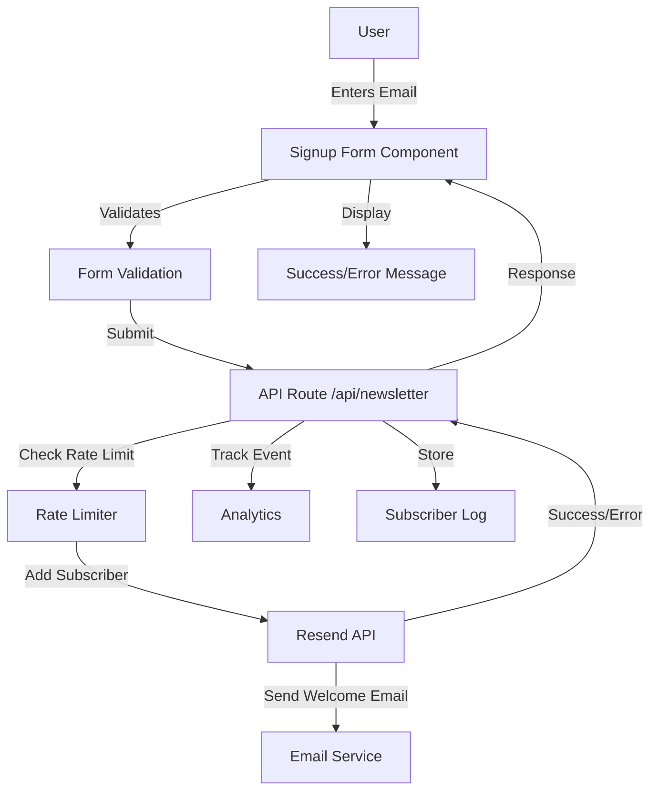

# Design Document

## Overview

The Newsletter Signup feature provides a simple, privacy-friendly way for visitors to subscribe to ConnectiveByte's newsletter. The design prioritizes user experience, privacy compliance, and seamless integration with the existing website and analytics system. The implementation uses Resend (already integrated for contact form) as the email service provider, ensuring consistency and simplicity.

## Architecture

### System Architecture



### Technology Stack

**Frontend:**

- React Hook Form + Zod (consistent with contact form)
- Framer Motion (animations)
- Existing design system (colors, typography)

**Backend:**

- Next.js API Route (`/api/newsletter`)
- Resend API (email service)
- Rate limiting (simple in-memory or Redis)

**Email Service:**

- Resend (already integrated)
- Audience/List management
- Welcome email template

## Components and Interfaces

### 1. Newsletter Signup Form Component

```typescript
// components/forms/NewsletterSignupForm.tsx
'use client';

import { useState } from 'react';
import { useForm } from 'react-hook-form';
import { zodResolver } from '@hookform/resolvers/zod';
import { newsletterSchema, type NewsletterFormData } from '@/lib/validation/newsletter-schema';
import { useTrackEvent } from '@/lib/analytics/useTrackEvent';

interface NewsletterSignupFormProps {
  variant?: 'footer' | 'inline' | 'popup';
  showNameField?: boolean;
}

export function NewsletterSignupForm({
  variant = 'footer',
  showNameField = false,
}: NewsletterSignupFormProps) {
  const [submitStatus, setSubmitStatus] = useState<'idle' | 'success' | 'error'>('idle');
  const trackEvent = useTrackEvent();

  const {
    register,
    handleSubmit,
    formState: { errors, isSubmitting },
    reset,
  } = useForm<NewsletterFormData>({
    resolver: zodResolver(newsletterSchema),
  });

  const onSubmit = async (data: NewsletterFormData) => {
    try {
      const response = await fetch('/api/newsletter', {
        method: 'POST',
        headers: { 'Content-Type': 'application/json' },
        body: JSON.stringify({ ...data, source: variant }),
      });

      if (!response.ok) {
        throw new Error('Subscription failed');
      }

      setSubmitStatus('success');
      trackEvent('Newsletter Signup Click', { location: variant });
      reset();
    } catch (error) {
      setSubmitStatus('error');
    }
  };

  // Render form based on variant and status
  // ...
}
```

**Design Rationale**: Reuses existing form patterns from contact form for consistency. Variant prop allows different placements (footer, inline, popup) with appropriate styling.

### 2. Newsletter Schema Validation

```typescript
// lib/validation/newsletter-schema.ts
import { z } from 'zod';

export const newsletterSchema = z.object({
  email: z
    .string()
    .min(1, 'メールアドレスを入力してください')
    .email('有効なメールアドレスを入力してください')
    .refine((email) => !isDisposableEmail(email), 'このメールアドレスは使用できません'),
  name: z.string().optional(),
  consent: z.boolean().refine((val) => val === true, 'プライバシーポリシーに同意してください'),
  // Honeypot field for bot detection
  website: z.string().max(0).optional(),
});

export type NewsletterFormData = z.infer<typeof newsletterSchema>;

// List of common disposable email domains
function isDisposableEmail(email: string): boolean {
  const disposableDomains = [
    'tempmail.com',
    '10minutemail.com',
    'guerrillamail.com',
    // Add more as needed
  ];
  const domain = email.split('@')[1]?.toLowerCase();
  return disposableDomains.includes(domain);
}
```

**Design Rationale**: Zod schema provides type-safe validation with custom rules for email quality. Honeypot field catches bots without impacting UX.

### 3. Newsletter API Route

```typescript
// app/api/newsletter/route.ts
import { NextRequest, NextResponse } from 'next/server';
import { Resend } from 'resend';
import { newsletterSchema } from '@/lib/validation/newsletter-schema';
import { rateLimit } from '@/lib/rate-limit';
import { WelcomeEmail } from '@/emails/WelcomeEmail';

const resend = new Resend(process.env.RESEND_API_KEY);

export async function POST(request: NextRequest) {
  try {
    // Rate limiting
    const ip = request.headers.get('x-forwarded-for') || 'unknown';
    const rateLimitResult = await rateLimit(ip, 3, 3600); // 3 per hour

    if (!rateLimitResult.success) {
      return NextResponse.json(
        { error: '送信回数が上限に達しました。しばらく待ってから再度お試しください。' },
        { status: 429 }
      );
    }

    // Parse and validate request
    const body = await request.json();
    const result = newsletterSchema.safeParse(body);

    if (!result.success) {
      return NextResponse.json({ error: result.error.errors[0].message }, { status: 400 });
    }

    const { email, name, website } = result.data;

    // Honeypot check
    if (website) {
      console.log('Bot detected:', email);
      return NextResponse.json({ success: true }); // Fake success
    }

    // Add to Resend audience
    await resend.contacts.create({
      email,
      firstName: name,
      audienceId: process.env.RESEND_AUDIENCE_ID!,
    });

    // Send welcome email
    await resend.emails.send({
      from: 'ConnectiveByte <info@connectivebyte.com>',
      to: email,
      subject: 'ConnectiveByteニュースレターへようこそ',
      react: WelcomeEmail({ name: name || '読者' }),
    });

    // Log subscription
    console.log('Newsletter subscription:', { email, name, timestamp: new Date() });

    return NextResponse.json({ success: true });
  } catch (error) {
    console.error('Newsletter subscription error:', error);
    return NextResponse.json(
      { error: 'エラーが発生しました。もう一度お試しください。' },
      { status: 500 }
    );
  }
}
```

**Design Rationale**: API route handles validation, rate limiting, spam prevention, and email service integration. Returns appropriate error messages in Japanese.

### 4. Rate Limiting Utility

```typescript
// lib/rate-limit.ts
interface RateLimitStore {
  [key: string]: { count: number; resetTime: number };
}

const store: RateLimitStore = {};

export async function rateLimit(
  identifier: string,
  limit: number,
  windowSeconds: number
): Promise<{ success: boolean; remaining: number }> {
  const now = Date.now();
  const key = `newsletter:${identifier}`;

  // Clean up expired entries
  if (store[key] && store[key].resetTime < now) {
    delete store[key];
  }

  // Initialize or increment
  if (!store[key]) {
    store[key] = {
      count: 1,
      resetTime: now + windowSeconds * 1000,
    };
    return { success: true, remaining: limit - 1 };
  }

  if (store[key].count >= limit) {
    return { success: false, remaining: 0 };
  }

  store[key].count++;
  return { success: true, remaining: limit - store[key].count };
}
```

**Design Rationale**: Simple in-memory rate limiting for MVP. Can be upgraded to Redis for production if needed.

### 5. Welcome Email Template

```typescript
// emails/WelcomeEmail.tsx
import {
  Body,
  Container,
  Head,
  Heading,
  Html,
  Link,
  Preview,
  Text,
} from '@react-email/components';

interface WelcomeEmailProps {
  name: string;
}

export function WelcomeEmail({ name }: WelcomeEmailProps) {
  return (
    <Html>
      <Head />
      <Preview>ConnectiveByteニュースレターへようこそ</Preview>
      <Body style={main}>
        <Container style={container}>
          <Heading style={h1}>ようこそ、{name}さん！</Heading>

          <Text style={text}>
            ConnectiveByteニュースレターにご登録いただき、ありがとうございます。
          </Text>

          <Text style={text}>
            このニュースレターでは、以下の内容をお届けします：
          </Text>

          <ul style={list}>
            <li>AI時代の協創リーダーシップに関する最新の知見</li>
            <li>思考連携とチーム効率化の実践的なヒント</li>
            <li>ConnectiveByteの新機能やイベント情報</li>
            <li>Version 0プログラムの参加者事例</li>
          </ul>

          <Text style={text}>
            配信頻度：月1-2回程度
          </Text>

          <Text style={text}>
            今後ともよろしくお願いいたします。
          </Text>

          <Text style={footer}>
            このメールの配信を停止する場合は、
            <Link href="{{unsubscribe_url}}" style={link}>
              こちら
            </Link>
            からお手続きください。
          </Text>
        </Container>
      </Body>
    </Html>
  );
}

// Styles
const main = { backgroundColor: '#f6f9fc', fontFamily: 'sans-serif' };
const container = { margin: '0 auto', padding: '20px 0 48px', maxWidth: '580px' };
const h1 = { color: '#1e3a8a', fontSize: '24px', fontWeight: 'bold' };
const text = { color: '#4b5563', fontSize: '16px', lineHeight: '24px' };
const list = { color: '#4b5563', fontSize: '16px', lineHeight: '24px' };
const footer = { color: '#9ca3af', fontSize: '14px', lineHeight: '20px' };
const link = { color: '#1e3a8a', textDecoration: 'underline' };
```

**Design Rationale**: React Email components provide consistent, responsive email templates. Content aligns with ConnectiveByte brand values.

## Integration Points

### 1. Footer Integration

```typescript
// components/layout/Footer.tsx
import { NewsletterSignupForm } from '@/components/forms/NewsletterSignupForm';

export function Footer() {
  return (
    <footer>
      {/* Existing footer content */}

      {/* Newsletter Section */}
      <div className="border-t border-[#e5e7eb] pt-8 mt-8">
        <div className="max-w-md mx-auto text-center">
          <h3 className="text-xl font-bold text-[#111827] mb-2">
            ニュースレター登録
          </h3>
          <p className="text-[#4b5563] mb-4">
            AI時代の協創リーダーシップに関する最新情報をお届けします
          </p>
          <NewsletterSignupForm variant="footer" />
        </div>
      </div>
    </footer>
  );
}
```

### 2. Analytics Integration

Newsletter signup events are automatically tracked using the existing analytics system:

```typescript
// Already implemented in NewsletterSignupForm
trackEvent('Newsletter Signup Click', { location: variant });
```

Configure in Plausible dashboard:

- Goal: "Newsletter Signup Click"
- Properties: location (footer, inline, popup)

### 3. Privacy Policy Update

Add newsletter section to privacy policy:

```markdown
## ニュースレター

当社のニュースレターに登録すると、以下の情報を収集します：

- メールアドレス（必須）
- お名前（任意）
- 登録日時

これらの情報は、ニュースレターの配信のみに使用され、第三者に提供されることはありません。
配信停止はいつでも可能です。
```

## Email Service Configuration

### Resend Setup

1. **Create Audience**

   ```bash
   # In Resend dashboard
   # Create audience: "ConnectiveByte Newsletter"
   # Get audience ID
   ```

2. **Environment Variables**

   ```bash
   RESEND_API_KEY=re_xxx  # Already configured
   RESEND_AUDIENCE_ID=aud_xxx  # New
   ```

3. **Verify Domain**
   - Add DNS records for connectivebyte.com
   - Verify sender address: info@connectivebyte.com

### Unsubscribe Handling

Resend automatically handles unsubscribe links:

- `{{unsubscribe_url}}` in email templates
- Automatic list management
- Compliance with CAN-SPAM, GDPR

## User Experience Flow

### Happy Path

1. User enters email in footer form
2. Form validates in real-time
3. User checks consent checkbox
4. User clicks "登録する" button
5. Loading state shows (spinner)
6. Success message displays
7. Welcome email arrives within 5 minutes
8. User is added to Resend audience

### Error Scenarios

**Invalid Email:**

- Inline error: "有効なメールアドレスを入力してください"
- Field highlighted in red

**Rate Limit Exceeded:**

- Error message: "送信回数が上限に達しました。しばらく待ってから再度お試しください。"
- Retry after 1 hour

**Network Error:**

- Error message: "エラーが発生しました。もう一度お試しください。"
- Retry button available

**Already Subscribed:**

- Success message (don't reveal subscription status)
- Welcome email not sent again

## Design Specifications

### Form Styling

```typescript
// Consistent with existing design system
const formStyles = {
  container: 'max-w-md mx-auto',
  input: 'w-full px-4 py-3 border border-[#e5e7eb] rounded-lg focus:ring-2 focus:ring-[#10b981]',
  button: 'w-full bg-[#10b981] text-white px-6 py-3 rounded-lg hover:bg-[#059669]',
  error: 'text-[#ef4444] text-sm mt-1',
  success: 'bg-[#10b981]/10 border border-[#10b981]/20 rounded-lg p-4 text-[#10b981]',
};
```

### Responsive Design

- **Mobile (< 768px)**: Full-width form, stacked fields
- **Tablet (768px - 1024px)**: Centered form, max-width 500px
- **Desktop (> 1024px)**: Centered form, max-width 600px

### Accessibility

- Proper label associations
- ARIA attributes for error messages
- Keyboard navigation support
- Screen reader friendly
- Focus indicators

## Testing Strategy

### Unit Tests

```typescript
// __tests__/components/NewsletterSignupForm.test.tsx
describe('NewsletterSignupForm', () => {
  it('validates email format', () => {
    // Test email validation
  });

  it('requires consent checkbox', () => {
    // Test consent requirement
  });

  it('displays success message on successful submission', () => {
    // Test success state
  });

  it('handles API errors gracefully', () => {
    // Test error handling
  });
});
```

### Integration Tests

```typescript
// __tests__/api/newsletter.test.ts
describe('POST /api/newsletter', () => {
  it('adds subscriber to Resend audience', () => {
    // Test Resend integration
  });

  it('sends welcome email', () => {
    // Test email sending
  });

  it('enforces rate limiting', () => {
    // Test rate limit
  });

  it('detects honeypot submissions', () => {
    // Test spam prevention
  });
});
```

### E2E Tests

```typescript
// e2e/newsletter.spec.ts
test('user can subscribe to newsletter', async ({ page }) => {
  await page.goto('/');
  await page.fill('input[name="email"]', 'test@example.com');
  await page.check('input[name="consent"]');
  await page.click('button[type="submit"]');
  await expect(page.locator('.success-message')).toBeVisible();
});
```

## Performance Considerations

### Optimization

- Form submission: < 2 seconds
- Email delivery: < 5 minutes
- Rate limiting: In-memory (fast)
- Validation: Client-side first (instant feedback)

### Monitoring

- Track signup conversion rate in analytics
- Monitor API response times
- Log failed subscriptions
- Alert on high error rates

## Privacy & Compliance

### GDPR Compliance

- ✅ Explicit consent required
- ✅ Clear privacy policy link
- ✅ Easy unsubscribe process
- ✅ Data minimization (only email + name)
- ✅ Right to deletion (via Resend)

### Japanese Privacy Law Compliance

- ✅ Purpose of data collection stated
- ✅ Consent obtained before collection
- ✅ Secure data handling
- ✅ Unsubscribe option provided

## Future Enhancements

### Phase 2 (Optional)

- Double opt-in confirmation
- Subscriber preferences (frequency, topics)
- Segmentation by interests
- A/B testing for signup copy
- Popup modal for exit intent
- Inline signup in blog posts
- Social proof (subscriber count)

## Success Metrics

### Key Metrics to Track

- Signup conversion rate (target: 2-5%)
- Email open rate (target: 20-30%)
- Click-through rate (target: 2-5%)
- Unsubscribe rate (target: < 2%)
- Bounce rate (target: < 5%)

### Analytics Events

- Newsletter Signup Click (location)
- Newsletter Signup Success
- Newsletter Signup Error
- Welcome Email Sent
- Welcome Email Opened
