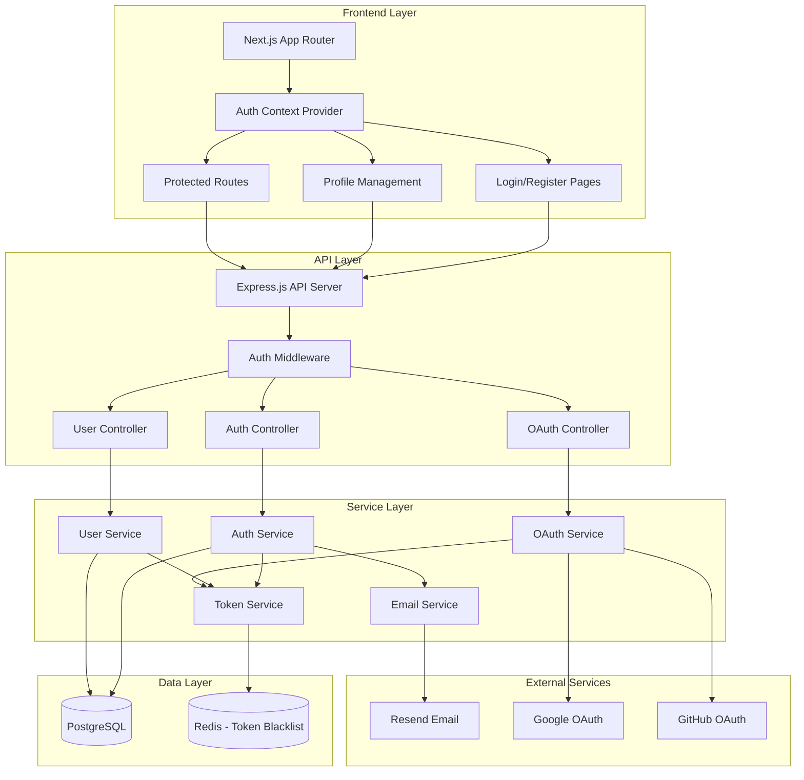
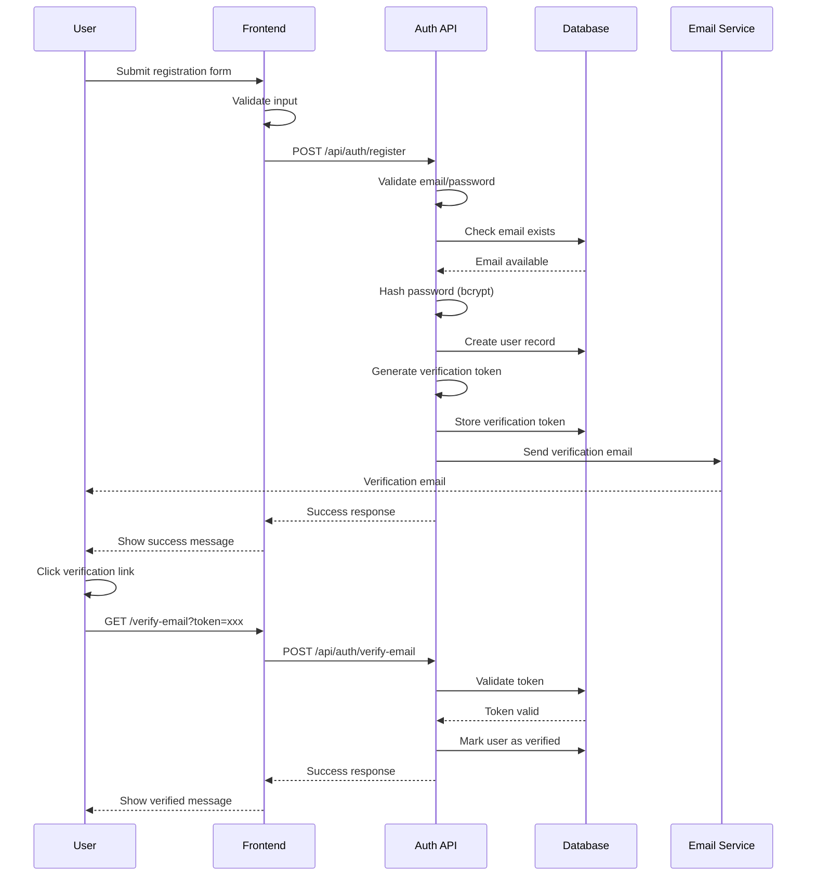
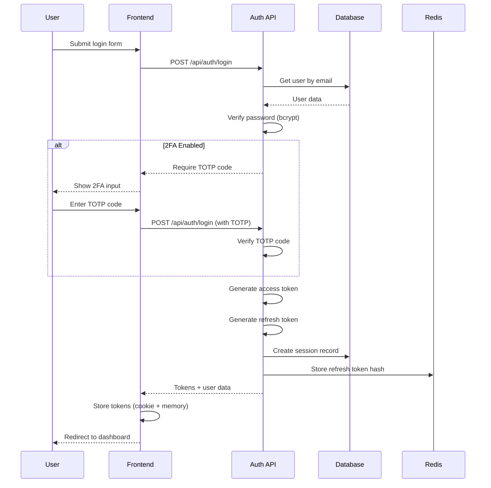
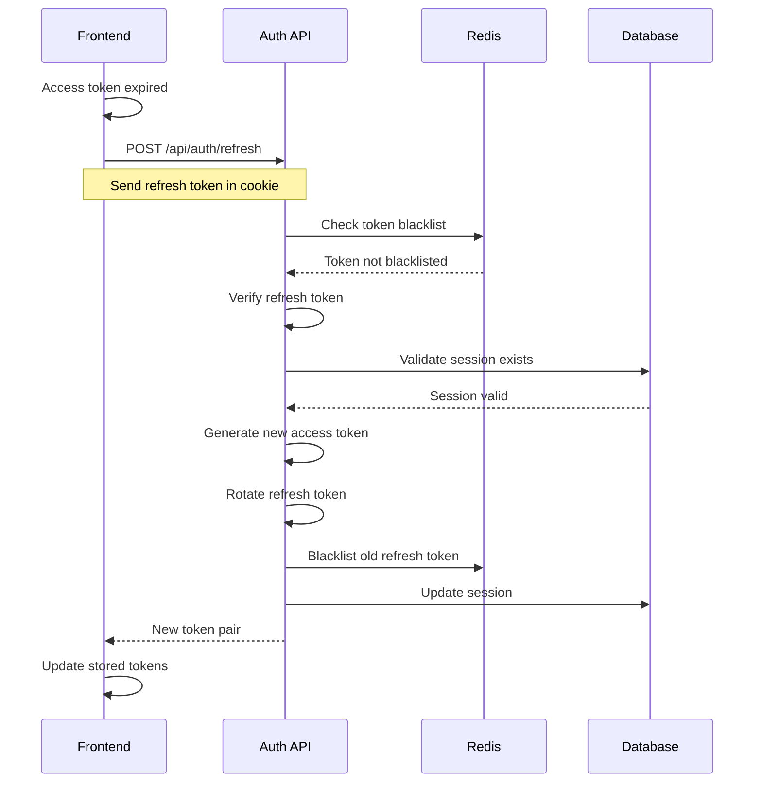

# Design Document

## Overview

The User Authentication and Profile Management System is designed as a secure, scalable authentication layer that integrates seamlessly with the existing ConnectiveByte platform architecture. The system follows industry best practices for security, implements JWT-based stateless authentication with refresh token rotation, and provides a foundation for role-based access control across all platform features. The design prioritizes security, user experience, and maintainability while supporting future extensibility for additional authentication methods.

### Design Principles

1. **Security First**: All authentication flows implement defense-in-depth strategies
2. **Stateless Architecture**: JWT tokens enable horizontal scaling without session storage
3. **Progressive Enhancement**: Core features work without JavaScript, enhanced with client-side validation
4. **Privacy by Design**: Minimal data collection, secure storage, and user control over data
5. **Developer Experience**: Clear API contracts, comprehensive documentation, and reusable components

## Architecture

### System Architecture Diagram



### Technology Stack

**Frontend:**

- Next.js 15 (App Router) - Authentication pages and protected routes
- React Context API - Global authentication state
- React Hook Form + Zod - Form validation
- TanStack Query - API data fetching and caching
- js-cookie - Secure cookie management

**Backend:**

- Express.js - API server
- Passport.js - Authentication middleware
- jsonwebtoken - JWT token generation and verification
- bcrypt - Password hashing
- speakeasy - TOTP for 2FA
- Prisma - Database ORM

**Infrastructure:**

- PostgreSQL - User data storage
- Redis - Token blacklist and rate limiting
- Resend - Email delivery

## Components and Interfaces

### 1. Authentication Service

**Purpose**: Handle user registration, login, and token management

**Key Interfaces:**

```typescript
interface AuthService {
  register(data: RegisterDTO): Promise<AuthResponse>;
  login(credentials: LoginDTO): Promise<AuthResponse>;
  verifyEmail(token: string): Promise<void>;
  refreshToken(refreshToken: string): Promise<TokenPair>;
  logout(userId: string, refreshToken: string): Promise<void>;
  requestPasswordReset(email: string): Promise<void>;
  resetPassword(token: string, newPassword: string): Promise<void>;
}

interface RegisterDTO {
  email: string;
  password: string;
  fullName: string;
}

interface LoginDTO {
  email: string;
  password: string;
  totpCode?: string;
}

interface AuthResponse {
  user: UserProfile;
  tokens: TokenPair;
}

interface TokenPair {
  accessToken: string;
  refreshToken: string;
}

interface UserProfile {
  id: string;
  email: string;
  fullName: string;
  role: UserRole;
  isVerified: boolean;
  avatarUrl?: string;
}

type UserRole = 'learner' | 'content_administrator' | 'system_admin';
```

### 2. Token Service

**Purpose**: Generate, verify, and manage JWT tokens

**Key Interfaces:**

```typescript
interface TokenService {
  generateAccessToken(userId: string, role: UserRole): string;
  generateRefreshToken(userId: string): string;
  verifyAccessToken(token: string): TokenPayload;
  verifyRefreshToken(token: string): TokenPayload;
  blacklistToken(token: string, expiresAt: Date): Promise<void>;
  isTokenBlacklisted(token: string): Promise<boolean>;
  rotateRefreshToken(oldToken: string): Promise<string>;
}

interface TokenPayload {
  userId: string;
  role: UserRole;
  iat: number;
  exp: number;
}

// Token Configuration
const TOKEN_CONFIG = {
  accessToken: {
    expiresIn: '1h',
    secret: process.env.JWT_ACCESS_SECRET,
  },
  refreshToken: {
    expiresIn: '30d',
    secret: process.env.JWT_REFRESH_SECRET,
  },
};
```

### 3. User Service

**Purpose**: Manage user profiles and account operations

**Key Interfaces:**

```typescript
interface UserService {
  getUserById(id: string): Promise<User>;
  getUserByEmail(email: string): Promise<User | null>;
  updateProfile(userId: string, data: UpdateProfileDTO): Promise<User>;
  updateEmail(userId: string, newEmail: string): Promise<void>;
  changePassword(userId: string, currentPassword: string, newPassword: string): Promise<void>;
  uploadAvatar(userId: string, file: File): Promise<string>;
  deleteAccount(userId: string, password: string): Promise<void>;
  scheduleAccountDeletion(userId: string): Promise<void>;
  cancelAccountDeletion(userId: string): Promise<void>;
}

interface UpdateProfileDTO {
  fullName?: string;
  bio?: string;
  timezone?: string;
  githubUsername?: string;
}

interface User {
  id: string;
  email: string;
  passwordHash: string;
  fullName: string;
  bio?: string;
  avatarUrl?: string;
  timezone?: string;
  githubUsername?: string;
  role: UserRole;
  isVerified: boolean;
  twoFactorEnabled: boolean;
  twoFactorSecret?: string;
  createdAt: Date;
  updatedAt: Date;
  deletionScheduledAt?: Date;
}
```

### 4. OAuth Service

**Purpose**: Handle third-party authentication providers

**Key Interfaces:**

```typescript
interface OAuthService {
  initiateOAuthFlow(provider: OAuthProvider): string;
  handleOAuthCallback(provider: OAuthProvider, code: string): Promise<AuthResponse>;
  linkOAuthAccount(userId: string, provider: OAuthProvider, code: string): Promise<void>;
  unlinkOAuthAccount(userId: string, provider: OAuthProvider): Promise<void>;
  getLinkedAccounts(userId: string): Promise<LinkedAccount[]>;
}

type OAuthProvider = 'google' | 'github';

interface LinkedAccount {
  provider: OAuthProvider;
  providerUserId: string;
  email: string;
  linkedAt: Date;
}

interface OAuthProfile {
  provider: OAuthProvider;
  providerId: string;
  email: string;
  name: string;
  avatarUrl?: string;
}
```

### 5. Two-Factor Authentication Service

**Purpose**: Manage TOTP-based 2FA

**Key Interfaces:**

```typescript
interface TwoFactorService {
  generateSecret(userId: string): Promise<TwoFactorSetup>;
  enableTwoFactor(userId: string, totpCode: string): Promise<string[]>;
  disableTwoFactor(userId: string, password: string, totpCode: string): Promise<void>;
  verifyTOTP(userId: string, totpCode: string): Promise<boolean>;
  verifyBackupCode(userId: string, backupCode: string): Promise<boolean>;
  regenerateBackupCodes(userId: string, password: string): Promise<string[]>;
}

interface TwoFactorSetup {
  secret: string;
  qrCodeUrl: string;
  manualEntryKey: string;
}
```

### 6. Session Management Service

**Purpose**: Track and manage active user sessions

**Key Interfaces:**

```typescript
interface SessionService {
  createSession(userId: string, deviceInfo: DeviceInfo): Promise<Session>;
  getActiveSessions(userId: string): Promise<Session[]>;
  revokeSession(sessionId: string): Promise<void>;
  revokeAllSessions(userId: string, exceptSessionId?: string): Promise<void>;
  updateSessionActivity(sessionId: string): Promise<void>;
}

interface Session {
  id: string;
  userId: string;
  deviceInfo: DeviceInfo;
  ipAddress: string;
  createdAt: Date;
  lastActivityAt: Date;
  expiresAt: Date;
}

interface DeviceInfo {
  userAgent: string;
  browser: string;
  os: string;
  device: string;
}
```

### 7. Email Service

**Purpose**: Send authentication-related emails

**Key Interfaces:**

```typescript
interface EmailService {
  sendVerificationEmail(email: string, token: string): Promise<void>;
  sendPasswordResetEmail(email: string, token: string): Promise<void>;
  sendPasswordChangedNotification(email: string): Promise<void>;
  sendAccountDeletionNotification(email: string, scheduledDate: Date): Promise<void>;
  sendSecurityAlert(email: string, alertType: SecurityAlertType): Promise<void>;
}

type SecurityAlertType =
  | 'suspicious_login'
  | 'password_changed'
  | 'email_changed'
  | 'two_factor_enabled'
  | 'two_factor_disabled';
```

## Data Models

### Database Schema

```sql
-- Users table
CREATE TABLE users (
  id UUID PRIMARY KEY DEFAULT gen_random_uuid(),
  email VARCHAR(255) UNIQUE NOT NULL,
  password_hash VARCHAR(255),
  full_name VARCHAR(255) NOT NULL,
  bio TEXT,
  avatar_url VARCHAR(500),
  timezone VARCHAR(50) DEFAULT 'UTC',
  github_username VARCHAR(100),
  role VARCHAR(50) NOT NULL DEFAULT 'learner',
  is_verified BOOLEAN DEFAULT FALSE,
  two_factor_enabled BOOLEAN DEFAULT FALSE,
  two_factor_secret VARCHAR(255),
  created_at TIMESTAMP DEFAULT NOW(),
  updated_at TIMESTAMP DEFAULT NOW(),
  deletion_scheduled_at TIMESTAMP,
  deleted_at TIMESTAMP
);

CREATE INDEX idx_users_email ON users(email);
CREATE INDEX idx_users_role ON users(role);

-- OAuth accounts
CREATE TABLE oauth_accounts (
  id UUID PRIMARY KEY DEFAULT gen_random_uuid(),
  user_id UUID REFERENCES users(id) ON DELETE CASCADE,
  provider VARCHAR(50) NOT NULL,
  provider_user_id VARCHAR(255) NOT NULL,
  provider_email VARCHAR(255),
  linked_at TIMESTAMP DEFAULT NOW(),
  UNIQUE(provider, provider_user_id)
);

CREATE INDEX idx_oauth_user_id ON oauth_accounts(user_id);

-- Email verification tokens
CREATE TABLE email_verification_tokens (
  id UUID PRIMARY KEY DEFAULT gen_random_uuid(),
  user_id UUID REFERENCES users(id) ON DELETE CASCADE,
  token VARCHAR(255) UNIQUE NOT NULL,
  expires_at TIMESTAMP NOT NULL,
  created_at TIMESTAMP DEFAULT NOW()
);

CREATE INDEX idx_verification_token ON email_verification_tokens(token);
CREATE INDEX idx_verification_expires ON email_verification_tokens(expires_at);

-- Password reset tokens
CREATE TABLE password_reset_tokens (
  id UUID PRIMARY KEY DEFAULT gen_random_uuid(),
  user_id UUID REFERENCES users(id) ON DELETE CASCADE,
  token VARCHAR(255) UNIQUE NOT NULL,
  expires_at TIMESTAMP NOT NULL,
  used_at TIMESTAMP,
  created_at TIMESTAMP DEFAULT NOW()
);

CREATE INDEX idx_reset_token ON password_reset_tokens(token);
CREATE INDEX idx_reset_expires ON password_reset_tokens(expires_at);

-- Backup codes for 2FA
CREATE TABLE backup_codes (
  id UUID PRIMARY KEY DEFAULT gen_random_uuid(),
  user_id UUID REFERENCES users(id) ON DELETE CASCADE,
  code_hash VARCHAR(255) NOT NULL,
  used_at TIMESTAMP,
  created_at TIMESTAMP DEFAULT NOW()
);

CREATE INDEX idx_backup_user_id ON backup_codes(user_id);

-- Sessions
CREATE TABLE sessions (
  id UUID PRIMARY KEY DEFAULT gen_random_uuid(),
  user_id UUID REFERENCES users(id) ON DELETE CASCADE,
  refresh_token_hash VARCHAR(255) NOT NULL,
  device_info JSONB NOT NULL,
  ip_address VARCHAR(45),
  created_at TIMESTAMP DEFAULT NOW(),
  last_activity_at TIMESTAMP DEFAULT NOW(),
  expires_at TIMESTAMP NOT NULL
);

CREATE INDEX idx_sessions_user_id ON sessions(user_id);
CREATE INDEX idx_sessions_expires ON sessions(expires_at);

-- Authentication logs
CREATE TABLE auth_logs (
  id UUID PRIMARY KEY DEFAULT gen_random_uuid(),
  user_id UUID REFERENCES users(id) ON DELETE SET NULL,
  event_type VARCHAR(50) NOT NULL,
  email VARCHAR(255),
  ip_address VARCHAR(45),
  user_agent TEXT,
  success BOOLEAN NOT NULL,
  failure_reason VARCHAR(255),
  created_at TIMESTAMP DEFAULT NOW()
);

CREATE INDEX idx_auth_logs_user_id ON auth_logs(user_id);
CREATE INDEX idx_auth_logs_created ON auth_logs(created_at);
CREATE INDEX idx_auth_logs_event ON auth_logs(event_type);

-- Failed login attempts (for rate limiting)
CREATE TABLE failed_login_attempts (
  id UUID PRIMARY KEY DEFAULT gen_random_uuid(),
  email VARCHAR(255) NOT NULL,
  ip_address VARCHAR(45) NOT NULL,
  attempted_at TIMESTAMP DEFAULT NOW()
);

CREATE INDEX idx_failed_attempts_email ON failed_login_attempts(email, attempted_at);
CREATE INDEX idx_failed_attempts_ip ON failed_login_attempts(ip_address, attempted_at);
```

## Authentication Flows

### Registration Flow



### Login Flow



### Token Refresh Flow



## Error Handling

### Error Response Format

```typescript
interface ErrorResponse {
  error: {
    code: string;
    message: string;
    details?: Record<string, any>;
    timestamp: string;
  };
}

// Error codes
const AuthErrorCodes = {
  // Registration errors
  EMAIL_ALREADY_EXISTS: 'AUTH_REG_001',
  WEAK_PASSWORD: 'AUTH_REG_002',
  INVALID_EMAIL_FORMAT: 'AUTH_REG_003',

  // Login errors
  INVALID_CREDENTIALS: 'AUTH_LOGIN_001',
  ACCOUNT_NOT_VERIFIED: 'AUTH_LOGIN_002',
  ACCOUNT_LOCKED: 'AUTH_LOGIN_003',
  TWO_FACTOR_REQUIRED: 'AUTH_LOGIN_004',
  INVALID_TOTP_CODE: 'AUTH_LOGIN_005',

  // Token errors
  TOKEN_EXPIRED: 'AUTH_TOKEN_001',
  TOKEN_INVALID: 'AUTH_TOKEN_002',
  TOKEN_BLACKLISTED: 'AUTH_TOKEN_003',

  // Password reset errors
  RESET_TOKEN_EXPIRED: 'AUTH_RESET_001',
  RESET_TOKEN_INVALID: 'AUTH_RESET_002',

  // OAuth errors
  OAUTH_PROVIDER_ERROR: 'AUTH_OAUTH_001',
  OAUTH_ACCOUNT_CONFLICT: 'AUTH_OAUTH_002',

  // Rate limiting
  RATE_LIMIT_EXCEEDED: 'AUTH_RATE_001',
};
```

## Security Considerations

### Password Security

1. **Hashing**: bcrypt with 12 salt rounds
2. **Strength Requirements**: Minimum 8 characters, uppercase, lowercase, numbers
3. **Password History**: Prevent reuse of last 5 passwords
4. **Breach Detection**: Check against Have I Been Pwned API

### Token Security

1. **Access Token**: Short-lived (1 hour), stored in memory
2. **Refresh Token**: Long-lived (30 days), httpOnly secure cookie
3. **Token Rotation**: Refresh tokens rotated on each use
4. **Blacklisting**: Revoked tokens stored in Redis until expiration

### Rate Limiting

```typescript
const RATE_LIMITS = {
  login: {
    windowMs: 15 * 60 * 1000, // 15 minutes
    max: 5, // 5 attempts
  },
  register: {
    windowMs: 60 * 60 * 1000, // 1 hour
    max: 3, // 3 attempts
  },
  passwordReset: {
    windowMs: 60 * 60 * 1000, // 1 hour
    max: 3, // 3 attempts
  },
  api: {
    windowMs: 15 * 60 * 1000, // 15 minutes
    max: 100, // 100 requests
  },
};
```

### Session Security

1. **Session Tracking**: Store device info and IP address
2. **Concurrent Sessions**: Allow multiple sessions, user can revoke
3. **Suspicious Activity**: Flag logins from new locations/devices
4. **Auto Logout**: Expire sessions after 30 days of inactivity

## Testing Strategy

### Unit Tests

- Password hashing and verification
- Token generation and validation
- TOTP code generation and verification
- Email validation logic
- Rate limiting algorithms

### Integration Tests

- Complete registration flow
- Login with various scenarios (2FA, OAuth)
- Token refresh and rotation
- Password reset flow
- Profile update operations
- Session management

### Security Tests

- SQL injection attempts
- XSS attack vectors
- CSRF protection
- Rate limit enforcement
- Token tampering detection
- Brute force attack simulation

### End-to-End Tests

- User registration → verification → login
- Password reset complete flow
- OAuth connection and login
- 2FA setup and usage
- Account deletion with grace period

## Implementation Phases

### Phase 1: Core Authentication (Week 1)

- Database schema setup
- User registration and email verification
- Login with JWT tokens
- Password reset functionality

### Phase 2: Enhanced Security (Week 2)

- Refresh token rotation
- Session management
- Rate limiting
- Security logging and monitoring

### Phase 3: Extended Features (Week 3)

- OAuth integration (Google, GitHub)
- Two-factor authentication
- Profile management
- Account deletion

### Phase 4: Polish and Integration (Week 4)

- Frontend components and flows
- API documentation
- Security audit
- Integration with Learning Content System
