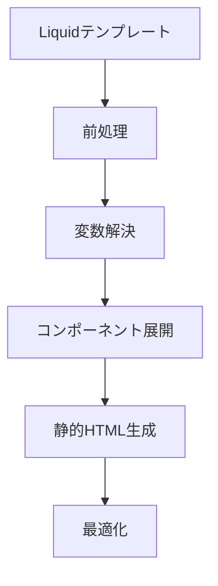

# Liquidテンプレートの静的HTML変換アプローチ

## 1. 変換パイプライン



## 2. 実装ステップ

### 2.1 前処理フェーズ

- Liquidテンプレートのパース
- 依存関係の特定（コンポーネント、設定、翻訳等）
- 必要なデータの収集

### 2.2 変数解決フェーズ

- `settings`オブジェクトの静的データへの変換
- 国際化文字列の展開
- 条件分岐の評価
- アセットURLの解決

### 2.3 コンポーネント展開フェーズ

- `render`/`section`タグの展開
- パーシャルの統合
- レイアウトの適用

### 2.4 静的HTML生成フェーズ

- 動的な部分を静的コンテンツに変換
- CSSカスタム変数の固定値化
- JavaScriptの必要な部分の維持

### 2.5 最適化フェーズ

- 不要なコードの削除
- アセットの最適化
- パフォーマンス改善

## 3. 実装オプション

### 3.1 Node.jsベースの変換ツール

```javascript
const liquidEngine = new LiquidEngine();
const staticGenerator = {
  resolveVariables(template, context),
  expandComponents(template, components),
  generateStaticHtml(template)
};
```

### 3.2 ビルドプロセスの統合

```bash
# ビルドスクリプト例
npm run build:liquid-to-static
```

## 4. 考慮事項

### 4.1 メンテナンス性

- 元のLiquidテンプレートとの同期方法
- 更新プロセスの自動化
- バージョン管理との統合

### 4.2 パフォーマンス

- ビルド時間の最適化
- 生成されたHTMLのサイズ
- キャッシュ戦略

### 4.3 機能の維持

- 必要な動的機能の特定
- クライアントサイドでの実装方法
- 代替手段の検討

## 5. 推奨ツール

- liquid-node: Liquidテンプレートのパース
- cheerio: HTML操作
- postcss: CSS処理
- webpack/rollup: アセットバンドル

## 6. 導入ステップ

1. プロトタイプ変換ツールの開発
2. テストケースの作成
3. 段階的な変換プロセスの実装
4. 検証とフィードバック
5. 本番環境への展開

## 7. 次のステップ

- [ ] 変換ツールのプロトタイプ開発
- [ ] テストデータの準備
- [ ] 変換プロセスの検証
- [ ] パフォーマンステスト
- [ ] ドキュメント作成
