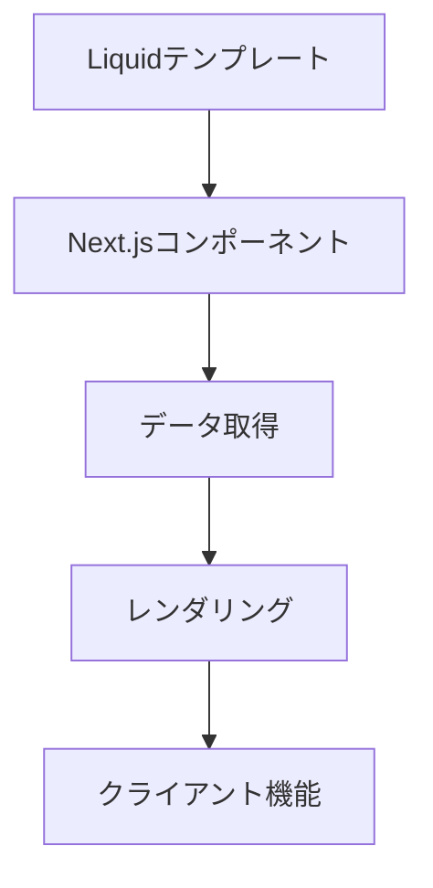

# Next.jsでのLiquidテンプレート統合アプローチ

## 1. 実装アプローチ

### 1.1 基本戦略



### 1.2 変換ポイント

- Liquid変数 → Reactのprops
- Liquidの条件分岐 → JSX条件レンダリング
- インクルード → Reactコンポーネント
- フィルター → JavaScriptユーティリティ関数

## 2. データ管理

### 2.1 静的データ

```typescript
// data/settings.ts
export const settings = {
  type_header_font: {
    family: 'Arial',
    style: 'normal',
    weight: 400,
  },
  // ... 他の設定
};
```

### 2.2 動的データ

```typescript
// pages/api/shop-data.ts
export default async function handler(req, res) {
  // ショップデータの取得ロジック
  res.json({
    name: 'Shop Name',
    locale: { iso_code: 'ja' },
  });
}
```

## 3. コンポーネント構造

### 3.1 レイアウト

```tsx
// app/layout.tsx
export default function Layout({ children }) {
  return (
    <html lang={locale.iso_code}>
      <head>{/* メタデータ、スタイル等 */}</head>
      <body>
        {/* ヘッダー、フッター等 */}
        {children}
      </body>
    </html>
  );
}
```

### 3.2 ページコンポーネント

```tsx
// app/page.tsx
export default function Page() {
  return <main>{/* コンテンツ */}</main>;
}
```

## 4. スタイリング対応

### 4.1 CSSカスタムプロパティ

- CSS Modulesまたはstyled-componentsで管理
- テーマ設定を動的に適用

### 4.2 アセット管理

- Next.jsの公開ディレクトリを活用
- 画像の最適化機能を利用

## 5. 実装手順

1. 基本レイアウトの移行
   - HTML構造をJSXに変換
   - スタイリングの移行

2. データ層の実装
   - API routesの設定
   - 静的データの整理

3. コンポーネントの開発
   - 共通コンポーネントの作成
   - ページコンポーネントの実装

4. 機能の移行
   - カートの実装
   - 検索機能の実装
   - ローカライゼーション対応

## 6. 利点

- SSRによるパフォーマンス最適化
- コンポーネントベースの開発
- TypeScriptによる型安全性
- ビルトインの最適化機能

## 7. 注意点

- クライアントステートの管理
- SEO対応の確認
- パフォーマンスのモニタリング
- ブラウザ互換性の確保

## 8. 次のステップ

- [ ] プロトタイプページの作成
- [ ] データフェッチングの実装
- [ ] コンポーネントライブラリの構築
- [ ] E2Eテストの作成
